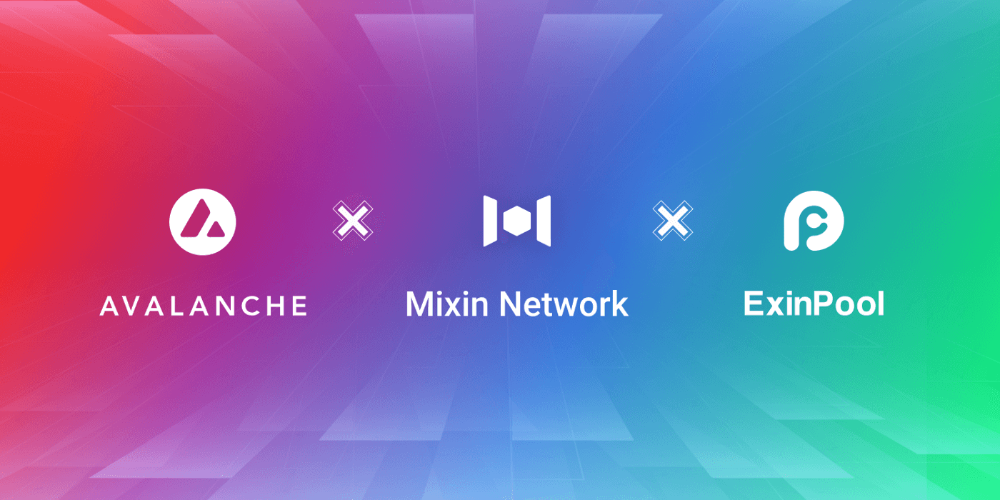

# Mixin Joins Avalanche Validator Ecosystem to Provide Staking Services to Users

Avalanche Protocol is an open-source blockchain platform designed for DeFi with high throughput, low latency, fast finality, and scalability. Smart contracts can be confirmed in less than 1 second and support a full set of Ethereum development toolkits while supporting millions of independent verifiers to participate as miners.

Mixin Network has integrated with Avalanche and started a strategic partnership with them. Exin, as one of the most active developer teams in the Mixin ecosystem, owns the popular staking product ExinPool, which will join the Avalanche validator node ecosystem to provide secure and trusted staking and node services to the community.

ExinPool nodes have a queuing mechanism for joining and exiting (ignoring the rule that the 14-day locked period for staking), providing excellent liquidity and allowing users to participate in staking with zero thresholds and earn stable returns.

ExinPool encourages the community to participate in node co-construction and profit from the early-bird benefits in the early stages of the Avalanche node. Currently, the AVAX Staking Annualized Percentage Rate (APR) is about 10.08%. Users participating through ExinPool can enjoy super-high node revenue dividends while receiving additional AVAX, BTC, and EPC rewards during the campaign period. Significantly increasing the rate of return (short-term APR is close to 15%, exclusive of the extra BTC, EPC rewards). The details of the early-bird benefits are as follows:

- 99% of node staking rewards will be returned to each node    participant daily.
- Users who participate in staking every 10 AVAX can enjoy a reward of 0.001 AVAX per day for 3 months (the maximum reward is for the top 10000 AVAX participants, that is, the maximum reward is 1 AVAX per day).
- There will be a BTC bonus distribution to participants, with a daily BTC bonus of 100 Satoshi for every 10 AVAX from the participant lasting for one month.
- In addition, those who participate in ExinPool AVAX nodes will receive EPC bonus: every 10 AVAX staked, participants can earn 10 EPC per day lasting for one month.
- Follow-up activities that may be launched: ExinPool users who stake AVAX with ExinPool could receive LP Token, which can be used for trading, mortgage, lending, etc.
- Note: The returns and bonuses are distributed through ExinPool, with zero transaction fee.

ExinPool is committed to build the Avalanche ecosystem and jointly promote network stability and decentralization. Users can participate in the Avalanche ExinPool node through the entrance on Mixin Messenger to get stable returns easily. Meanwhile, welcome to join the official Avalanche community and learn more. Click [here](https://avalanche.mixinbots.com/join) to join now!

## About Avalanche
Avalanche is the fastest smart contracts platform in the blockchain industry, as measured by time-to-finality, and has the most validators securing its activity of any proof-of-stake protocol. Avalanche is blazingly fast, low cost, and green. Any smart contract-enabled application can outperform its competition on Avalanche.

## About Mixin Network

Mixin Network is an open-source, lightning-fast, and decentralized Web3 platform to bring speed and scalability to the blockchain. Mixin allows blockchains to gain trillions of TPS, sub-second final confirmation, zero transaction fee, enhanced privacy, and unlimited extensibility.

Mixin Network is a PoS network with 26 full nodes. As a layer-2 solution, it has supported 41 public blockchains including Bitcoin, Ethereum, Monero, Polkadot, etc. The total assets on the network have been over 2 billion US Dollars. Mixin is also a full-featured financial platform with functions of AMM, aggregating trade, pending orders on Exchange platforms, unbiased stable currency, etc. Mixin Network is dedicated to providing users with a decentralized blockchain infrastructure that always puts security, privacy, and decentralization first.

## Follow us:

Official Website:[https://mixin.one](https://mixin.one/)

Twitter: [https://twitter.com/Mixin_Network](https://twitter.com/Mixin_Network/)

Facebook: [https://www.facebook.com/MixinNetwork](https://www.facebook.com/MixinNetwork)
