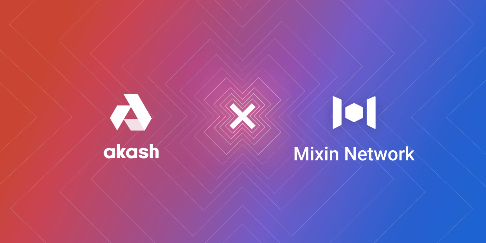

# Mixin Network Establishes Strategic Partnership With Akash Network

Mixin Network is glad to announce a strategic partnership with Akash Network, a distributed peer-to-peer marketplace for cloud compute. Launched in March 2021, Akash Network enables companies with spare compute capacity in on-premise or collocated data centers to lease their unused capacity for cloud deployments.

Together, both parties will conduct in-depth collaboration in market promotion, network construction, and global community expansion. Through this partnership, Mixin is integrating Akash into its multi-chain network ecosystem, bringing its vast number of community members into the Akash ecosystem and providing them access to the Akash Token (AKT), Akash Network's native utility token.

Mixin and Akash Network will work closely to explore opportunities to integrate their networks in ways that benefit the users and protect open platforms while reducing cost. This will include access to multiple decentralized applications on the Mixin Network, meaning AKT holders will have the chance to use AKT in practical application scenarios.

Both Akash and Mixin Network care deeply about their communities. Users are always welcome to join in, meet cryptocurrency friends, get the latest news about Akash Network, and get benefits from the secure and scalable blockchain infrastructure. Click [here](https://akash.mixin.group/) to join today!

## About Akash

Akash Network, the world's first decentralized and open-source cloud, accelerates deployment, scale, efficiency and price performance for high-growth industries like blockchain and machine learning/AI. The "Airbnb for Cloud Compute," Akash Network provides a fast, efficient and low-cost application deployment solution. Developers can deploy apps to cloud-hosted containers using Akash Network at half the cost of traditional cloud giants like Amazon Web Services, Google Cloud and Microsoft Azure. With 85% of underutilized cloud computing capacity in the 8.4 million data centers, using open-source container technology, Akash Network allows anyone to lease cloud computing resources. For more information visit: [https://akash.network/](https://akash.network/).

## About Mixin Network

Mixin Network is an open-source, lightning-fast, and decentralized Web3 platform to bring speed and scalability to the blockchain. Mixin allows blockchains to gain trillions of TPS, sub-second final confirmation, zero transaction fee, enhanced privacy, and unlimited extensibility.

Mixin Network is a PoS network with 26 full nodes. As a layer-2 solution, it has supported 41 public blockchains including Bitcoin, Ethereum, Monero, Polkadot, etc. The total assets on the network have been over 2 billion US Dollars. Mixin is also a full-featured financial platform with functions of AMM, aggregating trade, pending orders on Exchange platforms, unbiased stable currency, etc. Mixin Network is dedicated to providing users with a decentralized blockchain infrastructure that always puts security, privacy, and decentralization first.

## Follow us:

Official Website:[https://mixin.one](https://mixin.one/)

Twitter: [https://twitter.com/Mixin_Network](https://twitter.com/Mixin_Network/)

Facebook: [https://www.facebook.com/MixinNetwork](https://www.facebook.com/MixinNetwork)
