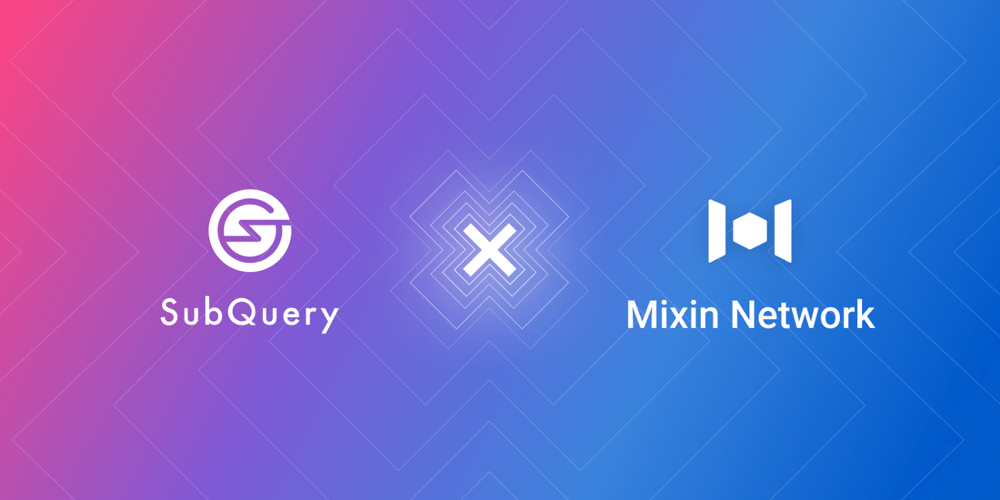

# Mixin Network Establishes Strategic Partnership With SubQuery

Mixin Network is glad to announce a strategic partnership with SubQuery. SubQuery is a decentralized data aggregation, indexing & querying layer between Layer-1 blockchains and decentralized applications (DApps). Currently focused on Polkadot and Substrate projects, this data-as-a-service allows developers to focus on their core use case and front-end, without needing to waste time on building a custom backend for data processing.

Together, both parties will work together to grow and engage SubQuery's community in China through Mixin Messenger. Through this partnership, Mixin Network will work closely with SubQuery in market promotion, network construction, and global community expansion. This will include bringing more developers to the SubQuery network and also give common users a chance to access and use the multiple decentralized applications on the Mixin Network.

SubQuery is working with Mixin Messenger to provide core data on assets and transactions in the growing Polkadot/Kusama ecosystem. Through the common API model that SubQuery has designed, Mixin will easily be able to onboard new parachain tokens.

Both SubQuery and Mixin Network care deeply about their communities. All users, regardless of where they are located, are invited to join a growing community and get the latest news about SubQuery. Click [here](https://subquery.mixinbots.com/join)to join today!

## About SubQuery

SubQuery is a data aggregation layer that will operate between blockchains (like Polkadot) and DApps (like Mixin Messenger). This service allows DApp developers to focus on their core use case and front-end, without needing to waste time on building a custom backend for data processing.

[Website](https://subquery.network/) | [Email](http://hello@subquery.network/) | [Discord](https://discord.com/invite/78zg8aBSMG) | [Telegram](https://t.me/subquerynetwork) | [Twitter](https://twitter.com/subquerynetwork) | [Matrix](https://matrix.to/#/#subquery:matrix.org) | [LinkedIn](https://www.linkedin.com/company/subquery)

## About Mixin Network

Mixin Network is an open-source, lightning-fast, and decentralized Web3 platform to bring speed and scalability to the blockchain. Mixin allows blockchains to gain trillions of TPS, sub-second final confirmation, zero transaction fee, enhanced privacy, and unlimited extensibility.

Mixin Network is a PoS network with 26 full nodes. As a layer-2 solution, it has supported 41 public blockchains including Bitcoin, Ethereum, Monero, Polkadot, etc. The total assets on the network have been over 2 billion US Dollars. Mixin is also a full-featured financial platform with functions of AMM, aggregating trade, pending orders on Exchange platforms, unbiased stable currency, etc. Mixin Network is dedicated to providing users with a decentralized blockchain infrastructure that always puts security, privacy, and decentralization first.

## Follow us:

Official Website:[https://mixin.one](https://mixin.one/)

Twitter: [https://twitter.com/Mixin_Network](https://twitter.com/Mixin_Network/)

Facebook: [https://www.facebook.com/MixinNetwork](https://www.facebook.com/MixinNetwork)
