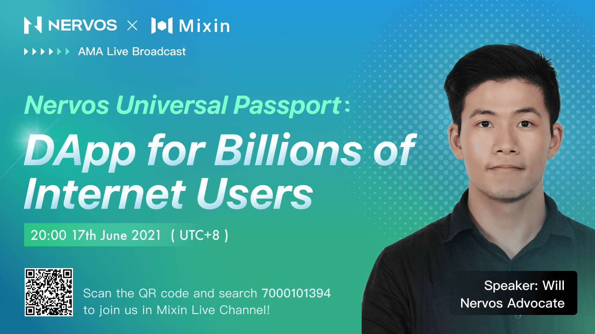

# Nervos and Mixin Network AMA Recap

On 17th June, an informative AMA was successfully conducted by Nervos and Mixin Network with the topic of DApp for Billions of Internet Users. Williams, the advocate of Nervos was invited to share his expertise on how Nervos could help blockchain users to get access to blockchain applications at ease.

Mixin joined Nervos ecosystem and integrated Nervos into its multi-chain network ecosystem in March 2020 and helps with its ecosystem development. Mixin Network will continually work closely with Nervos and explore deeper collaboration to further expand each other's community and prosper the blockchain ecosystem.

Users are welcome to join our vibrant communities on Mixin Network, meet all the cryptocurrency friends, get the latest news about Nervos and Mixin, and get benefits from the secure and scalable blockchain infrastructure.

## About Nervos

Nervos Network is an open-source public blockchain ecosystem and collection of protocols creating the foundation for a universal internet-like public network.

Nervos Network is making blockchain application universal, offering unparalleled user reach and uptake. Nervos is decentralized and sustainable, intent on bringing you the next step in blockchain evolution.

## About Mixin Network

Mixin Network is an open-source, lightning-fast, and decentralized Web3 platform to bring speed and scalability to the blockchain. Mixin allows blockchains to gain trillions of TPS, sub-second final confirmation, zero transaction fee, enhanced privacy, and unlimited extensibility.

Mixin Network is a PoS network with 26 full nodes. As a layer-2 solution, it has supported 41 public blockchains including Bitcoin, Ethereum, Monero, Polkadot, etc. The total assets on the network have been over 2 billion US Dollars. Mixin is also a full-featured financial platform with functions of AMM, aggregating trade, pending orders on Exchange platforms, unbiased stable currency, etc. Mixin Network is dedicated to providing users with a decentralized blockchain infrastructure that always puts security, privacy, and decentralization first.

## Follow us:

Official Website:[https://mixin.one](https://mixin.one/)

Twitter: [https://twitter.com/Mixin_Network](https://twitter.com/Mixin_Network/)

Facebook: [https://www.facebook.com/MixinNetwork](https://www.facebook.com/MixinNetwork)
