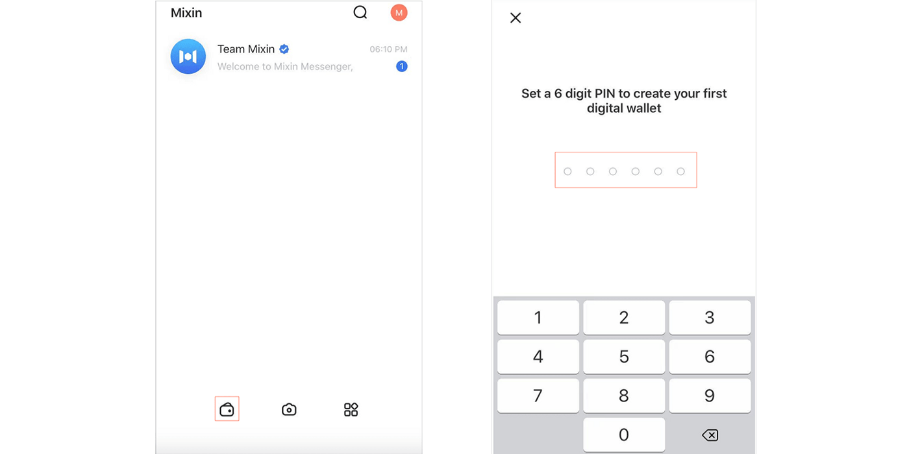
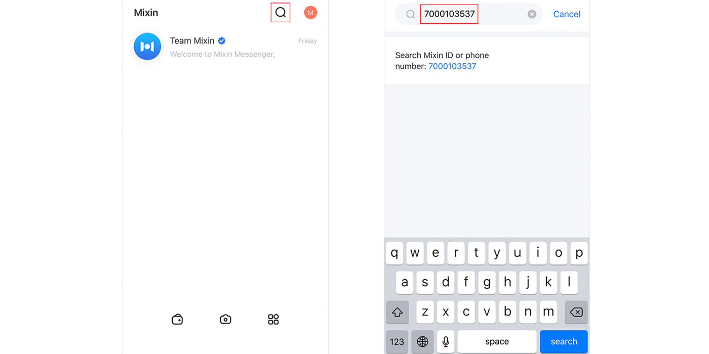
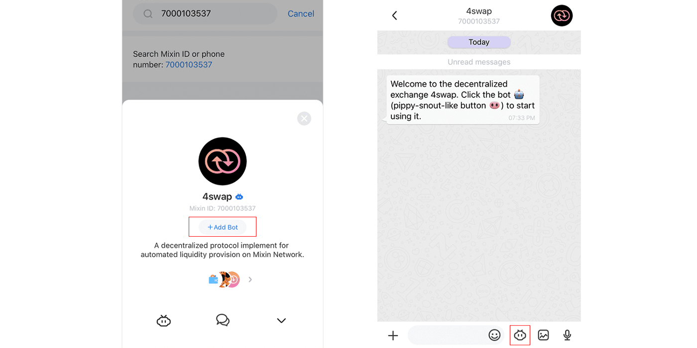
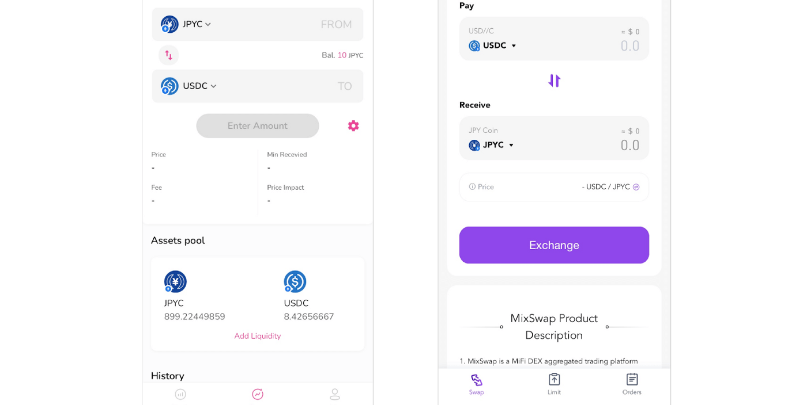

# Trade JPYC With Mixin Messenger!

JPYC is a JPY-pegged stablecoin, legally dealt as a Prepaid Payment Instrument in Japan. The JPYC/USDC trading pair has been listed by the community on Mixin. Users can now use Mixin Messenger to trade JPYC. There will be **no KYC required** with the decentralized swapping bots and **no gas fee**.

Follow below simple steps to trade your JPYC with Mixin Messenger — all on your mobile devices.

- Install and set-up Mixin Messenger
- Set up your Mixin wallet
- Add Bot([4swap](https://4swap.org/"4swap"), MixSwap)

**Step 1**: Install and set-up Mixin Messenger ([App Store](https://apps.apple.com/app/mixin/id1322324266"appstore") OR [Google Play](https://play.google.com/store/apps/details?id=one.mixin.messenger"googleplay"))

**Step 2**: Set up your Mixin wallet

- Tapping the wallet icon
- Creating a PIN

**Step 3**: Add Bot (4swap OR MixSwap)

- Search for ID: 7000103537 or 7000103767
- Tap "+ Add Bot"
- Then transaction

  **Home page & Search for ID**

  **Add Bot & Tap Bot Icon**

  **4swap is Similar to Uniswap & MixSwap is Similar to 1inch**
  
## Note:
1. If you don't see the "Add Bot" button, then you may already have added it. Tap the four squares icon from the main screen, tap the bot, then continue.

2. You can directly [Deposit JPYC on Mixin Messenger](https://mixinmessenger.zendesk.com/hc/en-us/articles/360018789931For"depositjpyc").

## Related URLs:

1. 4swap official website: [https://4swap.org](https://4swap.org)
2. JPYC official website: [https://jpyc.jp](https://jpyc.jp)
3. Mixin Network official website: [https://mixin.one](https://mixin.one)

## About Mixin Network

Mixin Network is an open-source, lightning-fast, and decentralized Web3 platform to bring speed and scalability to the blockchain. Mixin allows blockchains to gain trillions of TPS, sub-second final confirmation, zero transaction fee, enhanced privacy, and unlimited extensibility.

Mixin Network is a PoS network with 26 full nodes. As a layer-2 solution, it has supported 41 public blockchains including Bitcoin, Ethereum, Monero, Polkadot, etc. The total assets on the network have been over 2 billion US Dollars. Mixin is also a full-featured financial platform with functions of AMM, aggregating trade, pending orders on Exchange platforms, unbiased stable currency, etc. Mixin Network is dedicated to providing users with a decentralized blockchain infrastructure that always puts security, privacy, and decentralization first.

## Follow us:

Official Website:[https://mixin.one](https://mixin.one/)

Twitter: [https://twitter.com/Mixin_Network](https://twitter.com/Mixin_Network/)

Facebook: [https://www.facebook.com/MixinNetwork](https://www.facebook.com/MixinNetwork)
