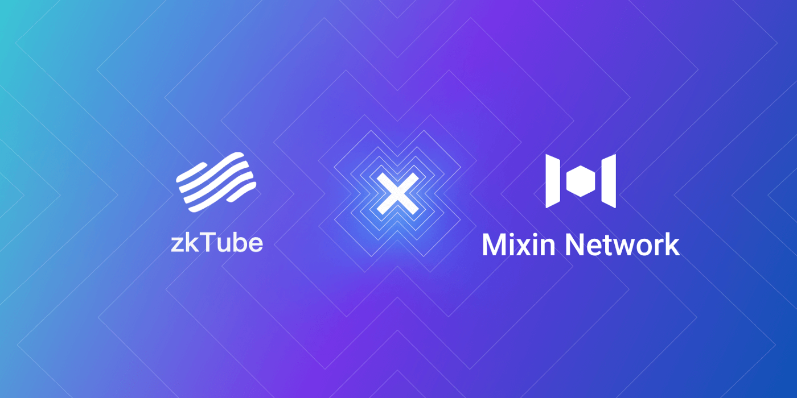

# zkTube Labs Establishes Strategic Partnership With Mixin Network

zkTube Labs is pleased to announce a strategic partnership with Mixin Network. Based on the premise that combines zero-knowledge protocol and Layer 2, zkTube is referred to as a Layer 2 protocol that utilizes zero-knowledge proof and ZK rollup for the individual and businesses to realize lower transaction fees plus high throughput transactions between ETH or Ethereum and ERC-20.

It utilizes zero-knowledge proof to offer solutions to the problems and issues of expansion, data availability, privacy for Ethereum, and all data is synchronized and stored on the [zkTube mainnet](https://zktube.io/). zkTube is poised to become the best Layer 2 environment for payments with no more than 0.01 cents per transaction, and TPS up to 3000+. It offers great value for people. Soon, it will be a point for financial institutions to move to Ethereum, to provide a more friendly payment system worldwide.

zkTube's global community includes 60,000 members from Australia, Arabia, Russia, Vietnam, China, and South Korea.

Mixin Network is a simple UTXO transaction network, focused on transaction functionalities and privacy protection, which is composed of a single theoretically permanent Kernel, many dynamic Domains and different multipurpose Domain Extensions, to formulate an extended star topology. Kernel has a simple logic, it can achieve almost unlimited concurrency performance.

Besides blockchain projects, as a next-generation transaction network, Mixin Network also provides transaction solutions for other non-blockchain projects.

Through the partnership, the two parties will conduct in-depth collaboration in market promotion, network construction, and community expansion across the globe. zkTube will collaborate Mixin with its multi-chain network ecosystem and wallet service.

Users are welcome to join the vibrant communities of zkTube and Mixin Network, meet all the cryptocurrency friends, get the latest news about these two, and get benefits from the secure and scalable blockchain infrastructure.

## About zkTube

zkTube is a project built and developed on Layer 2 based on the PLONK algorithm protocol using ZK-Rollup technology. It can improve scalability by transferring batches of transactions to a single transaction. Its essence is to compress the user state on the chain and store it in a Merkle tree and transfer the user state change to the chain while ensuring the user state change process's correctness through a Zero-Knowledge proof mechanism. The cost of directly processing user state changes on the chain is relatively high, but only using the smart contract on the chain to verify the correctness of a zero-knowledge proof is relatively low. In addition, the required remittance information is transmitted to the contract along with the certificate, which is convenient for users to verify accounts.

zkTube aims to become an indispensable Layer 2 environment builder and Layer 2 solution provider in Web3.0. The realization of the asset migration from Layer 1 to Layer 2 continuously iterates the technology, builds the underlying technical framework Lego for developers, and reduces development costs.

## About Mixin Network

Mixin Network is an open-source, lightning-fast, and decentralized Web3 platform to bring speed and scalability to the blockchain. Mixin allows blockchains to gain trillions of TPS, sub-second final confirmation, zero transaction fee, enhanced privacy, and unlimited extensibility.

Mixin Network is a PoS network with 26 full nodes. As a layer-2 solution, it has supported 41 public blockchains including Bitcoin, Ethereum, Monero, Polkadot, etc. The total assets on the network have been over 2 billion US Dollars. Mixin is also a full-featured financial platform with functions of AMM, aggregating trade, pending orders on Exchange platforms, unbiased stable currency, etc. Mixin Network is dedicated to providing users with a decentralized blockchain infrastructure that always puts security, privacy, and decentralization first.

## Follow us:

Official Website:[https://mixin.one](https://mixin.one/)

Twitter: [https://twitter.com/Mixin_Network](https://twitter.com/Mixin_Network/)

Facebook: [https://www.facebook.com/MixinNetwork](https://www.facebook.com/MixinNetwork)
