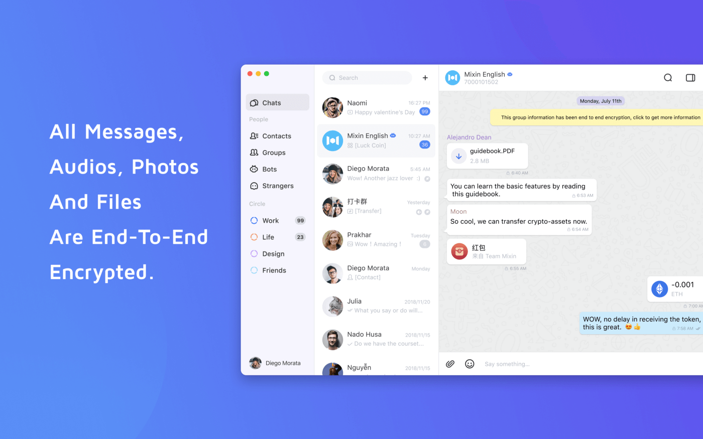
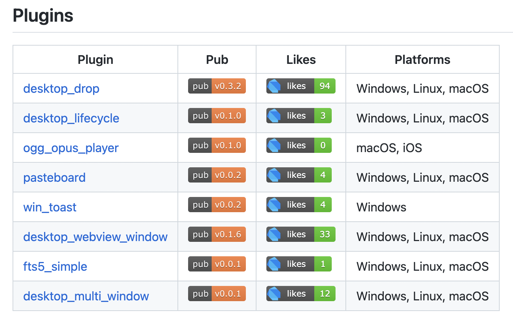

# Announcing Mixin Flutter Desktop Open Source

We are announcing a new Mixin Messenger desktop version open source, we use Flutter to build a new cross-platform version app. GitHub: [https://github.com/MixinNetwork/flutter-app](https://github.com/MixinNetwork/flutter-app)

## Flutter
When we plan to develop a desktop app for Windows, Linux and macOS, we choose Electron before, but as you know the Electron app is too big and costs much memory. So we looking for other cross-platform solutions, Flutter is an open source framework for building multi-platform applications. Our team paid attention to flutter very early. When it's support desktop, we think it's time to try Flutter to build our new Mixin Messenger desktop app.

Mixin Messenger is an open source end-to-end encryption messenger that uses signal protocol focused on safety and private message. For this purpose, We implement Signal Protocol on dart [https://github.com/MixinNetwork/libsignal_protocol_dart](https://github.com/MixinNetwork/libsignal_protocol_dart). And some plugins like drag files, paste images and files, open WebView on desktop. You can find the plugins on [https://github.com/MixinNetwork/flutter-plugins](https://github.com/MixinNetwork/flutter-plugins) or [https://pub.dev/publishers/mixin.dev/packages](https://pub.dev/publishers/mixin.dev/packages)

## Summary

Thanks for our remote teammates collaborative development of the Mixin Messenger Flutter desktop. Welcome Flutter developers contribute flutter app and issue bugs on GitHub. Hope to meet you on Mixin Messenger.

Official website download [https://mixin.one/mm](https://mixin.one/mm)
Windows store download [https://www.microsoft.com/en-us/p/mixin-desktop/9nq6hf99b8nj](https://www.microsoft.com/en-us/p/mixin-desktop/9nq6hf99b8nj)
Mac App Store [https://apps.apple.com/us/app/mixin-messenger/id1571128582](https://apps.apple.com/us/app/mixin-messenger/id1571128582)

## About Mixin Network

Mixin Network is an open-source, lightning-fast, and decentralized Web3 platform to bring speed and scalability to the blockchain. Mixin allows blockchains to gain trillions of TPS, sub-second final confirmation, zero transaction fee, enhanced privacy, and unlimited extensibility.

Mixin Network is a PoS network with 26 full nodes. As a layer-2 solution, it has supported 41 public blockchains including Bitcoin, Ethereum, Monero, Polkadot, etc. The total assets on the network have been over 2 billion US Dollars. Mixin is also a full-featured financial platform with functions of AMM, aggregating trade, pending orders on Exchange platforms, unbiased stable currency, etc. Mixin Network is dedicated to providing users with a decentralized blockchain infrastructure that always puts security, privacy, and decentralization first.

## Follow us:

Official Website:[https://mixin.one](https://mixin.one/)

Twitter: [https://twitter.com/Mixin_Network](https://twitter.com/Mixin_Network/)

Facebook: [https://www.facebook.com/MixinNetwork](https://www.facebook.com/MixinNetwork)
