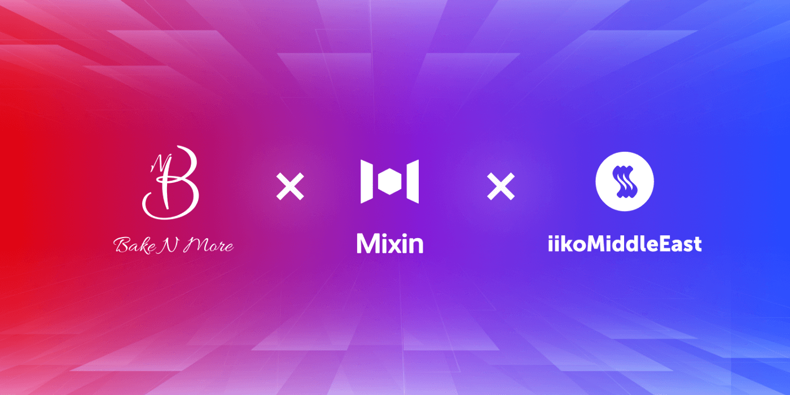

# Bake N More, the First Cafe in Dubai to Accept Crypto Payment-Powered by Mixin

[Bake N More](https://www.instagram.com/bakenmore.ae/"bakenmore"), a Dubai-based Café, is the most recent business in the city to accept digital currency as payment. At Bake N More, customers can pay for and enjoy their fresh baked goods with cryptocurrency without incurring any transaction fee. Bake N More will be serving freshly prepared all-day breakfast, brewed coffee, breads, baked goods, salads, and unique sandwiches. Bake N More's factory is equipped with an advanced, cutting-edge semi-automated assembly-line production that is operational round the clock and possesses the capacity to produce high volumes of products for the café's partners.

Talking about the thought process behind this charming new café and excited about its launch, Mohammad Al Hammadi, Owner of Bake N More said, "Our society needs the transition from eating unhealthy food filled by preservatives, artificial flavors, and emulsifiers, hence we decided to make the food space better by sharing our fresh and healthy products with our community. We lovingly bake a wide variety of breads, pastries, all kinds of slices, muffins, macarons, brownies, and more, while insisting on the finest ingredients and quality of the products. Our French award winner- executive chef, David Croiser, brings over 25 years' experience, he believes tasty foods don't need to be unhealthy, thus we have invested in the best ingredients and skilled human resources who are synergistically moving together to ensure that we deliver the highest quality product with the best customer service. We are delighted and privileged to welcome business partners and customers to our coffee shop and serve them with our fresh and hot out of the oven nourishments."

The contemporary café's open-source payment platform is handled by Mixin Network which allows customers to pay for their purchases with Bitcoin, Ethereum, Tether and 3 other major cryptocurrencies. All existing payment methods like cash, cards and online payments are accepted. Mixin Network is a lightning fast, decentralized Web3 platform that brings speed and scalability to blockchain and allows blockchains to gain trillions of TPS, sub-second final confirmation, zero transaction fee, enhanced privacy, and unlimited extensibility.

Delighted about their collaboration with Bake N More, Meng Chan Shu, Global Ambassador of Mixin Network said, "Mixin Messenger is not just a normal chatting app, it is also a decentralized crypto wallet that is connected to 41 blockchains with more than 2 billion USD under asset. It is also lightning fast in transferring tokens and has never been successfully hacked in the last 4 years. With no gas fee among users, it is a solution that can help Bake N More unlock the copious advantages of a payment system that is safe, speedy, and simple."

Bake N More's POS and ERP are powered by an all-in-one Dubai-based solution, IIKO, who brings advanced technologies to F&B outlets with an intelligent cloud-based system. IIKO is currently operating in 51 countries, covering multiple restaurant functionalities and brings superior operational practices into the life of a restaurant to help maximize their profits and minimize their hassle.

Optimistic about their partnership with Bake N More, Alex Ponomarev from IIKO said, "We are happy to collaborate with a trendsetting café like Bake N More and we are looking forward to helping them operate in the most business efficient manner. Along with the outstanding operational practices that we have introduced to the hospitality businesses, we will act as a technology center for the whole restaurant operation aggregating all the third-party solutions, including payments through Mixin Network, enhancing the overall functionality and providing more capabilities to the business".

Bake N More is here to cater to a clientele that loves healthy and fresh food that tastes good. Through their café, they want to build and maintain a business strategy that is prosperous and fruitful through the medium of providing quality upscale baked products for a variety of consumers. They are committed to providing superior quality to meet their customers' needs through progressive processes that help achieve sustained excellence.

## About Bake N More

Bake N More factory is equipped with an advanced, leading edge semi-automated assembly-line production that is operational 24 hours per day with the capacity to produce high volumes of products for our B2B partners. Also, we are privileged to welcome customers to our coffee shop and serve them with our fresh and hot out of the oven nourishments.

Our mission in Bake N More Factory is to create long-term partnerships with customers by ensuring to deliver the highest quality product with the best customer service. We are here to build and maintain a business strategy that is prosperous and fruitful involving a steady growth and innovation by providing a quality upscale baked product for various consumers. We are committed to provide valued quality to meet our customers' needs and to achieve excellence by following the safe and legal food products produced in compliance with all regulatory standards. To ensure best practice we have established the internationally recognized Hazard Analysis Critical Control Point (HACCP) system and applying the latest technology and innovation and our highly trained committed team ensure that all goods are produced in a way to meet our customers' requirement. Bake N More Factory provides services to businesses and individuals

Follow us: [Official Website](https://bakenmore.ae/)｜[Instagram](https://www.instagram.com/bakenmorecafe/?hl=en)｜[Facebook](https://www.facebook.com/bakenmoreAE)

## About Mixin Network

Mixin Network is an open-source, lightning-fast, and decentralized W3 platform to bring speed and scalability to the blockchain. Mixin allows blockchains to gain trillions of TPS, sub-second final confirmation, zero transaction fee, enhanced privacy and unlimited extensibility.

Mixin Network is a PoS network with 38 full nodes. As a layer-2 solution, it has supported 41 public blockchains including Bitcoin, Ethereum, Monero, Polkadot, etc. The total assets on the network have been over 2 billion US Dollars. Mixin is also a full-featured financial platform with functions of AMM, aggregating trade, pending orders on Exchange platforms, unbiased stable currency, etc. Mixin Network is dedicated to providing users with a decentralized blockchain infrastructure that always puts security, privacy, and decentralization first.

Follow us: [Official Website](https://mixin.one/)｜[Twitter](https://twitter.com/Mixin_Network/)｜[Facebook](https://www.facebook.com/MixinNetwork)｜[Medium](https://medium.com/mixinnetwork)｜[Email](contact@mixin.one)

## About IIKO East DMCC

iiko is a global restaurant POS & ERP provider opeating in 51 countries. Having started in 2005 iiko has been chosen by more than 70 000 venues and is operated daily in more than 45000 places across the globe. Covering all of the functionalities in the restaurant iiko brings the best operational practices into the life of a restaurant willing to raise profits and reduce hassle. iikoMiddleEast is iiko's branch covering the MENA region operating from Dubai. Over the last 3 years the company has gained more than 1000 venues in several countries.

Follow us: [Official Website](https://iiko.ae/)｜[Instagram](https://www.instagram.com/iikomiddleeast/)｜[Facebook](https://www.facebook.com/iikomiddleeast/)

