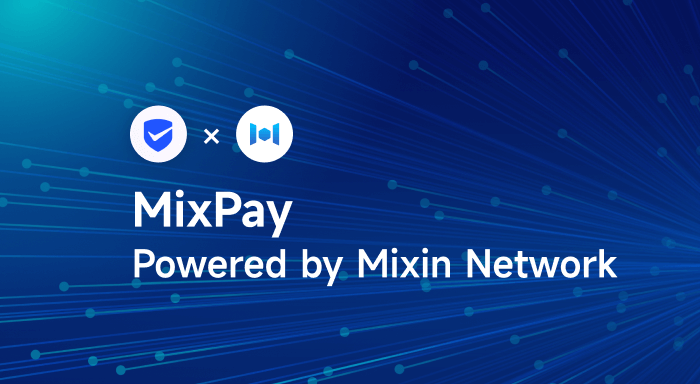

# MixPay, Crypto Payment Platform Powered by Mixin Network

[MixPay](https://mixpay.me/) is a decentralized crypto payment service platform built on [Mixin Network](https://mixin.one/) , founded in Nov, 2021. MixPay makes it easy to spend and accept cryptos as a secure payment platform in Web3.

MixPay supports more than 20+ cryptocurrencies and all on-chain crypto wallets. Regardless of what crypto payers pay with, payees can choose to accept the cryptos they prefer, and MixPay converts them automatically.

MixPay is very flexible because of its underlying ability to separate the three parts of quote, payment, and settlement. And it is the easiest way to accept online or offline payments in various cryptocurrencies with below key features:

- Global — Accept payment from anywhere in the world.
- Fast — Lightning fast experience.
- Secure — All assets are stored in a secure Mixin Network.
- Free — Zero gas fee via Mixin Messenger.
- Convenient — Support any cryptocurrency and any wallet.
- Powerful — Support three modes of settlement, individual, developer, and multi-signature account.
- Flexible — Separate quote, payment and settlement, and set your preferred cryptocurrency or fiat currency for these three parts.

As one of the features, MixPay supports three modes of settlement, individual, developer, and multi-signature account. Individuals are also known as Mixin Messenger users, assets settled to robots are programmable, and assets settled to multi-signature account can be easily managed by organizations or teams.

There are many usage scenarios for MixPay. For example, with the MixPay crypto Point-of-Sale system, your customers will be able to pay with cryptocurrency on-site in your shops or cafes, etc.

MixPay provides powerful developer API sets that can be adapted to various payment scenarios, which can be integrated by business entities, and non-profit organizations to help them get access to crypto payment functions for their business with ease.

## Documents
For users: [https://help.mixpay.me]([https://help.mixpay.me])
For developers: [https://developers.mixpay.me](https://developers.mixpay.me)

## Social
Official: [https://mixpay.me](https://mixpay.me)
Linktree: [https://linktr.ee/mixpay](https://linktr.ee/mixpay)
Twitter: [https://twitter.com/MixPayHQ](https://twitter.com/MixPayHQ)
Facebook: [https://www.facebook.com/mixpayhq](https://www.facebook.com/mixpayhq)
Instagram: [https://www.instagram.com/mixpay.me](https://www.instagram.com/mixpay.me)
Discord: [https://discord.gg/AtJr6ycfEy](https://discord.gg/AtJr6ycfEy)
Medium: [https://medium.com/@MixPayHQ](https://medium.com/@MixPayHQ)
Mirror: [https://mirror.xyz/mixpayme.eth](https://mirror.xyz/mixpayme.eth)
GitHub: [https://github.com/MixPayHQ](https://github.com/MixPayHQ)
Email: bd@mixpay.me

## About Mixin Network

Mixin Network is an open-source, lightning-fast, and decentralized Web3 platform to bring speed and scalability to the blockchain. Mixin allows blockchains to gain trillions of TPS, sub-second final confirmation, zero transaction fee, enhanced privacy, and unlimited extensibility.

Mixin Network is a PoS network with 26 full nodes. As a layer-2 solution, it has supported 41 public blockchains including Bitcoin, Ethereum, Monero, Polkadot, etc. The total assets on the network have been over 2 billion US Dollars. Mixin is also a full-featured financial platform with functions of AMM, aggregating trade, pending orders on Exchange platforms, unbiased stable currency, etc. Mixin Network is dedicated to providing users with a decentralized blockchain infrastructure that always puts security, privacy, and decentralization first.

## Follow us:

Official Website:[https://mixin.one](https://mixin.one/)

Twitter: [https://twitter.com/Mixin_Network](https://twitter.com/Mixin_Network/)

Facebook: [https://www.facebook.com/MixinNetwork](https://www.facebook.com/MixinNetwork)
