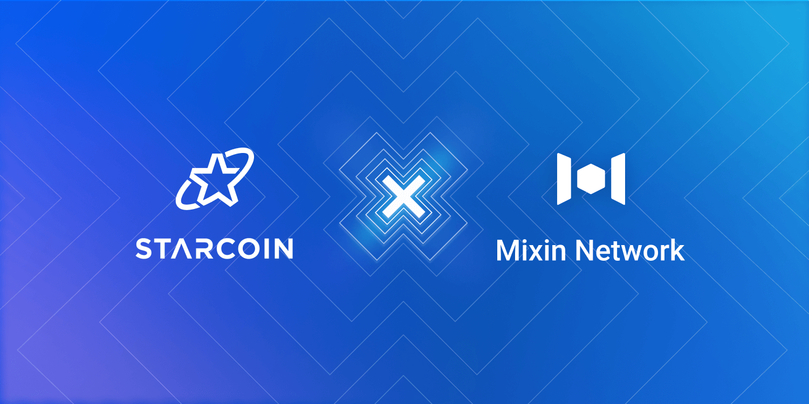

# Mixin Network Establishes Strategic Partnership With Starcoin

Mixin Network is glad to announce a strategic partnership with Starcoin. [Starcoin](https://starcoin.org/en/) is a proof-of-work blockchain that enables secure smart contracts based on Move to power services in Web 3.0. They provide the infrastructure that could become part of the metaverse.

The two parties will work together in market promotion, network construction, and global community expansion. This will include bringing more users to the Starcoin network and also give STC holders a chance to access and use the multiple DeFi applications on the Mixin Network.

Mixin Network and Starcoin will work closely to explore opportunities to integrate their networks in ways that benefit users, including more cross-chain perspectives. Providing solid infrastructure to the development of Web3.

Both Starcoin and Mixin Network care deeply about their users and communities. Welcome to join our growing community and get the latest news and progress!

## About Starcoin
Starcoin provides the utmost security from the origin via its enhanced PoW consensus and Secure smart contract, using the language of Move. Through layered and flexible interoperability, it optimizes the building of ecosystems such as DeFi, NFTs, Gaming, etc., with higher efficiency and convenience. This process redefines value by empowering every participant in the ecosystem to enjoy the multiplication of values.

## About Mixin Network
Mixin Network is an open-source, lightning-fast, and decentralized Web3 platform to bring speed and scalability to the blockchain. Mixin allows blockchains to gain millions of TPS, sub-second final confirmation, zero transaction fee, enhanced privacy and unlimited extensibility.

Mixin Network is a PoS network with 26 full nodes. As a wallet solution, it is currently supporting 44 public blockchains including Bitcoin, Ethereum, Avalanche, Polkadot, etc. The total assets on the network have been over 1 billion US Dollars. Mixin is also a full-featured financial platform with functions of AMM, aggregating trade, pending orders on Exchange platforms, unbiased stable currency, etc. Mixin Network is dedicated to providing users with a decentralized blockchain infrastructure that always puts security, privacy, and decentralization first.

Highest TVL: USD2.9 billion on November 10, 2021

Highest Daily Transaction Volume: 4.9 million transactions on August 27, 2021

User Base: 1 million

## Follow us:

[Official Website](https://mixin.one/)｜[Twitter](https://twitter.com/Mixin_Network)｜[Facebook](https://www.facebook.com/MixinNetwork)｜[Medium](https://medium.com/mixinnetwork)｜[Email](contact@mixin.one)｜[Instagram](https://instagram.com/mixinnetwork)

