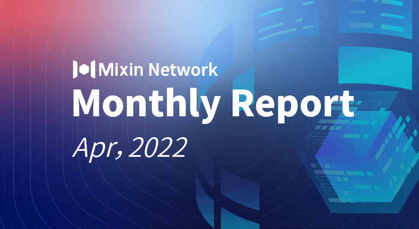

# Mixin Network Monthly Report — No. 38

04–01–2022 ~ 04–30–2022

## Mixin Mainnet

- The Mainnet has been running for 1157 days, and the topology height is 304,051,235 (+27,214,460)
- The top 100 assets of the entire network reach a total market value of $1,923,884,560
- There are a total of 2,306 (+34) asset types in the entire network
- There are 33 full nodes in the network

### Statistics of Popular Assets

| Assets     | Total Volume(fluctuating) | Number of Monthly Transaction |
|:----------:|:-------------------------:|:-----------------------------:|
| BTC        | 16,027(-1,962)         | 5,394,836 |
| BOX        | 65,831,610(+1,250,652) | 528,108   |
| ETH        | 64,043(-381)           | 537,753   |
| MOB        | 34,113,640(+967,706)   | 178,344   |
| ERC20 USDT | 56,339,991(+4,903,899) | 9,498,557 |
| USDC       | 43,349,847(+841,457)   | 17,274    |
| pUSD       | 22,723,298(+2,421,238) | 2,514,300 |
| EOS        | 8,436,224(+375,542)    | 212,673   |
| RUM        | 3,830,442(+8,352)      | 23,965    |
| TRC20 USDT | 9,065,453(+4,614,395)  | 1,942,774 |
| DOT        | 522,159(+16,797)       | 93,018    |
| DOGE       | 50,360,943(-7,940,317) | 62,535    |

  **The above data was collected around 00:50 (UTC+4) on May 1, 2022**

## Mixin Dapps

### Mixin Messenger

- The message disappearing function has been developed and will be tested and launched soon
- Voice call optimization
- MVM developer documentation is published
- Mixin Wallet bot 7000101500 supports viewing NFT in the wallet

### [Pando](https://pando.im/)

- Pando Wave, demand financial bot 7000104413 is launched
- MOB, RUM, SHIB and SOL were added to mortgage lending

### Links
- JPYC bot login has supported Mixin Messenger, Links and Fennec, [https://links.jpyc.jp](https://links.jpyc.jp)

### Exin

- Price warning function development

### [Trident](https://thetrident.one)

- Community NFT airdrop activities like Mixbot, CNFT, Pixiu and etc. are held
- Japanese version support
- Mi circle supports NFT verification for joining

## Others

- 04–20–2022
  Mixin Network Dubai users offline meet-up, sharing news of Mixin while enjoying the refreshments.
- 04–20–2022
  Blockchain media 77Finance joins the Mixin ecosystem.
- 04–21–2022
  MVM developer documentation releases: [https://mvm.dev](https://mvm.dev)
- 04–29–2022
  4swap is listed on Coingecko: [https://www.coingecko.com/en/exchanges/four_swap](https://www.coingecko.com/en/exchanges/four_swap)
- 04–30–2022
  The blockchain value discovery community Coinverse officially entered Mixin and conducted AMA activities related to the current NFT trend. The community also launches a double sign-in reward activity.
  
Key Points:
Mixin ecosystem NFT airdrop month; the official listing on Coingecko of 4swap is of great significance to the Mixin ecosystem; MixPay, crypto payment product in Mixin ecosystem, iterative upgrades and earns more merchants support; MVM is progressing steadily.

## About Mixin Network

Mixin Network is an open-source, lightning-fast, and decentralized Web3 platform to bring speed and scalability to the blockchain. Mixin allows blockchains to gain trillions of TPS, sub-second final confirmation, zero transaction fee, enhanced privacy, and unlimited extensibility.

Mixin Network is a PoS network with 26 full nodes. As a layer-2 solution, it has supported 41 public blockchains including Bitcoin, Ethereum, Monero, Polkadot, etc. The total assets on the network have been over 2 billion US Dollars. Mixin is also a full-featured financial platform with functions of AMM, aggregating trade, pending orders on Exchange platforms, unbiased stable currency, etc. Mixin Network is dedicated to providing users with a decentralized blockchain infrastructure that always puts security, privacy, and decentralization first.

## Follow us:

Official Website:[https://mixin.one](https://mixin.one/)

Twitter: [https://twitter.com/Mixin_Network](https://twitter.com/Mixin_Network/)

Facebook: [https://www.facebook.com/MixinNetwork](https://www.facebook.com/MixinNetwork)
