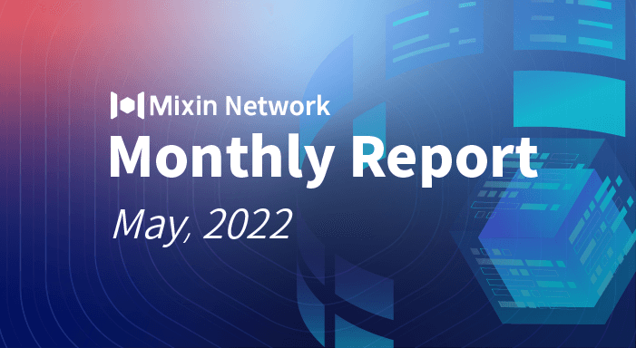

# Mixin Network Monthly Report — No. 39

05–01–2022 ~ 05–31–2022

## Mixin Mainnet

- The Mainnet has been running for 1188 days, and the topology height is 339,437,117 (+35,385,882)
- The top 100 assets of the entire network reach a total market value of $1,409,041,612
- There are a total of 2,357 (+51) asset types in the entire network
- There are 31 full nodes in the network

### Statistics of Popular Assets

| Assets     | Total Volume(fluctuating) | Number of Monthly Transaction |
|:----------:|:-------------------------:|:-----------------------------:|
| BTC        | 13,212(-2,815)          | 5,634,060  |
| BOX        | 68,463,077(+2,631,467)  | 579,425    |
| ETH        | 67,540(+3,497)          | 653,694    |
| MOB        | 35,440,746(+1,327,106)  | 243,865    |
| ERC20 USDT | 42,328,646(-14,011,345) | 14,799,368 |
| USDC       | 38,696,136(-4,653,711)  | 43,532     |
| pUSD       | 19,998,471(-2,724,827)  | 2,171,539  |
| EOS        | 9,172,539(+736,315)     | 220,791    |
| RUM        | 3,831,679(+1,237)       | 23,965     |
| DOGE       | 77,892,989(+27,532,046) | 58,277     |
| TRC20 USDT | 5,375,197(-3,690,256)   | 1,157,564  |
| UNI        | 887,618(+43,071)        | 114,709    |

  **The above data was collected around 22:00 (UTC+4) on May 31, 2022**

## Mixin Dapps

### Mixin Messenger

- Message disappearing function has been tested and the official version has been submitted for review
- The unification of Android, iOS and desktop strings has been completed, providing a basis for supporting more languages in the next step
- Homepage searching engine has supported entering a link to directly open a web page, providing a basis for the subsequent direct opening of Dapps
- Adding message loading animation
- The Android version has supported Android 11, and fixed the problem that the webpage cannot open external applications

### [Pando](https://pando.im/)

- Pando Leaf auction page and process optimization
- New logo designing for Pando series products
- The discussion of greatly reducing the minting interest of Pando Leaf, so as to further promote ecosystem development
- Credit score and regular investment group member information query Bot has been online

### Exin

- The price warning function has been launched
- Optimized part of the message prompt copy
- Small-value transactions support for part of cryptocurrencies (1U)

### MixPay

- Multi-signature account & Bot account support
- Page function optimization
- Access to multiple stores

### [Trident](https://thetrident.one)

- "Transfer" function support
- Original NFT designer certification support

## Others

- 05–14–2022
  Mixin team's second offline meetup in Dubai was held at Bake N More Cafe, where renowned artist Bravanft introduced his NFT works released in Trident.
- 05–10–2022
  Mixin's 4th Anniversary NFTs have started to be distributed.
- 05–16–2022
  Jun conducted an AMA on the topic of "How to prevent anxiety in the crypto market? What is the market trend" in Coinverse, one blockchain value discovery community on Mixin.
- 05–19–2022
  The super community began to officially promote to project parties in Japan, and the "CoinPost Super Community" has been launched on Links.
- 05–20–2022
  Jun conducted an AMA on the topic of "Let's talk about the value of ENS, should we buy it?" in Coinverse, one blockchain value discovery community on Mixin.
- 05–24–2022
  Thorb announced in Mi Circle that dozens of stores have accepted MixPay payments, covering various industries, and there are also more than a dozen projects under development for online integration.
- 05–24–2022
  Jun conducted an AMA on the topic of "BikeRush, one StepN imitation is online tonight! Can we invest in it?" in Coinverse, one blockchain value discovery community on Mixin.
- 05–31–2022
  Jun conducted an AMA on the topic of "About the breakthrough of BTC, where is the trend going? and the importance of trading systems" in Coinverse, one blockchain value discovery community on Mixin.
- 05–31–2022
  Mixin Network rose to 13th in the Defilama TVL public blockchain ranking.

## About Mixin Network

Mixin Network is an open-source, lightning-fast, and decentralized Web3 platform to bring speed and scalability to the blockchain. Mixin allows blockchains to gain trillions of TPS, sub-second final confirmation, zero transaction fee, enhanced privacy, and unlimited extensibility.

Mixin Network is a PoS network with 26 full nodes. As a layer-2 solution, it has supported 41 public blockchains including Bitcoin, Ethereum, Monero, Polkadot, etc. The total assets on the network have been over 2 billion US Dollars. Mixin is also a full-featured financial platform with functions of AMM, aggregating trade, pending orders on Exchange platforms, unbiased stable currency, etc. Mixin Network is dedicated to providing users with a decentralized blockchain infrastructure that always puts security, privacy, and decentralization first.

## Follow us:

Official Website:[https://mixin.one](https://mixin.one/)

Twitter: [https://twitter.com/Mixin_Network](https://twitter.com/Mixin_Network/)

Facebook: [https://www.facebook.com/MixinNetwork](https://www.facebook.com/MixinNetwork)
