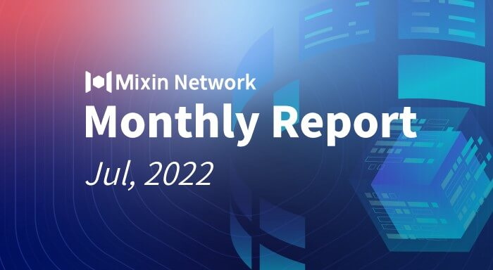

# Mixin Network Monthly Report — No. 41

2022-07-01 ~ 2022-07-31

## Mixin Mainnet

- The Mainnet has been running for 1250 days, and the topology height is 386,174,139 (+12,883,254)
- The top 100 assets of the entire network reach a total market value of $1,164,454,998
- There are a total of 2,407(+22) asset types in the entire network
- There are 26 full nodes in the network

### Statistics of Popular Assets

| Assets     | Total Volume(fluctuating) | Number of Monthly Transaction |
|:----------:|:-------------------------:|:-----------------------------:|
| BTC        | 13,343(+864)              | 809,235                       |
| BOX        | 72,615,594(+1,397,290)    | 477,173                       |
| ETH        | 78,455(+4,576)            | 538,573                       |
| MOB        | 36,544,965(+304,431)      | 159,589                       |
| USDC       | 35,402,693(-1,314,313)    | 19,625                        |
| ERC20 USDT | 34,900,662(+2,801,146)    | 2,778,909                     |
| pUSD       | 21,173,529(+837,701)      | 1,605,552                     |
| EOS        | 9,222,344(-97,045)        | 201,445                       |
| SOL        | 272,767(+25,996)          | 28,588                        |
| UNI        | 921,174(+9,585)           | 69,417                        |
| RUM        | 3,835,659                 | 10,569                        |
| DOGE       | 66,509,432(+4,770,936)    | 41,914                        |

  **The above data was collected around 21:00 (UTC+4) on August 01, 2022**

## Mixin Dapps

### Mixin Messenger

- Switching the default deposit address of Bitcoin to SegWit address
- Support Japanese version
- Support the function of notification window automatic floating by clicking when Bot is in use
- iOS version support searching Bot with system Spotlight
- Optimization of homepage loading and searching match
- Development of independent information bots

### [Pando](https://pando.im/)

- Pando Catkin launched: [https://catkin.pando.im/](https://catkin.pando.im/ "Pando Catkin")
- Toushi View has entered the closed beta stage and will be launched soon
- BOX lending and dismantling automation services are under development

### Exin

- Transak and Banxa fiat deposits support
- Regular investment function optimization, and USDC regular investment newly supported

### MixPay

- WordPress plugin support
- Twitter and Instagram retweet sweepstakes and contests holding
- Optimization of the user payment experience for on-chain payment

### [Trident](https://thetrident.one)

- Trident's main API documentation has been updated: [https://docs.thetrident.one/api/intro/](https://docs.thetrident.one/api/intro/ "Trident API")
- Adding site-wide activity page
- Activities on the collection page can be filtered by type
- Adjustment of NFT hidden logic
- Supporting MetaMask login

## Others

- 07–03–2022
  Mi Circle of Cedric Fung carried out the activity of lottery draw of 1 BTC, which was drawn according to the random number of Bitcoin with basic requirements of clicking likes and being in the circle during the whole event period.
- 07–06–2022
  By analysis of the mainnet UTXO, there are about 100,000 users holding XIN accounts, and users with 0.015 XIN airdrops have been excluded.
- 07–09–2022
  The MVM faucet has been online: [https://catkin.pando.im/](https://catkin.pando.im/ "Pando Catkin"), and MetaMask users can log in and claim for it.
- 07–15–2022
  Mixin global ambassador conducted an AMA event in Sinso Network's Telegram community.
- 07–19–2022
  Mixin partners with TapX and joined its ecosystem: [https://tapx.link/mixin/](https://tapx.link/mixin/ "TapX Link")
- 07–30–2022
  The Mixin team's first offline meetup in Kuala Lumpur Malaysia was held at the HWG Investment Bank.
  
## About Mixin Network

Mixin Network is an open-source, lightning-fast, and decentralized Web3 platform to bring speed and scalability to the blockchain. Mixin allows blockchains to gain trillions of TPS, sub-second final confirmation, zero transaction fee, enhanced privacy, and unlimited extensibility.

Mixin Network is a PoS network with 26 full nodes. As a layer-2 solution, it has supported 41 public blockchains including Bitcoin, Ethereum, Monero, Polkadot, etc. The total assets on the network have been over 2 billion US Dollars. Mixin is also a full-featured financial platform with functions of AMM, aggregating trade, pending orders on Exchange platforms, unbiased stable currency, etc. Mixin Network is dedicated to providing users with a decentralized blockchain infrastructure that always puts security, privacy, and decentralization first.

## Follow us:

Official Website:[https://mixin.one](https://mixin.one/)

Twitter: [https://twitter.com/Mixin_Network](https://twitter.com/Mixin_Network/)

Facebook: [https://www.facebook.com/MixinNetwork](https://www.facebook.com/MixinNetwork)
