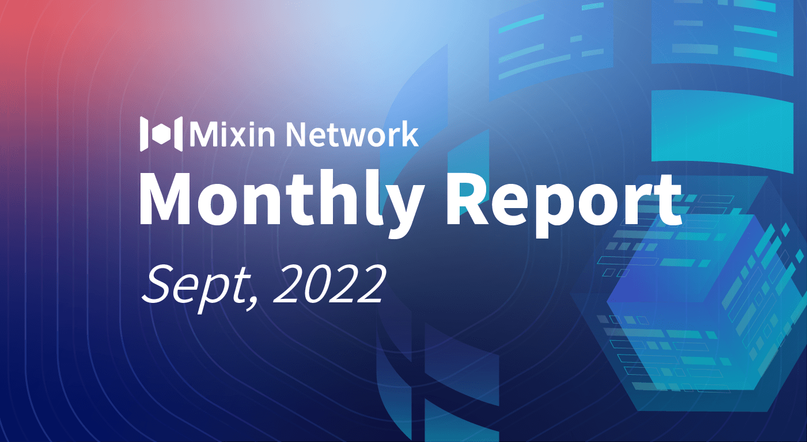

# Mixin Network Monthly Report — No. 43

2022–09–01 ~ 2022–09–30

## Mixin Mainnet

- The Mainnet has been running for 1311 days, and the topology height is 410,305,614 (+12,412,575)
- The top 100 assets of the entire network reach a total market value of $1,001,018,559
- There are a total of 2,449(+20) asset types in the entire network
- There are 25 full nodes in the network

### Statistics of Popular Assets

| Assets     | Total Volume(fluctuating) | Number of Monthly Transaction |
|:----------:|:-------------------------:|:-----------------------------:|
| BTC        | 12,813(+165)           | 594,550   |
| BOX        | 75,681,550(+1,377,737) | 407,994   |
| ETH        | 76,792(-2,882)         | 507,300   |
| MOB        | 38,259,035(+200,004)   | 191,745   |
| USDC       | 32,628,288(+38,714)    | 24,100    |
| ERC20 USDT | 29,627,404(-1,528,273) | 2,881,189 |
| pUSD       | 22,379,801(+199,985)   | 1,210,181 |
| EOS        | 8,504,134(+259,370)    | 380,404   |
| SOL        | 274,710(-717)          | 34,980    |
| UNI        | 971,605(+16,044)       | 82,671    |
| DOGE       | 72,683,077(+9,939,968) | 61,215    |
| RUM        | 3,835,817(+158)        | 6,294     |

  **The above data was collected around 23:00 (UTC+4) on October 01, 2022**

## Mixin Dapps

### Mixin Messenger

- Upgrade TIP protocol
- Development of adding send and receive functions on the home page of the wallet
- iOS 16 fit
- Fixed the problem that the logout interface display incorrectly
- Optimize database

### [Pando](https://pando.im/)

- Pando business data migration and optimization
- Construction of the content framework of the Mixin ecosystem website: mixin.network
- The new lending service has entered the closed beta stage

### Exin

- ExinPool newly support ETH 2.0 Staking, and has raised 12 nodes so far

### MixPay

- Obtained MSB license in Canada
- The new version of Checkout Page is online, and the payment experience is optimized
- Support Binance Pay

### [Quill](https://quill.im/)

- Major interface revision

## Others

- 09–05–2022
OptionDance supports MetaMask wallet.
- 09–10–2022
Mixin Network held an offline meetup with the theme "Trident, MVM, MixPay Updates and Bot Usage" in Dubai.
- 09–11–2022
MVM passed the audit from SlowMist: [https://github.com/MixinNetwork/audits](https://github.com/MixinNetwork/audits)
- 09–26–2022
The mainnet released version of 0.14.0, which adopts a new data encoding format, which takes up less space and is faster, improves network transmission efficiency and reduces the signature process with performance optimization.
- 09–27–2022
According to the statistics of the main network, the total number of CNB transactions exceeds 150 million, and the number of USDT transactions is 75 million.
- 09–28–2022
Data shows that Mixin Messenger's voice service was recently used by more than 30,000 people.
- 09–30–2022
Blockchain Explorer, ViewBlock officially supports Mixin: [https://viewblock.io/mixin](https://viewblock.io/mixin)
  
## About Mixin Network

Mixin Network is an open-source, lightning-fast, and decentralized Web3 platform to bring speed and scalability to the blockchain. Mixin allows blockchains to gain millions of TPS, sub-second final confirmation, zero transaction fee, enhanced privacy and unlimited extensibility.

Mixin Network is a PoS network with 26 full nodes. As a wallet solution, it is currently supporting 42 public blockchains including Bitcoin, Ethereum, Avalanche, Polkadot, etc. The total assets on the network have been over 1 billion US Dollars. Mixin is also a full-featured financial platform with functions of AMM, aggregating trade, pending orders on Exchange platforms, unbiased stable currency, etc. Mixin Network is dedicated to providing users with a decentralized blockchain infrastructure that always puts security, privacy, and decentralization first.

Highest TVL: USD2.9 billion on November 10, 2021

Highest Daily Transaction Volume: 4.9 million transactions on August 27, 2021

User Base: 1 million

## Follow us:

[Official Website](https://mixin.one/)｜[Twitter](https://twitter.com/Mixin_Network)｜[Facebook](https://www.facebook.com/MixinNetwork)｜[Medium](https://medium.com/mixinnetwork)｜[Email](contact@mixin.one)｜[Instagram](https://instagram.com/mixinnetwork)
