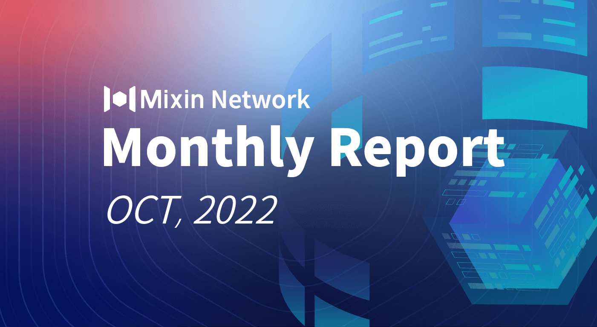

# Mixin Network Monthly Report — No. 44

2022–10–01 ~ 2022–10–31

## Mixin Mainnet

- The Mainnet has been running for 1341 days, and the topology height is 431,385,149 (+21,079,535)
- The top 100 assets of the entire network reach a total market value of $ 1,065,794,323
- There are a total of 2,473(+24) asset types in the entire network
- There are 26 full nodes in the network

### Statistics of Popular Assets

| Assets     | Total Volume(fluctuating) | Number of Monthly Transaction |
|----------:|:----------------------:|:---------:|
| BTC        | 13,084(+272)           | 2,724,005 |
| BOX        | 75,681,550(+1,377,737) | 407,994   |
| ETH        | 76,295(-497)           | 242,935   |
| USDC       | 33,177,473(+549,185)   | 1,977,199 |
| MOB        | 38,952,686(+693,650)   | 2,480,762 |
| ERC20 USDT | 29,627,404(-1,528,273) | 2,881,189 |
| pUSD       | 22,299,253(-80,548)    | 1,063,628 |
| EOS        | 8,772,112(+267,978)    | 380,404   |
| SOL        | 275,015(+305)          | 2,081,822 |
| DOGE       | 72,118,533(-564,544)   | 819,614   |
| UNI        | 987,079(+15,474)       | 69,236    |
| RUM        | 3,836,102(+285)        | 4,289     |
  **The above data was collected around 20:00 (UTC+4) on October 31, 2022**

## Mixin Dapps

### Mixin Messenger

- Release the official version of TIP
- Support positioning to the message location by long pressing on the chat picture
- The blockchain that has stopped running or is rarely used displays a reminder that recharge is not supported, and transfers and withdrawals are not affected
- iOS 16 supports long-pressing the chat picture to recognize text
- Support withdrawal fees without using mainnet tokens, such as eUSD
- Fixed the problem that new mobile phone number blocks in some regions do not support login

### [Pando](https://pando.im/)

- pUSD consumer mall Bazaar (7000104756) launched
- Pando Catkin launches with Mixin bot 7000104655
- Pando series products support MVM

### MixPay

- Checkout Page optimization, newly support for Solana Pay
- Support pUSD pricing, payment and settlement
- Cooperation with ".bit", "MyCointool", "WOM", "SUI world", and "APTOS world"

### [Quill](https://quill.im/)

- Trident Assistant adds the function of uploading attachments, making it easier to create NFTs in batches

## Others

- 10–06–2022
Mixin Network now supports the 42nd blockchain XDC Network.
- 10–10–2022
Mixin supports MobileCoin's ecological stable currency eUSD the first time. Different from other non-mainnet tokens, eUSD transfer fees use eUSD instead of the mainnet token MOB.
- 10–13–2022
The BigONE team released the Mixin trading bot, which supports limit price, market price and trigger orders, and supports 9 currency transactions such as ETH, BTC, SOL, and MOB.
- 10–14–2022
OOKC and Mixin co-held the first Crypto After Party in Dubai with more than 100 participants.
- 10–17–2022
The content of mixin.one has been updated, adding MVM, TIP, MTG modules.
- 10–20–2022
Mixin Network now supports the 43rd blockchain Aptos.
- 10–23–2022
MVM passes IOActive's audit:
[https://github.com/MixinNetwork/audits/blob/main/mixin-virtual-machine-ioactive.pdf](https://github.com/MixinNetwork/audits/blob/main/mixin-virtual-machine-ioactive.pdf)
- 10–27–2022
Mixin Network now supports the 44th blockchain Starcoin.
  
## About Mixin Network

Mixin Network is an open-source, lightning-fast, and decentralized Web3 platform to bring speed and scalability to the blockchain. Mixin allows blockchains to gain millions of TPS, sub-second final confirmation, zero transaction fee, enhanced privacy and unlimited extensibility.

Mixin Network is a PoS network with 26 full nodes. As a wallet solution, it is currently supporting 44 public blockchains including Bitcoin, Ethereum, Avalanche, Polkadot, etc. The total assets on the network have been over 1 billion US Dollars. Mixin is also a full-featured financial platform with functions of AMM, aggregating trade, pending orders on Exchange platforms, unbiased stable currency, etc. Mixin Network is dedicated to providing users with a decentralized blockchain infrastructure that always puts security, privacy, and decentralization first.

Highest TVL: USD2.9 billion on November 10, 2021

Highest Daily Transaction Volume: 4.9 million transactions on August 27, 2021

User Base: 1 million

## Follow us:

[Official Website](https://mixin.one/)｜[Twitter](https://twitter.com/Mixin_Network)｜[Facebook](https://www.facebook.com/MixinNetwork)｜[Medium](https://medium.com/mixinnetwork)｜[Email](contact@mixin.one)｜[Instagram](https://instagram.com/mixinnetwork)
