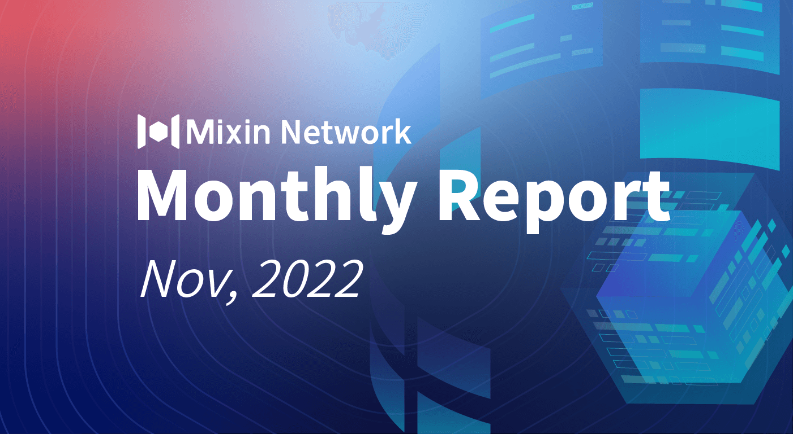

# Mixin Network Monthly Report — No. 45

2022–11–01 ~ 2022–11–30

## Mixin Mainnet

- The Mainnet has been running for 1373 days, and the topology height is 449,427,101 (+18,041,952)
- The top 100 assets of the entire network reach a total market value of $757,636,594
- There are a total of 2,487(+14) asset types in the entire network
- There are 26 full nodes in the network

### Statistics of Popular Assets

| Assets     | Total Volume | Number of Monthly Transaction |
|----------:|:----------------------:|:---------:|
| BTC        | 9,303                  |	1,772,548 | 
| BOX	       | 78,332,249             | 364,760   |
| ETH      	 | 76,145               	| 404,690   |
| USDC       | 33,273,363	            | 32,685    |
| MOB        | 39,518,421             |	327,134   |
| USDT(ERC20)| 27,079,932           	| 2,164,501 |
| pUSD	     | 13,646,676	            | 1,150,498 |
| EOS        | 6,871,639            	| 201,023   |
| SOL	       | 16,495	                | 90,784    |
| DOGE	     | 72,905,182	            | 170,990   |
| UNI        | 1,001,010	            | 117,488   |
| RUM        | 3,839,533            	| 10,282    |
  **The above data was collected around 14:00 (UTC+4) on December 02, 2022**

## Mixin Dapps

### Mixin Messenger

- Support bot authorization to enter PIN to improve security and privacy
- Wallet adds network selection steps for recharge
- Optimize voice call

### MVM Bridge

- Swap supports both 4swap and MixPay
- Asset list optimization, support asset details page, support adding Token to MetaMask
- Added Swap for Gas module
- Add MVM Ecosystem module
- Optimize recharge logic
- Optimize Swap interaction details
- Increase global recharge progress reminder

### [Pando](https://pando.im/)

- OneKey hardware wallet, mobile phone recharge, and books that support MVM are listed on Bazaar
- Enhanced security of Pando series products

### ExinOne

- Officially supports the pending order function, and has supported up to 39 trading pairs

### MixPay

- Support OKX Wallet
- MixPay Dashboard supports MVM login
- Added bill function
- Cooperation with “EDNS”, “TokenPocket”, and “Nervos Network”

### [Quill](https://quill.im/)

- Add “My Wallet” module

## Others

- 11–02–2022
Mixin public blockchain was officially included by CryptoRank, a crypto market data aggregation and analysis platform: [https://cryptorank.io/price/mixin](https://cryptorank.io/price/mixin)

- 11–03–2022
MVM Bridge is included by DeBridges, a bridge aggregation platform: [https://debridges.com/bridge/mvm-bridge](https://debridges.com/bridge/mvm-bridge)

- 11–06–2022
Pando Rings suffered a price hacking attack, this attack was not related to Mixin Network, here is the official announcement: [https://pando.im/news/2022/2022-11-06-alert-to-pando-community-hack-of-pando-rings/](https://pando.im/news/2022/2022-11-06-alert-to-pando-community-hack-of-pando-rings/)

- 11–07–2022
Mixin Global Ambassador held an AMA event with XinFin Network.

- 11–14–2022
Mixin Safe multi-signature cold wallet security model design is released, developed by the Mixin mainnet development team.

- 11–17–2022
The Mixin Network team participated in the Web3Dubai Developers Conference, along with MixPay, Bake N More and RedteaGo teams. There was also an airdrop event of 50,000 Satoshi for downloading Mixin Messenger.

- 11–20–2022
Pando Rings and Pando Leaf resumed operations (some functions are limited). Thanks to the support of two special users in Rings, the loss caused by this invasion will not be borne by other Rings users. In other words, if you deposit assets in Rings, you will not lose any, as Rings will provide enough assets to accept it, and every function will be as usual, more specifications here: [https://quill.im/764392/61a394bc-fea8-419c-a93c-462576ddf00c](https://quill.im/764392/61a394bc-fea8-419c-a93c-462576ddf00c)
  
## About Mixin Network

Mixin Network is an open-source, lightning-fast, and decentralized Web3 platform to bring speed and scalability to the blockchain. Mixin allows blockchains to gain millions of TPS, sub-second final confirmation, zero transaction fee, enhanced privacy and unlimited extensibility.

Mixin Network is a PoS network with 26 full nodes. As a wallet solution, it is currently supporting 44 public blockchains including Bitcoin, Ethereum, Avalanche, Polkadot, etc. The total assets on the network have been over 1 billion US Dollars. Mixin is also a full-featured financial platform with functions of AMM, aggregating trade, pending orders on Exchange platforms, unbiased stable currency, etc. Mixin Network is dedicated to providing users with a decentralized blockchain infrastructure that always puts security, privacy, and decentralization first.

Highest TVL: USD2.9 billion on November 10, 2021

Highest Daily Transaction Volume: 4.9 million transactions on August 27, 2021

User Base: 1 million

## Follow us:

[Official Website](https://mixin.one/)｜[Twitter](https://twitter.com/Mixin_Network)｜[Facebook](https://www.facebook.com/MixinNetwork)｜[Medium](https://medium.com/mixinnetwork)｜[Email](contact@mixin.one)｜[Instagram](https://instagram.com/mixinnetwork)
