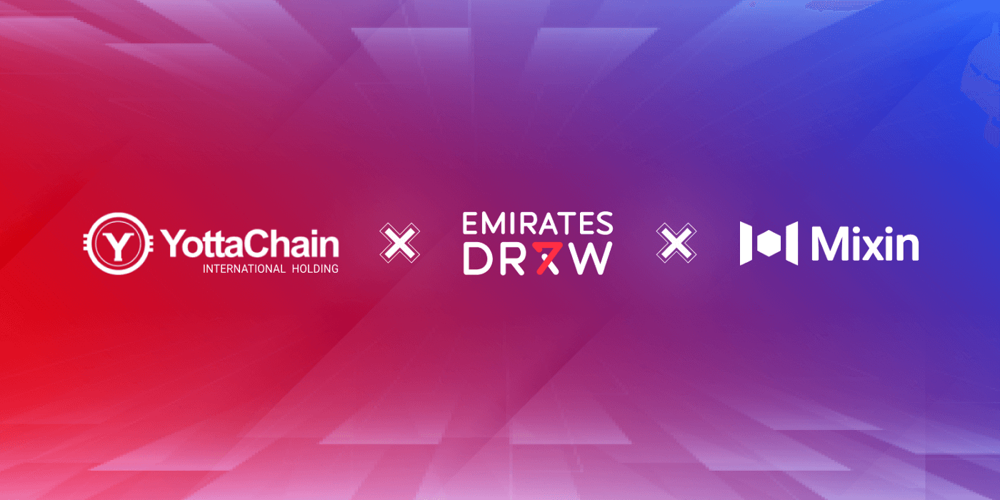

# Mixin Network Partners with YottaChain International Holding and Emirates Draw to Provide Access for Crypto Holders

**Dubai, UAE March 9, 2022:** Mixin Network is pleased to announce a strategic partnership with YottaChain International Holding Limited (DIFC), a leading technology company specializing in the decentralization of data storage solutions, to support Emirates Draw, the socially responsible UAE-based organization, to allow crypto holders across the globe an opportunity to participate in Emirates Draw.

The first phase will allow payments in USDT, a well-known and stable token, through a decentralized application (dApp). Mixin Network will collaborate with YottaChain International Holding to open access for additional tokens in the future, easing access for further crypto communities to participate in Emirates Draw.

**Mr. Hans Yuewen, Chairman of YottaChain International Holding, said:**
"We take great pride in the cooperation with Emirates Draw and Mixin Network which will help expand the application ecology of YottaChain and realize the diversification of its applications. We were also seduced by the unique ‘Coral Reef Regeneration Programme' led by Emirates draw that makes our world a better place."

The support from Mixin Network and YottaChain will ensure consumers have greater access to, and understanding of, Emirates Draw through cryptocurrency. Crypto users who wish to participate in Emirates Draw could access the dAPP section in Mixin Crypto Wallets.

## About Mixin Network
Mixin Network is an open-source, lightning-fast, and decentralized W3 platform to bring speed and scalability to the blockchain. Mixin allows blockchains to gain trillions of TPS, sub-second final confirmation, zero transaction fee, enhanced privacy and unlimited extensibility.

Mixin Network is a PoS network with 37 full nodes. As a layer-2 solution, it has supported 41 public blockchains including Bitcoin, Ethereum, Monero, Polkadot, etc. The total assets on the network have been over 2 billion US Dollars. Mixin is also a full-featured financial platform with functions of AMM, aggregating trade, pending orders on Exchange platforms, unbiased stable currency. Mixin Network is dedicated to providing users with a decentralized blockchain infrastructure that always puts security, privacy, and decentralization first.

## About YottaChain International Holding (DIFC)
YottaChain International Holding (DIFC) is a leading technology company specializing in the decentralization of data storage solutions. Embracing blockchain solutions, the company has later developed, launched, and supported various crypto related projects in IT, eCommerce, and the Metaverse.

## About Emirates Draw
A socially responsible UAE based organization that aims to support local environmental causes and initiatives through the CSR programmes that it spearheads. The organization aspires to provide ‘For a Better Tomorrow' and radically improve everyday life for its lucky winners and society at large. Inclusive to all, eligible participants (18 years and above) are entered into two weekly draws; the first draw featuring seven guaranteed winners of AED 77,777 each and the second draw for six prize categories including the largest Grand Prize in UAE history of AED100 million.

## For more information, please contact:
[Twitter](https://twitter.com/Mixin_Network) | [Telegram (Official)](https://t.me/MixinCommunity) |[Reddit](https://www.reddit.com/r/mixin/)| [Medium](https://medium.com/mixinnetwork) | [Facebook](https://www.facebook.com/MixinNetwork) | [Official Website](https://mixin.one/)

Email: contact@mixin.one