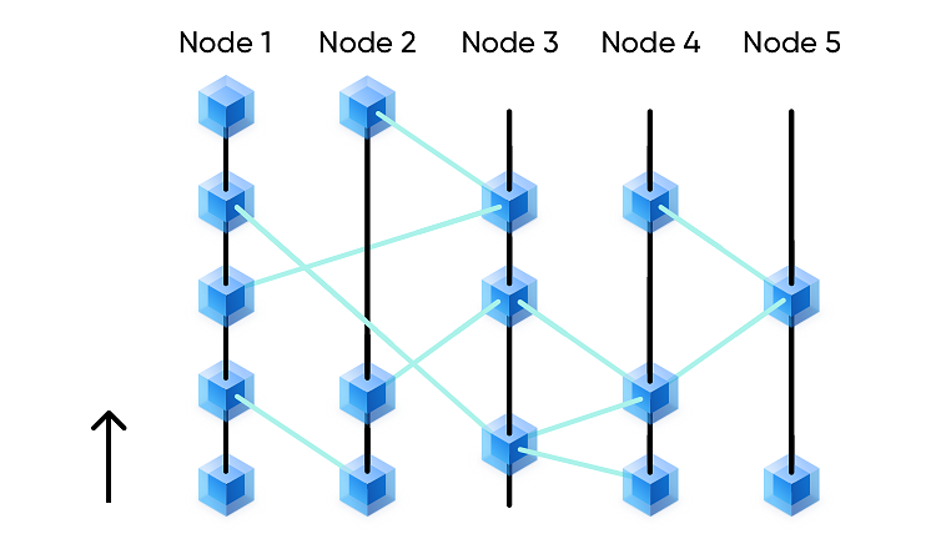
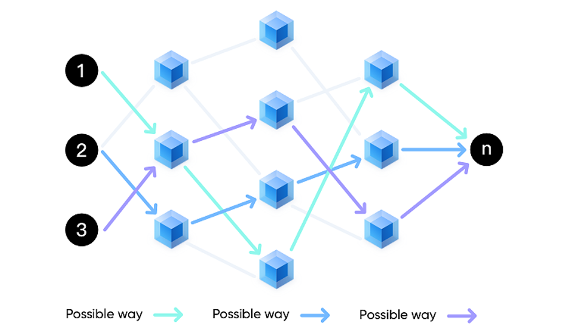

# The Introduction of Mixin Network

## Short Brief
Mixin is a free, lightning-fast, and decentralized network for transferring digital assets. It helps the existing distributed ledgers, such as BTC, ETH, and EOS, to obtain billions of TPS, sub-second confirmation, zero transfer costs, enhanced privacy, and unlimited scalability.
## Basic info
* Start Date: October 2017
* Total suply: 1,000,000 XIN
* Consensus: PoS + Asynchronous BFT
* Finality: Less than 1 second
* Data structure: DAG
* Node: Maximum 50 full nodes, minimum 7 full nodes, 32 full nodes are running now.
* Mining rule: 10% of the remaining mining pool would be mined and rewarded to the running nodes.
* Safety reinforce: Trusted Execution Environment (TEE)
* Cross-chain technology: Sidechain

## Network Features
### Multiple security
PoS decentralized network, TEE hardware reinforcement, and tens of thousands of light nodes supervise the whole nodes to prevent doing evil.
### Ultra-high concurrency
It can be directly applied to large commercial applications, and its performance is close to traditional centralized servers. It can achieve thousands of million or even higher TPS by upgrading hardware, bandwidth, etc.
### Free Transfer
User transfer is free with no cost, which can meet the commercial application scenarios such as small payment and daily consumption.
### Real-time transfers
At present, it takes only 300 milliseconds for 32 nodes to complete the verification and signature of a transfer, and there are no risks such as transaction rollback and double-spending.
### Support diverse blockchains
Now supports 41 blockchains such as Bitcoin, Bitcoin Cash, Bitcoin SV, Ethereum, Ethereum Classic, Dogecoin, Litecoin, Zcash, Dash, Tezos, Namecoin, NEM, Stellar, Ripple, EOS, Polkadot, Monero, NEAR, Horizen, Avalanche, Arweave, Akash, Algorand, Kusama, Solana, Filecoin, Binance Chain, Cosmos, Handshake, Decred, etc., and more than 100,000 tokens.
### Easy Management
A single account manages multi-chain assets, dramatically simplifies the difficulty of asset management for users, and supports new blockchains by default.
### Co-management by multi-Signature
Support up to 255 people to co-manage multi-signature assets, suitable for teams and families to jointly manage large amounts of assets, also suitable for B2C and C2C platforms to co-manage funds, and the platform cannot misappropriate the funds of users and merchants.
### Transaction privacy
Only two parties know the transaction, and the full nodes can't identify the two sides of the transaction, which means that the specific two sides of the transaction can't be deduced from the transaction itself.
### Easier Compliance
While the dual-key structure ensures asset anonymity, users can actively provide their view key for accounting queries, which can be used for tax filing and accounting audits, etc., while assets will not be transferred.
### Eco-friendly
No license requires easy access, stable service, and an affordable cost. The standard REST API interface allows developers to quickly implement products and services in any familiar language with low learning costs. Most importantly, developing applications based on Mixin is expected to be as affordable as using AWS cloud services with excellent performance and moderate prices.
### Network Stability
Most blockchains on the market have a fatal flaw - node network security is heavily influenced by the price of the coin, and when the price of the coin falls below the cost price, the nodes start to decrease, thus threatening the network security. In contrast, Mixin's nodes achieve long-term stable profitability by charging separate Dapp API call fees, similar to AWS cloud services, ensuring the entire network's safe and stable continuous operation. It is also a must-have feature for commercial-grade blockchains.
## Core technologies
### Cross-chain ledger
The sidechain synchronizes and listens to all Mixin-related transactions from the main chain. All external deposits, withdrawals, and internal transfers are recorded in a decentralized distributed ledger. In contrast, the main chain assets are transferred to a multi-signature address jointly managed by all nodes. Each record contains the following information: asset type (e.g., Bitcoin, Ethereum, etc.), transfer amount, etc., and is tamper-proof and traceable. Mixin has no coin/token issuance, so there are no mainnet tokens, and no assets come out of thin air.

The Mixin cross-chain solution is somewhat similar to an exchange but with decentralized nodes that jointly manage assets, with open-sourced and transparent code and data, and a focus on one thing - transfer.
### Directed Acyclic Graph Technology (DAG)
Mixin adopts DAG as the underlying data structure model. Unlike other DAG blockchains (e.g., IOTA, Bytaball, etc.), Mixin has no central authority node. The data does not need to wait for the final confirmation from the central authority node. It ensures efficient asynchronous operation by limiting the time of referencing data and guarantees the correctness of consensus results by Asynchronous BFT. It can be simply understood that each full node of Mixin is a chain with complete data, but the order of the data is different, and eventually all can derive the same result:

### Trusted Execution Environment (TEE)
Mixin uses Intel SGX as the TEE implementation to further enhance security. All full nodes must run in a Trusted Execution Environment, ensuring that the "coda for the full node running" is "the code it claims to be running." No one can change the running code in the trusted execution environment without being aware of it.

### Privacy Enhancements
The privacy of UTXO transactions is enhanced by CryptoNote technology so that only the two parties to a transaction know about it. In other words, the full node cannot identify the two parties to the transaction, meaning that no specific parties to a transaction can be deduced from the transaction itself:

In summary: the finite number of PoS nodes, DAG, UTXO, Asynchronous BFT, CryptoNote, TEE, with these subtle combinations of technologies, it achieves data tamper-evidence and solves performance bottlenecks, double-spending, privacy, scalability, and other issues.
## Node Network
### Full Nodes
Full nodes are mainly responsible for bookkeeping, verifying, and signing each transaction. Each transaction needs to be verified and signed by two-thirds plus one of the nodes before it finally takes effect.
#### Join the node
No license is required, and the node can join anonymously by pledging 2% of the previous year's circulation. For example, it pledges 10,000 XIN in the first year and 11,000 XIN in the second year to become the full node; the hardware equipment for joining the full node is 8 core CPU + 32 G RAM + 500G SSD + 100 M bandwidth, which costs less than 500 USD per month.
#### Withdrawal from the node
No license is required.
### Light Nodes
Light nodes also require collateral, and their role is mainly to oversee full node bookkeeping and schedule automatic voting.
## XIN Token
### Allocation
* 50% Mining pool node incentive
* 40% Uniformly sold via exchange at 1 XIN / 20 EOS, no angels, no cornerstones, no private placements
* 5% Incentive for whitelist users
* 5% Core development team
### Circulation
As of May 2022, about 329,871 XIN remains in the mining pool. Currently, 89.87671224 XIN are released from the mining pool every day, and the trend is decreasing year by year, the circulated XIN is about 639,117:
* Nodes pledge 444,010 XIN; most of them are retail crowdfunding nodes. The others are mainly institutions and other teams, such as Onda Group, LaoMao team, etc.
* About 258,657 XIN are on the market.
### USE
* To pledge to participate in the full node bookkeeping and get mining revenue.
* The pledge participates in light nodes, oversees full node bookkeeping, and arranges automatic voting.
* To pledge to participate in Domain to manage assets and co-managing assets with nodes.
* Voting to participate in community governance, such as voting on the amount of penalty for misbehaving nodes, what chains to access, kernel specifications, or specific policies in the upgrade process.
* Creating a Dapp requires a one-time consumption of some XINs.
* Cost for API calls.
### Listed Exchanges
* [BigONE](https://big.one/en/trade/XIN-EOS)
* [4swap](https://mixin.one/codes/2140515d-b77f-4476-92f6-39d953c74cc5)
* [ExinSwap](https://mixin.one/codes/d1790a2e-da04-429c-b289-5ecac43863a2)
## Dapps and ecosystems
### [Mixin Messenger](https://mixin.one/messenger)
The first dapp is based on Mixin Network, a messenger powered by Signal protocol, protects privacy by end-to-end encryption, and supports cryptocurrency wallet features. It's simple to manage assets with a 6-digit PIN and your phone number. Because more and more projects and community developers enroll in the Mixin ecosystem, each Mixin user can trade any assets that Mixin Network supports in one-step, with no delay, no much costs. It's available on both [App Store](https://itunes.apple.com/us/app/id1322324266) and [Google Play Store](https://play.google.com/store/apps/details?id=one.mixin.messenger).
### [MixPay](https://mixpay.me/)
MixPay simplifies and improves Web3 Payments with the power of Mixin Network. Accept any crypto with on-the-fly conversion.
### [Poolin](https://poolin.com/)
Poolin is boasting unique financial resources to escort your asset appreciation relying on the industry's leading industry accumulation and global vision.
### [ExinOne](https://mixin.one/codes/310e1f2b-2fc7-4ae0-ae2c-2f4c189808b1)
One-stop trading tool, token to token based trading connecting to Binance and Huobi, with non custody.
### [4swap](https://mixin.one/codes/2140515d-b77f-4476-92f6-39d953c74cc5)
Similar to Uniswap mechanism, current TVL exceeds 100 million US dollars, with a 24-hour trading volume of 8 million US dollars.
### [MixSwap](https://mixin.one/codes/77919b5f-9e6e-42ed-9ed7-961adbe7fdbd)
MixSwap is the MiFi DEX aggregation trading platform of Exin.
### [Pando Leaf](https://mixin.one/codes/2056124b-1076-4416-a068-32ac85564568)
Token pledge minting application which has passed 2 companies' audit. The pledged assets are close to 50 million US dollars.
### [ExinPool](https://mixin.one/codes/791f20db-51ce-4af2-918b-7496864ab833)
A staking platform for cryptocurrencies that work like Fixed Deposit.

## Core developers
The core team developed VPlayer from 2011 to 2015, which gained 40 million users worldwide by self-growth. The Vitamio SDK released during the period was licensed by many famous companies such as Weibo, Cheetah Jinshan, and Ku6; the Shou.TV handheld mobile game live streaming developed from 2015 ~ 2017 and gained 10 million users worldwide.
### Cedric Feng - CEO & Co-founder
He is an expert in audio and video, proficient in Go, Ruby, Android, and other full-stack development, and has a deep understanding of the product. After dropping out of college to make Android App in Google Play, he joined Yixia technology company to be in charge of VPlayer and Vitamio. He set up a new company in 2014 to focus on overseas mobile game live streaming.
### Crossle Song - - CTO & Co-founder
Ex-president of the science and technology research institute in Yixia, he was responsible for researching and developing the product line related to video playback. As he has a deep understanding of Android and iOS audio and video, he helped the company connect Vitamio with hundreds of millions of users, including Weibo and Cheetah.
### Jun Tang - Product Director & Co-Founder
Ex-research and development manager in Yixia, he was responsible for the Android development of the MiaoPai app. He has rich experience in Android and iOS development and has a deep understanding of user experience.

**Annoucement** This article is translated from [《区块链项目 — — Mixin 公链》](https://w3c.group/c/1573118879471104), written by 长不老
