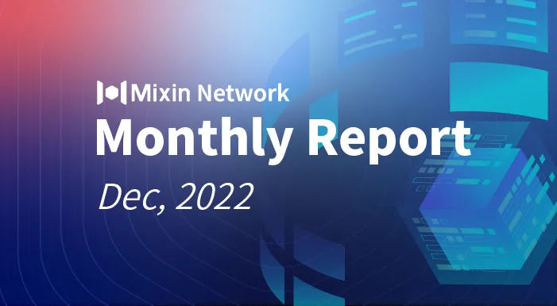

# Mixin Network Monthly Report — No. 46

2022–12–01 ~ 2022–12–31

## Mixin Mainnet
- The Mainnet has been running for 1402 days, and the topology height is 471,134,512 (+21,707,411).
- The top 100 assets of the entire network reach a total market value of $738,864,697.
- There are a total of 2,529 (+42) asset types in the entire network.
- There are 26 full nodes in the network.

### Statistics of Popular Assets

| Assets     | Total Volume | Number of Monthly Transaction |
|----------:|:----------------------:|:---------:|
| BTC        | 9,604                  |	977,616 | 
| BOX	       | 79,546,104             | 310,559   |
| ETH      	 | 77,190               	| 200,629   |
| USDC       | 33,273,363	            | 32,685    |
| MOB        | 40,809,227             |	414,285   |
| USDT(ERC20)| 24,260,204           	| 1,525,003 |
| pUSD	     | 12,720,521	            | 1,194,897 |
| EOS        | 6,859,480            	| 150,688   |
| DOGE	     | 75,026,848	                | 63,667    |
| UNI	     | 1,049,114	            | 81,419   |
| RUM        | 3,844,969	            | 8,643   |
| USTD(TRC20)        | 3,733,231            	| 38,098    |
  **The above data was collected around 12:00 (UTC+4) on Jan. 01, 2023**

## Mixin Dapps
### Mixin Messenger
- The crypto selection section in wallet search and transfer, supports displaying TRC-20, BEP-20 and other type labels to help users better distinguish multi-chain assets.
- Currency newly support CAD and TWD.
- Reduce and optimize third-party library references.
- Detail optimization and bug fixes.

### MVM Bridge
- Support login-free preview, and replace to a new login MetaMask and WalletConnect framework.
- Optimize the global recharge query and greatly improve performance.
- The browser API supports returning the corresponding asset id and price, which is convenient for MVM developers to use.
- Support dynamic query of transaction fees.

### Pando

- The new lending and borrowing product Leading begins internal testing.
- Pando series products start to design a new version.
- The Pando products deprecate Pando Seed and use ETH as a utility token instead, which is more friendly to MVM users.

### ExinOne
- Polygon, BNB chain and TON token trading support.
- Support of USDT, USDC, MATIC and ETH cross-chain exchange free of charge.

### MixPay
- Cooperation with OneKey, and OneKey Mall supports the use of MixPay.
- The Checkout page supports USDT-BEP20, USDT-Polygon and other tokens on BSC and Polygon for payments.
- MixPay+ supports BitKeep wallet.
- Carried out an AMA on MixPay Protocol in the Telegram group of EDNS.
- Participate in FaTPay’s Twitter Space event themed “Competition and Monopoly in Web3” as a guest.

### Quill
- Optimize the payment process for MVM users
- Optimize the Swap payment process
- Add Twitter connection

## Others
- 12–01–2022
Starcoin establishes an official community in Mixin and holds a 3-day lucky coin event.

- 12–06–2022
Mixin Network now supports the 45th public chain BSC (Binance Smart Chain).

- 12–07–2022
Mixin Network now supports the 46th public chain Polygon.

- 12–07–2022
The Mixin team has successfully bid for the “mixin” username on Telegram: https://fragment.com/username/mixin

- 12–21–2022
Mixin’s ranking rose to the TOP 10 in DefiLlama.

- 12–21–2022
Annabelle from Starcoin conducted an AMA in the Starcoin Chinese group with the theme “In-depth understanding of Move public chain-Starcoin”.

- 12–22–2022
Since the launch of the Pando protocol, as the largest collection of DeFi protocols on the Mixin Network, Pando ranks #61 globally in Defillama. Among them, the 4swap protocol has confirmed a total of 30 million transactions, with a cumulative transaction amount of 4.9 billion US dollars, generating about 11 million US dollars in transaction fees.

- 12–25–2022
Mixin celebrates its 5th anniversary. Thanks for the continuous support for the Mixin ecosystem! https://2022.mixin.one

- 12–27–2022
Mixin Network now supports the 47th public chain TON.

## About Mixin Network

Mixin Network is an open-source, lightning-fast, and decentralized Web3 platform to bring speed and scalability to the blockchain. Mixin allows blockchains to gain millions of TPS, sub-second final confirmation, zero transaction fee, enhanced privacy and unlimited extensibility.

Mixin Network is a PoS network with 26 full nodes. As a wallet solution, it is currently supporting 47 public blockchains including Bitcoin, Ethereum, Avalanche, Polkadot, etc. The total assets on the network have been over 1 billion US Dollars. Mixin is also a full-featured financial platform with functions of AMM, aggregating trade, pending orders on Exchange platforms, unbiased stable currency, etc. Mixin Network is dedicated to providing users with a decentralized blockchain infrastructure that always puts security, privacy, and decentralization first.

Highest TVL: USD2.9 billion on November 10, 2021

Highest Daily Transaction Volume: 4.9 million transactions on August 27, 2021

User Base: 1 million

## Follow us:

[Official Website](https://mixin.one/)｜[Twitter](https://twitter.com/Mixin_Network)｜[Facebook](https://www.facebook.com/MixinNetwork)｜[Medium](https://medium.com/mixinnetwork)｜[Email](contact@mixin.one)｜[Instagram](https://instagram.com/mixinnetwork)