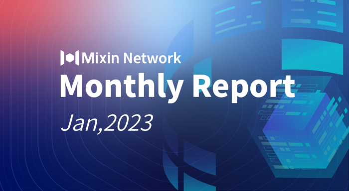

# Mixin Network Monthly Report — No. 47

2023–01–01 ~ 2023–01–31

## Mixin Mainnet
- The Mainnet has been running for 1435 days, and the topology height is 496,237,427 (+25,102,915).
- The top 100 assets of the entire network reach a total market value of $1,006,638,979.
- There are a total of 2,550 (+21) asset types in the entire network.
- There are 26 full nodes in the network.

## Statistics of Popular Assets

| Assets     | Total Volume (changes) | Number of Monthly Transaction |
|----------:|:----------------------:|:---------:|
| BTC        | 9,689 (+95)                  |	790,001 | 
| BOX	       | 80,968,962(+1,422,768)	             | 232,599   |
| ETH      	 | 77,480 (+290)             	| 404,690   |
| USDC       | 33,395,129 (+219,477)	            | 13,984    |
| MOB        | 40,424,692 (-384,535)             |	539,182   |
| USDT(ERC20)| 25,876,120 (+1,615,916)           	| 2,123,961 |
| pUSD	     | 13,010,350 (+289,829)	            | 1,114,151 |
| EOS        | 6,934,042 (+74,561)            	| 185,213   |
| DOGE	     | 64,014,695 (-11,012,153)                | 91,966    |
| UNI	     | 1,063,490 (+48,104)	            | 14,375   |
| RUM        | 3,847,142 (+2,173)	            | 6,243   |
| DOT        | 579,128 (+10,698)            	| 100,847    |
 **The above data was collected around 20:00(UTC+4) on Feb 2, 2023.**

## Mixin Dapps

### Mixin Messenger
- Support eip-681 protocol, easy to scan and pay via payment codes from other blockchain products.
- Support for logging in to the desktop via PIN
- Supporting Deep Link for accessing specific pages of Mixin Messenger directly from the web
- Support setting to disable audio message forwarding
- Android support for Android 13, PIN random keyboard and changing the chatting background.

### MixinBot on Telegram
- Support receiving TON assets.
- Support for purchasing in fiat money.
- Support for Russian and Simplified Chinese in settings.
- Integration with [CryptoGash Shop](https://cryptogas.shop) and add Buy TON and CKB buttons.
- Add log feature.
- Optimized the webpage opening speed.
- Detail adjustments and bug fixes.

### Pando
- Upgrade Pando Leaf security policy.
- Fix the data display issue of Pando Rings.
- CoWallet supports transferring to multi-signature addresses.
- Bazaar added Jingdong E-Card and Japanese National Lottery Loto 7 coupons.

### ExinOne
- Optimized the pending orders page and supported 37 tokens such as BTC, ETH, MOB, etc.
- New token listing PAXG, LDO, and BIT.

### MixPay
- Support TON public chain and integrate the Tonkeeper wallet payment.
- Integration with RedteaGo, Loto7, and One Goo.

### Others
- **Jan 03, 2023** The first Chinese artist who won the Japan Art Museum Award published the limited edition of Golden Rabbit NFT in Trident; all works have sold out quickly.
- **Jan 06, 2023** The Telegram wallet Bot MixinBot has been recommended among the TON communities as [it has supported the TON Network](https://t.me/toncoin/709).
- **Jan 13. 2023** Trader Escapist made her frist live video on Mixin.
- **Jan 18, 2023** BigONE Trading Bot (7000104779) goes live on grid trading.
- **Jan 20, 2023** Mixin Safe completed its first BTC transaction. The system covers three key technologies: multiple signatures, MPC multi-party calculation, and transaction timelock. It requires five identities: Kernel, Holder, Signer, Accountant, and Observer to enroll together.

## About Mixin Network

Mixin Network is an open-source, lightning-fast, and decentralized Web3 platform to bring speed and scalability to the blockchain. Mixin allows blockchains to gain millions of TPS, sub-second final confirmation, zero transaction fee, enhanced privacy and unlimited extensibility.

Mixin Network is a PoS network with 26 full nodes. As a wallet solution, it is currently supporting 47 public blockchains including Bitcoin, Ethereum, Avalanche, Polkadot, etc. The total assets on the network have been over 1 billion US Dollars. Mixin is also a full-featured financial platform with functions of AMM, aggregating trade, pending orders on Exchange platforms, unbiased stable currency, etc. Mixin Network is dedicated to providing users with a decentralized blockchain infrastructure that always puts security, privacy, and decentralization first.

Highest TVL: USD2.9 billion on November 10, 2021

Highest Daily Transaction Volume: 4.9 million transactions on August 27, 2021

User Base: 1 million

## Follow us:

[Official Website](https://mixin.one/)｜[Twitter](https://twitter.com/Mixin_Network)｜[Facebook](https://www.facebook.com/MixinNetwork)｜[Medium](https://medium.com/mixinnetwork)｜[Email](contact@mixin.one)｜[Instagram](https://instagram.com/mixinnetwork)