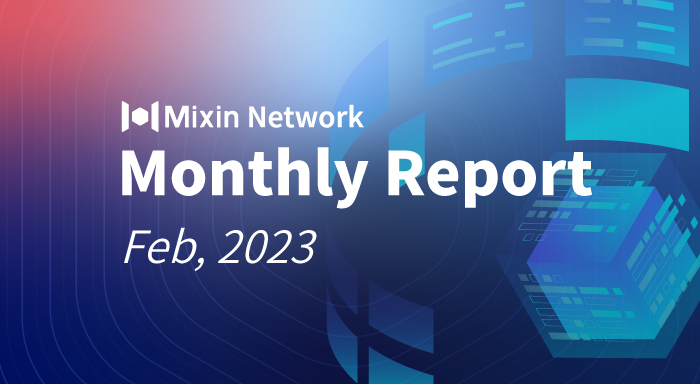

# Mixin Network Monthly Report — No. 48

2023–02–01 ~ 2023–02–28

## Mixin Mainnet
- The Mainnet has been running for 1461 days, and the topology height is 516,612,594 (+20,375,167).
- The top 100 assets of the entire network reach a total market value of $1,034,745,765.
- There are a total of 2,625 (+75) asset types in the entire network.
- There are 24 full nodes in the network.

## Statistics of Popular Assets

| Assets     | Total Volume (changes) | Number of Monthly Transaction |
|----------:|:----------------------:|:---------:|
| BTC        | 9,883 (+184)                 |	673,314 | 
| BOX	       | 82,003,965 (+1,035,003)	             | 299,807   |
| ETH      	 | 77,487 (+7)             	| 304,037   |
| USDC       | 34,758,642 (+1,363,513)	            | 11,582    |
| MOB        | 40,308,295 (-116,397)             |	557,405   |
| USDT(ERC20)| 21,750,765 (-4,125,355)          	| 2,076,267 |
| pUSD	     | 13,829,363 (+819,013)	            | 1,051,868 |
| EOS        | 6,908,641 (-25,401)            	| 179,574   |
| DOGE	     |  51,080,090 (-12,934,605)              | 54,598    |
| UNI	     | 1,086,682 (+23,193)            | 105,209  |
| RUM        | 3,847,258 (+116)	            | 9,311   |
| DOT        | 582,261 (+3,133)            	| 86,084    |

 **The above data was collected around 15:00 (UTC+4) on Mar 1, 2023.**

## Mixin Dapps

### Mixin Messenger
- Developing functionality to connect and use other on-chain Dapps via TIP (in progress).
- Support for setting up the font size for the chat in app settings.
- Support voice floating window to show mute status.
- Optimize the layout of PIN-related pop-ups.
- Significantly optimized the search performance for the desktop version.
- Optimize details and small issue fixes.

### Pando
- Launched Pando Talkee, a Web3 real-time commenting system, and started an [airdrop campaign](https://pando.im/news/2023/2023-02-20-top-comments-share-100-dollars/) for the top comments. 
- Pando launched the official [Japanese Twitter account](https://twitter.com/pando_ja) for the Japanese market. 

### ExinOne
- Remove access to the phone number for login.
- Optimized trading experience for token conversion and spot market.
- Listing eight new tokens, such as AMP, BLUR, MAGIC, etc.
- ExinPool supports staking in Matic nodes.
- "水龙头" (former named ExinEarn) added a new rebate channel for Food offers.

### MixPay
- MixPay is listed on the Cryptwerk platform.
- Support Bitcoin Lightning Network.
- Add WBTC for payment and settlement currency.
- Cooperated closely with RedteaGo and optimized the buying experience.

### Others
- **Feb 1, 2023** An AMA took place on Mixin & Nervos Nation Telegram channel.
- **Feb 9, 2023** CoinMarketCap Announced the Latest TVL ranking, where Mixin ranked 10th.
- **Feb 13, 2023** Released complete API documentation for [Mixin Safe](https://safe.mixin.dev/), including signing and sending transactions.
- **Feb 17, 2023** Mixin Supported Bitcoin Taproot Addresses; Taproot enhances transaction privacy.
- **Feb 23, 2023** Mixin Network supported the 48th public chain, MVM (Mixin Virtual Machine).
- **Feb 28, 2023** Mixin 4th anniversary for mainnet launched. The Collateral for each full node increased from 12710 XIN to 13439 XIN, and the total daily mining reward decreased from 89.87671224 XIN to 80.88904107 XIN. For more minting data, please check [here](https://blockchair.com/mixin/mintings).

## About Mixin Network

Mixin Network is an open-source, lightning-fast, and decentralized Web3 platform to bring speed and scalability to the blockchain. Mixin allows blockchains to gain millions of TPS, sub-second final confirmation, zero transaction fee, enhanced privacy and unlimited extensibility.

Mixin Network is a PoS network with 26 full nodes. As a wallet solution, it is currently supporting 48 public blockchains including Bitcoin, Ethereum, Avalanche, Polkadot, etc. The total assets on the network have been over 1 billion US Dollars. Mixin is also a full-featured financial platform with functions of AMM, aggregating trade, pending orders on Exchange platforms, unbiased stable currency, etc. Mixin Network is dedicated to providing users with a decentralized blockchain infrastructure that always puts security, privacy, and decentralization first.

Highest TVL: USD2.9 billion on November 10, 2021

Highest Daily Transaction Volume: 4.9 million transactions on August 27, 2021

User Base: 1 million

## Follow us:

[Official Website](https://mixin.one/)｜[Twitter](https://twitter.com/Mixin_Network)｜[Facebook](https://www.facebook.com/MixinNetwork)｜[Medium](https://medium.com/mixinnetwork)｜[Email](contact@mixin.one)｜[Instagram](https://instagram.com/mixinnetwork)
