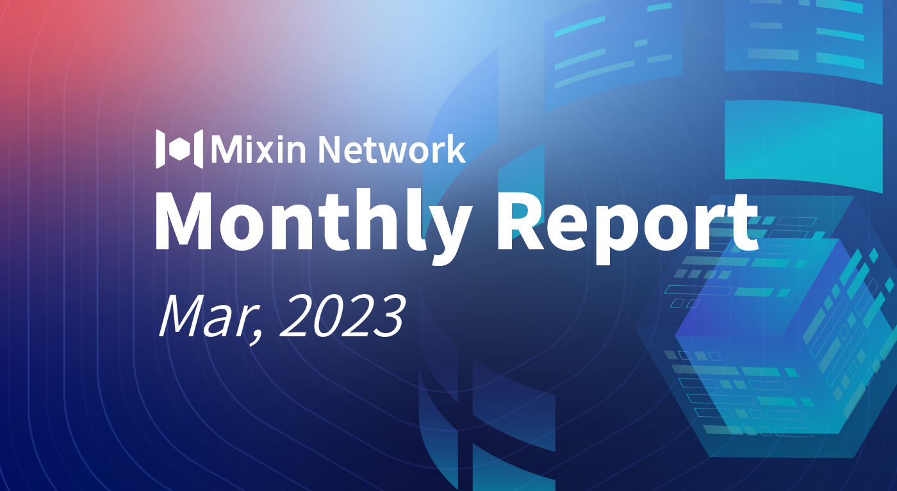

# Mixin Network Monthly Report — No. 49

2023–03–01 ~ 2023–03–31

## Mixin Mainnet
- The Mainnet has been running for 1494 days, and the topology height is 535,547,065 (+18,934,471).
- The top 100 assets of the entire network reach a total market value of $1,149,199,639.
- The whole network has a total of 2,755 (+130) assets.
- There are 24 full nodes in the network.

## Statistics of Popular Assets

| Assets     | Total Volume (changes) | Number of Monthly Transaction |
|----------:|:----------------------:|:---------:|
| BTC        | 10,010 (+127)                 |	1,149,939 | 
| BOX	     | 83,095,457 (+1,091,492)	             | 381,946   |
| ETH      	 | 77,995 (+508)             	| 440,650   |
| USDC       | 31,091,121 (-3,667,521)            | 24,404    |
| MOB        | 42,778,470 (+2,470,176)            |	283,357   |
| USDT(ERC20)| 24,503,825 (+2,753,060)          	| 2,286,024 |
| pUSD	     | 13,542,615 (-286,748)	            | 973,736 |
| EOS        | 6,856,396 (-52,245)          	| 253,270   |
| DOGE	     |  51,899,753 (+819,662)             | 61,617    |
| UNI	     | 1,112,039 (+25,356)          | 115,669  |
| RUM        | 3,848,202 (+944)            | 8,612   |
| DOT        | 588,070 (+5,809)            	| 75,597    |

 **The above data was collected around 14:00 (UTC+7) on April 2, 2023.**

## Mixin Dapps

### Mixin Messenger
- TIP connection to other Dapps is in internal testing.
- Started the development of synchronizing chat records from multiple ends.
- Add Spanish.
- Add the opening and closing balance to transfer details.
- Further optimization of search performance and accuracy on desktop.
- Detail optimization and small bugs fixed.

### Pando
- Open-sourced Botastic (AI framework that interacts with large language models such as Open AI’s GPT) and Talkee (Web3 real-time commenting system).
- Released [Developer Console](https://developers.pando.im/console).
- The Pando Team presented Botastic and Talkee at the Dev.Together conference.
- Submitted Talkee — Web3 real-time commenting system to [ProductHunt](https://www.producthunt.com/products/talkee).

### ExinOne
- Restart the free BTC campaign for BOX regular investment.
- Published ExinOne development documentation which allows developers to access ExinOne.
- Upgraded Liquidity Pool account to Trading account.
- Limited orders now support trading accounts.
- Updated the “loan” function and improved the Pledge & Borrow process.
- New listed ARB and other 24 tokens for trading services.

### MixPay
- Added email login on Dashboard.
- UniSat (Bitcoin inscribe platform) integrated MixPay.
- IdClub (Bitcoin Ordinals minting platform) integrated MixPay.
- Supported Pando USD for payment, quote, and settlement.
- MixPay attended the Investment Cocktail Reception hosted by 7 O’clock Capital and Daoverser Capital in Dubai.
- RedteaGo and MixPay launched a 10% off coupon code event.
- MixPay has partnered with Gamzie, an e-commerce site offering games and entertainment top-ups.

### Others
- **March 12, 2023** Mixin Messenger’s [new website](https://messenger.mixin.one) went live.
- **March 16, 2023** MixinBot and DeNet launched an airdrop campaign.
- **March 20, 2023** CoinMarketCap Announces Latest TVL Ranking Mixin Rises to #9.
- **March 22, 2023** Mixin mainnet team proposed a [Memo expansion fee model](https://github.com/MixinNetwork/mixin/issues/160) that could better meet the needs of developers’ data on the chain.
- **March 31, 2023** Mixin Safe core process front-end and back-end development have been completed. The subsequent focus will shift to interactive interface development, more detailed testing, and other work.

## About Mixin Network

Mixin Network is an open-source, lightning-fast, and decentralized Web3 platform to bring speed and scalability to the blockchain. Mixin allows blockchains to gain millions of TPS, sub-second final confirmation, zero transaction fee, enhanced privacy and unlimited extensibility.

Mixin Network is a PoS network with 26 full nodes. As a wallet solution, it is currently supporting 48 public blockchains including Bitcoin, Ethereum, Avalanche, Polkadot, etc. The total assets on the network have been over 1 billion US Dollars. Mixin is also a full-featured financial platform with functions of AMM, aggregating trade, pending orders on Exchange platforms, unbiased stable currency, etc. Mixin Network is dedicated to providing users with a decentralized blockchain infrastructure that always puts security, privacy, and decentralization first.

Highest TVL: USD2.9 billion on November 10, 2021

Highest Daily Transaction Volume: 4.9 million transactions on August 27, 2021

User Base: 1 million

## Follow us:

[Official Website](https://mixin.one/)｜[Twitter](https://twitter.com/MixinKernel)｜[Facebook](https://www.facebook.com/MixinNetwork)｜[Medium](https://medium.com/mixinnetwork)｜[Email](contact@mixin.one)｜[Instagram](https://instagram.com/mixinnetwork)
