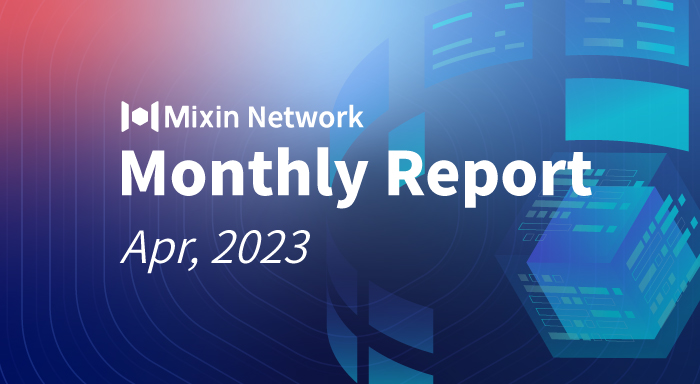

# Mixin Network Monthly Report — No. 50

2023–04–01 ~ 2023–04–30

## Mixin Mainnet
- The Mainnet has been running for 1522 days, and the topology height is 557,227,379 (+21,680,314).
- The top 100 assets of the entire network reach a total market value of $1,085,116,714.
- The whole network has a total of 2,810 (+55) assets.
- There are 25 full nodes in the network.

## Statistics of Popular Assets

| Assets     | Total Volume (changes) | Number of Monthly Transaction |
|----------:|:----------------------:|:---------:|
| BTC        | 9,493 (-517)                 |	893,568 | 
| BOX	     | 83,903,334 (+807,877)             | 323,919   |
| ETH      	 | 84,063 (+6,068)            	| 343,200   |
| USDC       | 3,366,983 (-27,724,139)           | 35,329    |
| MOB        | 42,296,558 (-481,912)           |	266,445   |
| USDT(ERC20)| 24,761,494 (+257,670)          	| 1,812,243 |
| pUSD	     | 13,707,696 (+165,081)	            | 961,834 |
| EOS        | 6,815,284 (-41,112)          	| 147,188   |
| DOGE	     |  61,835,124 (+9,935,372)            | 69,618   |
| UNI	     | 1,104,334 (-7,705)         | 96,700  |
| RUM        | 3,849,001 (+799)          | 8,654   |
| DOT        | 588,629 (+559)           	| 41,493    |

 **The above data was collected around 13:00 (UTC+8) on May 1, 2023.**

## Mixin Dapps

### Mixin Messenger
- Sync chat history on multi-ends feature has completed the development and started internal testing.
- Optimized the TIP connection to other Dapp during internal testing.
- Display Mixin ID in multiple interfaces of contacts。
- Fix the issue that the pop-up window may get stuck after completing payment.
- Detail optimization and minor issue fixes.

### MixinBot (Telegram bot)
- The new version has been launched, and the user experience is greatly improved.
- Integrated with ExinOne to improve the Swap function, the TON swap price is better than many other swap features, such as the TON official wallet.
- Support scan to connect to 4swap, Quill, and other Dapp built on the Mixin ecosystem.

### Pando
- Fully cooperated with MixPay, integrated MixPay in Talkee, Bazaar, and other products.
- Talkee supports airdrops and co-organizes an airdrop campaign with MixPay.

### ExinOne
- Launch of the trading rebate function for developers.
- New listing VGX.
- Trading details optimization.

### MixPay
- Fully cooperated with the Pando team and integrated MixPay in Talkee and Bazaar products.
- [Coinsbee](https://coinsbee.com/) (gift card platform) integrated into MixPay.
- Anonicall (privacy encrypted chat application) supports membership purchases via MixPay.
- Miners1688 (mining platform) supports buying miners with MixPay.
- Crypto Expo Asia supports buying tickets via MixPay
- Participated in Web3 Hong Kong Conference and did MixPay roadshow.
- Dashboard upgraded to support Swap function, multi-person management setting permission, and built-in decentralized wallet.

### Others
- **April 4, 2023** Mixin Network released [version 0.15.0](https://github.com/MixinNetwork/mixin/releases/tag/v0.15.0), allowing users to pay XIN to store up to 4MB of transaction data on the main network, it costs 0.001XIN per 1 KB of data. And the consumed XIN is uniformly destroyed, which marks the start of XIN deflation.
- **April 12, 2023** The Mixin team attended the Web3 Hong Kong conference and met many teams for potential cooperation.
- **April 15, 2023** The independent developer in the Mixin ecosystem, Ann Lee, released a new product, [b movie](https://b.movie), a Web3 social media product for film and TV, based on Mixin and Quorum.

- **April 20, 2023** The first transaction with the extended storage [Transaction 1](https://viewblock.io/mixin/tx/f382f825daa794c323d6c99eeba7fd10adb78eece6b71565897a3339fcb95e3c) took place, and the data is stored in [Transaction 2](https://medium.com/%20/viewblock.io/mixin/tx/ef334049d5cc02809d1522c15219008424474abff79b5067f49a248a1f64c1e3), this transaction destroyed 0.002 XIN.

## About Mixin Network

Mixin Network is an open-source, lightning-fast, and decentralized Web3 platform to bring speed and scalability to the blockchain. Mixin allows blockchains to gain millions of TPS, sub-second final confirmation, zero transaction fee, enhanced privacy and unlimited extensibility.

Mixin Network is a PoS network with 26 full nodes. As a wallet solution, it is currently supporting 48 public blockchains including Bitcoin, Ethereum, Avalanche, Polkadot, etc. The total assets on the network have been over 1 billion US Dollars. Mixin is also a full-featured financial platform with functions of AMM, aggregating trade, pending orders on Exchange platforms, unbiased stable currency, etc. Mixin Network is dedicated to providing users with a decentralized blockchain infrastructure that always puts security, privacy, and decentralization first.

Highest TVL: USD2.9 billion on November 10, 2021

Highest Daily Transaction Volume: 4.9 million transactions on August 27, 2021

User Base: 1 million

## Follow us:

[Official Website](https://mixin.one/)｜[Twitter](https://twitter.com/MixinKernel)｜[Facebook](https://www.facebook.com/MixinNetwork)｜[Medium](https://medium.com/mixinnetwork)｜[Email](contact@mixin.one)｜[Instagram](https://instagram.com/mixinnetwork)
