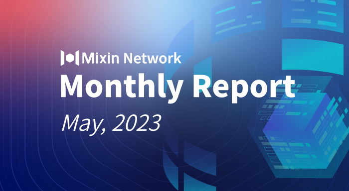

# Mixin Network Monthly Report — No. 51

2023–05–01 ~ 2023–05–31

## Mixin Mainnet
- The Mainnet has been running for 1554 days, and the topology height is 535,547,065 (+25,955,650).
- The top 100 assets of the entire network reach a total market value of $1,030,272,50.
- The whole network has a total of 2,907 (+97) assets.
- There are 26 full nodes in the network.

## Statistics of Popular Assets

| Assets     | Total Volume (changes) | Number of Monthly Transaction |
|----------:|:----------------------:|:---------:|
| BTC        | 9,560 (+67)                 |	590,854 | 
| BOX	     | 84,715,313 (+811,979)             | 314,718   |
| ETH      	 | 84,241 (+179)            	| 261,197  |
| USDC       | 3,345,042 (-21,941)           | 41,632    |
| MOB        | 44,531,938 (+2,235,380)           |	219,597   |
| USDT(ERC20)| 22,282,484 (-2,479,010)          	| 1,655,730 |
| pUSD	     | 14,863,104 (+1,155,408)	            | 857,654 |
| EOS        | 6,798,745 (-16,539)          	| 129,938   |
| DOGE	     |  61,681,576 (-153,549)            | 30,410   |
| UNI	     | 1,105,903 (+1,569)         | 136,091  |
| RUM        | 3,850,089 (+1088)          | 5,065   |
| DOT        | 588,070 (+5,809)           	| 75,597    |

 **The above data was collected around 12:00 (UTC+8) on Jun 2, 2023.**

## Mixin Dapps

### Mixin Safe
- The Mornin Key application, a decentralized password manager, has been launched on App Store and Google Play Store.
- [Mixin Safe’s official website](https://safe.mixin.zone/) is online.
- Support multi-currency, and support Litecoin.
- Add log module.
- Optimize the approval process.

### Mixin Messenger
- Sync chat history on the multi-ends feature has completed the development and test, and the new version will be launched soon.
- Detail optimization and minor bug fixed.

### Pando
- Pando launched a [new Swap interface](https://app.pando.im/swap), optimized desktop display, and others.
- Support deposit via MixPay
- Launched a version of AI bot 7000105018, which allows users to buy cryptocurrencies through conversation instead of opening a webpage.

### ExinOne
- New listing 7 tokens for trading, including EDU.
- Supported GALA contract swap and reopened trading.
- Launched the referral URL feature for users to get rewards by sharing trading links.
- ExinPool fundraised the 4th node for Mixin Network.

### MixPay
- Vaioretto, a custom nail branding site, integrated MixPay.
- MyCoinTool integrated MixPay to help users to purchase memberships via cryptocurrency.
- DigitalPurse integrated MixPay to buy gift cards via Telegram Bots.
- New integration with Pando v2.0.0.

### Others
- **May 1, 2023** MixPay, the payment protocol of eco-partner on Mixin, announced that the daily orders surpassed 2,000.
- **May 19, 2023** [Mixin Safe](https://safe.mixin.zone/) released the beta version, which can be used with Mornin Key and will support more wallets soon.
- **May 26, 2023** Mixin Team participated in a Web 3 Infra Developer Conference (Beijing) organized by Amazon Cloud and 7up DAO.

- **May 30, 2023** JustChat iOS is back on App Store. If you need the wallet feature, Mixin Messenger is the preferred option.

## About Mixin Network

Mixin Network is an open-source, lightning-fast, and decentralized Web3 platform to bring speed and scalability to the blockchain. Mixin allows blockchains to gain millions of TPS, sub-second final confirmation, zero transaction fee, enhanced privacy and unlimited extensibility.

Mixin Network is a PoS network with 26 full nodes. As a wallet solution, it is currently supporting 48 public blockchains including Bitcoin, Ethereum, Avalanche, Polkadot, etc. The total assets on the network have been over 1 billion US Dollars. Mixin is also a full-featured financial platform with functions of AMM, aggregating trade, pending orders on Exchange platforms, unbiased stable currency, etc. Mixin Network is dedicated to providing users with a decentralized blockchain infrastructure that always puts security, privacy, and decentralization first.

Highest TVL: USD2.9 billion on November 10, 2021

Highest Daily Transaction Volume: 4.9 million transactions on August 27, 2021

User Base: 1 million

## Follow us:

[Official Website](https://mixin.one/)｜[Twitter](https://twitter.com/MixinKernel)｜[Facebook](https://www.facebook.com/MixinNetwork)｜[Medium](https://medium.com/mixinnetwork)｜[Email](contact@mixin.one)｜[Instagram](https://instagram.com/mixinnetwork)
