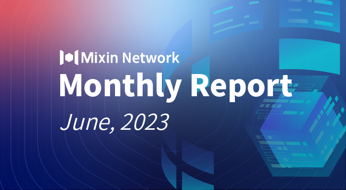

# Mixin Network Monthly Report — No. 52

2023–06–01 ~ 2023–06–30

## Mixin Mainnet
- The Mainnet has been running for 1584 days, and the topology height is 603,852,540 (+68,305,475).
- The top 100 assets of the entire network reach a total market value of $1,098,246,197.
- The whole network has a total of 3,074 (+167) assets.
- There are 25 full nodes in the network.

## Statistics of Popular Assets

| Assets     | Total Volume (changes) | Number of Monthly Transaction |
|----------:|:----------------------:|:---------:|
| BTC        | 9,463 (-97)                |	762,806 | 
| BOX	     | 85,299,604 (+584,291)             | 300,023   |
| ETH      	 | 84,818 (+576)          	| 289,197  |
| USDC       | 3,244,604 (-100,438)         | 9,464    |
| MOB        | 45,867,722 (+1,335,784)           |	221,093   |
| USDT(ERC20)| 23,235,290 (+952,806)          	| 1,787,864 |
| pUSD	     | 14,693,588 (-169,516)	            | 861,476 |
| EOS        | 7,043,327 (+244,582)          	| 170,138   |
| DOGE	     |  62,797,779 (+1,116,203)           | 38,003   |
| UNI	     | 1,122,326 (+16,423)        | 86,791  |
| RUM        | 3,853,181 (+3,092)         | 4,403   |
| DOT        | 594,587 (+5,095)          	| 45,121    |

 **The above data was collected around 13:00 (UTC+8) on July 2, 2023.**

## Mixin Ecosystems

### Mixin Safe
- Officially released the Mixin Safe public beta version.
- New signature format significantly improves compatibility and supports mainstream hardware wallets.
- Technical solution for handling fees upgraded and more flexible.
- Added new pages for membership and billing features.
- Supported Ledger hardware wallet and Bitcoin Core software wallet.
- Improved notification alerts.
- Added floating chat for customer service on the Mixin Safe website and published 15 help documents for the help center.
- New version of Mornin Key is available.

### Mixin Messenger
- Sync chat history on the multi-ends feature launched.
- Detail optimization and minor bug fixed.

### Pando
- 4swap released a [new web interface to simplify the token listing procedure](https://pando.im/news/2023/2023-06-21-new-web-interface-simplifies-token-list-on-pando-swap/).
- Co-launched a [Giveaway campaign](https://bfre.nz/news/150560) with Bfrenz.

### ExinOne
- ExinOne listed 8 trading tokens, including AGLD.
- Optimized the trade interface.
- The trading account started to charge EPC when swapping tokens directly via the account itself and released an EPC faucet (7000105001) to get free EPC.

### MixPay
- KEKKAI, OneKey’s authorized dealer, integrated MixPay’s Shopify plugin.
- Unilit, the first LRC20 minting marketplace in the Litecoin ecosystem, supported MixPay.
- BTCdomain, the leading platform for Bitcoin domain purchasing, accepted domain registration fees via MixPay.
- LTC Unicorn, the first NFT + GameFi project on the Litecoin network, supported MixPay for NFT purchases.
- Dogecoin wallet For web3 world Self-Custodial integrated with MixPay.
- CloudMate+ is a comprehensive cloud reselling assistant platform integrated with Mixpay as a payment method.
- The Blockchain Expo Dubai Web3 accepted to purchase tickets with crypto via MixPay.
- GameCardi, an e-business platform, supported MixPay to purchase gift cards, game cards, and payment cards.
- Instagiftcards supported MixPay to purchase gift, game, and payment cards via cryptocurrency.
- Quail, open-sourced newsletter platform, accepted purchasing the membership by MixPay.

### Others
- **Jun 12, 2023** Mixin Safe is officially scheduled to go live on Aug 8, 2023, and when Mixin Safe is online, the Mixin Network node rewards will become 50% for Mixin Kernel, 40% for Mixin Safe, and 10% for light nodes. The Safe nodes must be Kernel nodes, but all Kernel nodes do not have to be Safe nodes (not mandatory).
- **Jun 13, 2023** Trading Bot (7000104779) [Launches AI Rebalance and Fixed Investment](https://bigone.zendesk.com/hc/zh-cn/articles/19524408618777).
- **Jun 19, 2023** OptionDance’s European-style option protocol is [officially sponsored by Starknet](https://twitter.com/OptionDance/status/1669313531005775874) and retweeted by several KOL in the ecosystem.
- **Jun 21, 2023** Mixin Safe [beta testing](https://support.mixin.one/zh/article/mixin-safe-bug-1-btc-dvmt62/) is officially open to join while the bug bounty program launches.
- **Jun 29, 2023** Along with the successful launch of the Mixin Safe beta network, Mixin Wealth, the decentralized wealth management in Mixin’s ecosystem, will soon go live in beta. Mixin Wealth provides a decentralized platform for fund managers and investors to use, with the most significant feature being asset safety. Mixin Wealth combines the advantages of cryptocurrencies and traditional funds, allowing users to purchase U.S. stock ETFs more conveniently.
- **Jun 30, 2023:** Mixin Name Service (MNS), a domain name service, has been released in beta. Based on a smart contract deployed on MVM, users can use the service to register their own domain names, each of which is also an NFT.

## About Mixin Network

Mixin Network is an open-source, lightning-fast, and decentralized Web3 platform to bring speed and scalability to the blockchain. Mixin allows blockchains to gain millions of TPS, sub-second final confirmation, zero transaction fee, enhanced privacy and unlimited extensibility.

Mixin Network is a PoS network with 26 full nodes. As a wallet solution, it is currently supporting 48 public blockchains including Bitcoin, Ethereum, Avalanche, Polkadot, etc. The total assets on the network have been over 1 billion US Dollars. Mixin is also a full-featured financial platform with functions of AMM, aggregating trade, pending orders on Exchange platforms, unbiased stable currency, etc. Mixin Network is dedicated to providing users with a decentralized blockchain infrastructure that always puts security, privacy, and decentralization first.

Highest TVL: USD2.9 billion on November 10, 2021

Highest Daily Transaction Volume: 4.9 million transactions on August 27, 2021

User Base: 1 million

## Follow us:

[Official Website](https://mixin.one/)｜[Twitter](https://twitter.com/MixinKernel)｜[Facebook](https://www.facebook.com/MixinNetwork)｜[Medium](https://medium.com/mixinnetwork)｜[Email](contact@mixin.one)｜[Instagram](https://instagram.com/mixinnetwork)
