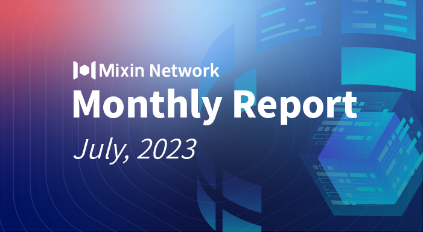

# Mixin Network Monthly Report — No. 53

2023–07–01 ~ 2023–07–31

## Mixin Mainnet
- The Mainnet has been running for 1,613 days, and the topology height is 621,700,380 (+17,847,840).
- The top 100 assets of the entire network reach a total market value of $1,109,749,948.
- The whole network has a total of 3,199 (+125) assets.
- There are 26 full nodes in the network.

## Statistics of Popular Assets

| Assets     | Total Volume (changes) | Number of Monthly Transaction |
|----------:|:----------------------:|:---------:|
| BTC        | 9,544 (+81)                |	663,489 | 
| BOX	     | 85,694,236 (+394,632)             | 297,944   |
| ETH      	 | 84,642 (-176)          	| 179,647  |
| USDC       | 2,744,818 (-499,786)         | 10,324   |
| MOB        | 45,250,173 (-617,550)          |	318,880   |
| USDT(ERC20)| 25,415,746 (+2,180,456)         	| 1,702,339 |
| pUSD	     | 14,697,259 (+3,671)	            | 781,951 |
| EOS        | 7,118,955 (+75,629)          	| 146,350   |
| DOGE	     | 61,505,678 (-1,292,101)           | 60,711   |
| UNI	     | 1,122,367 (+41)           | 86,413  |
| RUM        | 3,854,686 (+1,505)         | 7,128   |
| DOT        | 597,448 (+2,861)         	| 35,277    |

 **The above data was collected around 9:3 (UTC+8) on Jul 31, 2023.**

## Mixin Ecosystem

### Mixin Safe
- Asset recovery launched.
- Improvement of message notification service.
- Revised Safe official website technical solution page.
- Mornin Key supported backup feature.
- Optimize a lot of details and minor issues.

### Mixin Messenger
- Support Mixin anonymous number login (can be used directly when the anonymous numbers marketplace is online).
- Optimize the display of deleted users’ profile pages.

### [MixinBot](https://t.me/MixinBot) (Telegram bot)
- LuckyCoin is officially available.

### Pando
- Pando Lake & 4swap started to support [boost mode and limit order features](https://pando.im/news/2023/2023-07-30-new-features-for-pando-swap-boost-mode-and-limit-order/).
- Pando Lake & 4swap is ready to [increase the pUSD swap pool fee rate](https://pando.im/news/2023/2023-07-28-a-plan-of-increase-in-pusd-swap-pool-fee-rate/).

### ExinOne
- ExinOne listed 11 trading tokens, including MNT.

### MixPay
- AI.LS — Use MixPay to Buy AI Aggregation Tool Services
- MSN Gamer — Use MixPay to buy gift cards, game cards and more.
- MixPay Supports Dogecoin Browser Plugin Wallets Dpal and Unielon.
- MixPay Dashboard upgraded to support WalletConnect login.

### Others
- **Jul 15, 2023** Mixin Wealth, a decentralized fund marketplace, has released a [beta version](https://wealth.mixin.one/), allowing any fund manager to efficiently distribute their funds using Mixin Wealth, with the ability to specify flexible fundraising rules. The most essential features of Mixin Wealth are security, decentralization, transparency of fund custody, and ease of use.
- **Jul 18, 2023** Mixin Safe kicks off a [Review Campaign on BitcoinTalk](https://bitcointalk.org/index.php?topic=5460259.0).
- **Jul 22, 2023** OceanONE revoked all pending Omni — USDT version trade orders.
- **Jul 24, 2023** BigONE Earn bot (Mixin ID 7000104386) has [launched dual investment products](https://bigone.zendesk.com/hc/zh-cn/articles/20607717119769); investing in BTC, ETH, USDT, EOS, and other cryptocurrencies can participate in dual-coin products and earn financial returns. At the same time, the dual investment strategy investment has been launched, including Buy Dip, Sell Peak, Sideways Gain, Custom Strategy, etc.
- **Jul 27, 2023** The underlayer of Mixin API has been upgraded to support the multi-address deposit function of one account. For example, Polygon address deposit on Ethereum assets can also arrive at the account and the problem of top-up the wrong chain will be handled uniformly and automatically arrive at the account after the beta testing.
- **Jul 27, 2023** Statistics show that Mixin Network has about 100,000 daily active users.
- **Jul 27, 2023** The creator of the [Coinverse community](https://coinverse.mixinbots.com/), Bro Jun, brings you to review the past, examine the gains and losses, and look forward to the future. Meanwhile, the Coinverse group started a two-week [Double Energy] check-in activity.
- **Jul 29. 2023** Mixin Route has passed the approval of a large payment institution with acquiring qualifications, which means that users in 150+ countries and regions around the world can buy cryptocurrencies on Mixin-related products through Visa, Master, Apple Pay, Google Pay, etc., with better pricing, faster arrival speeds, and better service. The Mixin Messenger fiat deposit feature is also being developed synchronously.
- **Jul 31, 2023** Mixin Wealth, a decentralized fund marketplace, has launched its bot 7000105166 on Mixin Messenger, which officially launched the first subscription on Aug 1, 2023, at 8:00 p.m. (UTC+8). This time, the underlying fund is [Pando Innovation ETF 3056.HK](https://pandofinance.com.hk/en/products/1/), the subscription is unified using USDT of ERC20.

## About Mixin Network

Mixin Network is an open-source, lightning-fast, and decentralized Web3 platform to bring speed and scalability to the blockchain. Mixin allows blockchains to gain millions of TPS, sub-second final confirmation, zero transaction fee, enhanced privacy and unlimited extensibility.

Mixin Network is a PoS network with 26 full nodes. As a wallet solution, it is currently supporting 48 public blockchains including Bitcoin, Ethereum, Avalanche, Polkadot, etc. The total assets on the network have been over 1 billion US Dollars. Mixin is also a full-featured financial platform with functions of AMM, aggregating trade, pending orders on Exchange platforms, unbiased stable currency, etc. Mixin Network is dedicated to providing users with a decentralized blockchain infrastructure that always puts security, privacy, and decentralization first.

Highest TVL: USD2.9 billion on November 10, 2021

Highest Daily Transaction Volume: 4.9 million transactions on August 27, 2021

User Base: 1 million

## Follow us:

[Official Website](https://mixin.one/)｜[Twitter](https://twitter.com/MixinKernel)｜[Facebook](https://www.facebook.com/MixinNetwork)｜[Medium](https://medium.com/mixinnetwork)｜[Email](contact@mixin.one)｜[Instagram](https://instagram.com/mixinnetwork)
