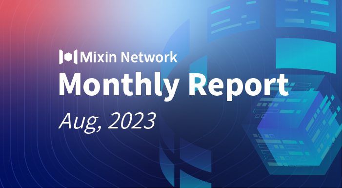

# Mixin Network Monthly Report — No. 54

2023–08–01 ~ 2023–08–31

## Mixin Mainnet
- The Mainnet has been running for 1,647 days, and the topology height is 636,255,674 (+14,555,294).
- The top 100 assets of the entire network reach a total market value of $964,687,268.
- The whole network has a total of 3,359 (+160) assets.
- There are 27 full nodes in the network.

## Statistics of Popular Assets

| Assets     | Total Volume (changes) | Number of Monthly Transaction |
|----------:|:----------------------:|:---------:|
| BTC        | 9,327 (-217)                |	654,722 |
| BOX	     | 86,291,087 (+395964,851)             | 313,740   |
| ETH      	 | 84,812 (+170)          	| 186,274  |
| USDC       | 2,796,732 (+51,914)         | 12,712   |
| MOB        | 46,389,163 (+1,138,991)          |	252,546   |
| USDT(ERC20)| 24,680,156 (-735,590)         	| 1,500,419 |
| pUSD	     | 12,629,752 (-2,067,507)	            | 717,229 |
| EOS        | 7,192,755 (+73,799)          	| 121,404   |
| DOGE	     | 73,061,663 (+11,555,986)           | 38,313   |
| UNI	     | 1,133,377 (+11,011)           | 73,742  |
| RUM        | 3,854,686 (+0)         | 5,061   |
| DOT        | 562,066 (-35,382)         	| 24,780    |

 **The above data was collected around 17:00 (UTC+8) on Sep 2, 2023.**

## Mixin Ecosystem

### Mixin Safe
- Launch the official version of Mixin Safe
- Optimize the process of creating Safes, transactions, and recovery.
- Improve the asset recovery process.

### Mixin Messenger
- On/off ramps are under internal testing.

### Pando
- Pando releases [Pando Earn](https://app.pando.im/earn) for users to earn cryptocurrencies.
- Mixin’s first ETF token 3056.HK is listed on [Pando](https://app.pando.im/swap?mode=pro&base=5c392265-1e05-3520-a25b-2fe9e36510d7&quote=31d2ea9c-95eb-3355-b65b-ba096853bc18).
- Pando Leaf [increased the stability fee](https://pando.im/news/2023/2023-08-21-increasing-stability-fee-in-pando-leaf/).

### ExinOne
- Optimize the trade feature;
- New listing 13 tokens such as KLAY;
- Support the function of withdrawing small amounts of BTC, ETH, BNB, and TRX;

### MixPay
- [Ton.org](https://ton.org) formally included [CryptoGas.shop](https://cryptogas.shop/), which is a cross-chain token purchasing platform based on Mixin Network and MixPay cross-chain payment protocols.
- Assure Wallet integrated CryptoGas.shop.
- Taxi-money game allows to top-up via MixPay.
- Social promotion tool [BoostMySocial](https://t.me/BoostMySocialBot) accesses MixPay.
- AI chatting tool [AskYourTelegram](https://t.me/AskYourTelegramProBot) accesses MixPay.

### Others
- **Aug 1, 2023** Released [MAO](https://mao.observer/) (Mixin Autonomous Organization), and [read to learn](https://quail.ink/observermao/p/mixin) the introduction of MAO;
- **Aug 7, 2023** Mixin Route’s [official website](https://route.mixin.one/) is online;
- **Aug 8, 2023** Mixin Safe mainnet is now live. 27 nodes of Mixin Kernel have been involved in joining Mixin Safe.
- **Aug 9, 2023**  [Mixin Wealth](https://wealth.mixin.one/)’s first fundraising was completed in less than 24 hours;
- **Aug 10, 2023** Mixin Name Service (MNS) is now available (7000105197)! MNS is based on a smart contract developed by MVM, and users can register their own domain names using the service; each domain name is also an NFT.
- **Aug 14, 2023** The Mixin team is ready to launch the Mixin Membership Program, combining Mixin Messenger membership with Mixin Safe membership, virtual number, and other services.
- **Aug 19, 2023** Mixin Messenger plans to go live with a feature to reject transfers, refining asset management and making it easier to reject money from unknown sources.
- **Aug 22, 2023** HMT’s liquidity market cap on 4swap exceeded $1.6 million;
- **Aug 29, 2023** Mixin Wealth issued the token 3056.HK distributed them to all participants, and some liquidity has been added on 4swap for small exchange.
- **Aug 29, 2023** 2 million EOS lost from the previous Pando Rings attack [has been recovered](https://eosflare.io/tx/88E5045C7F2BF91D93B550107C337A27A1F43E285C820C9F29F67EA7A7BFD4EC);
- **Aug 30, 2023** The independent developer An Lee releases his new work: Read X (7000104478), an AI-driven crypto news channel.

## About Mixin Network

Mixin Network is an open-source, lightning-fast, and decentralized Web3 platform to bring speed and scalability to the blockchain. Mixin allows blockchains to gain millions of TPS, sub-second final confirmation, zero transaction fee, enhanced privacy and unlimited extensibility.

Mixin Network is a PoS network with 26 full nodes. As a wallet solution, it is currently supporting 48 public blockchains including Bitcoin, Ethereum, Avalanche, Polkadot, etc. The total assets on the network have been over 1 billion US Dollars. Mixin is also a full-featured financial platform with functions of AMM, aggregating trade, pending orders on Exchange platforms, unbiased stable currency, etc. Mixin Network is dedicated to providing users with a decentralized blockchain infrastructure that always puts security, privacy, and decentralization first.

Highest TVL: USD2.9 billion on November 10, 2021

Highest Daily Transaction Volume: 4.9 million transactions on August 27, 2021

User Base: 1 million

## Follow us:

[Official Website](https://mixin.one/)｜[Twitter](https://twitter.com/MixinKernel)｜[Facebook](https://www.facebook.com/MixinNetwork)｜[Medium](https://medium.com/mixinnetwork)｜[Email](contact@mixin.one)｜[Instagram](https://instagram.com/mixinnetwork)
