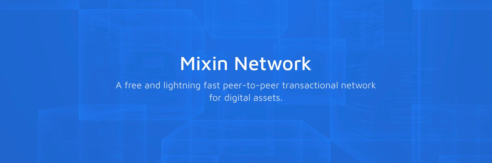

# Mixin Kernel Peer to Peer Network Upgrade



Today Mixin Kernel [v0.18 Stealth Phasmids](https://github.com/MixinNetwork/mixin/releases/tag/v0.18.0) is released, and brings a new peer to peer network layer that improves security and privacy of the signer node.

With the new P2P network layer, the signer node is not needed to be exposed to the public internet, and we recommend all signer nodes block all connections on all UDP/TCP ports through their firewalls.

To upgrade to the new network layer, all signer nodes need to do a small modification to their `confit.toml` file as below:

```diff
+[p2p]
+# the UDP port for communcation with other nodes
+port = 5850
+# the seed relayer nodes list
+seeds = [
+       "06ff8589d5d8b40dd90a8120fa65b273d136ba4896e46ad20d76e53a9b73fd9f@seed.mixin.dev:5850"
+]
+# a relayer needs a public address to listen and relay messages to other nodes
+# a signer should set this value to false for security
+relayer = false
+# metric different message types sent and received
+metric = false
+
 [rpc]
+# enable rpc access by setting a valid TCP port number
+port = 8239
```

## About Mixin Network

Mixin Network is an open-source, lightning-fast, and decentralized Web3 platform to bring speed and scalability to the blockchain. Mixin allows blockchains to gain millions of TPS, sub-second final confirmation, zero transaction fee, enhanced privacy and unlimited extensibility.

Mixin Network is a PoS network with 26 full nodes. As a wallet solution, it is currently supporting 48 public blockchains including Bitcoin, Ethereum, Avalanche, Polkadot, etc. The total assets on the network have been over 1 billion US Dollars. Mixin is also a full-featured financial platform with functions of AMM, aggregating trade, pending orders on Exchange platforms, unbiased stable currency, etc. Mixin Network is dedicated to providing users with a decentralized blockchain infrastructure that always puts security, privacy, and decentralization first.

Highest TVL: USD2.9 billion on November 10, 2021

Highest Daily Transaction Volume: 4.9 million transactions on August 27, 2021

User Base: 1 million

## Follow us:

[Official Website](https://mixin.one/)｜[Twitter](https://twitter.com/MixinKernel)｜[Facebook](https://www.facebook.com/MixinNetwork)｜[Medium](https://medium.com/mixinnetwork)｜[Email](contact@mixin.one)｜[Instagram](https://instagram.com/mixinnetwork)
