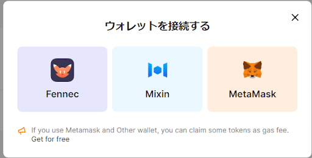
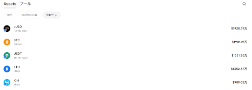
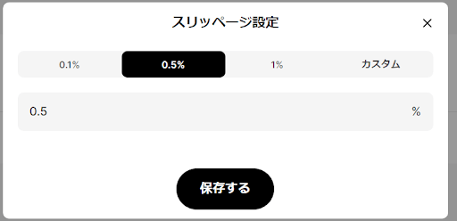

# Mixin上の「Uniswap」！暗号資産のユーザー間取引を円滑にする「4Swap」

- Author: ヤンちゃん
- Mixin ID: 39749821
- [Source](https://pando.im/essays/2022/an-introduction-to-4swap/)

## 免責事項

本記事は、下記dAppsの利用の推奨や特定の暗号資産への投資勧誘を目的としたものではありません。掲載されている内容やリンク先、サービス等からの不利益や損害については、一切の責任を負いかねます。各dAppsのご利用、または暗号資産への投資に関するご決定は利用者ご自身のご判断において行われるようお願いいたします。

## 4Swap

### 概要

[4Swap](https://app.4swap.org/#/pool)はPandoが提供しているDEXです。

##### 主な機能

- swap機能　

ユーザーが異なる2種類の暗号資産を交換できる機能です。イーサリアムとビットコインの取引ペアやビットコインとUSDT（ステーブルコイン）の取引ペアなどがあります。

- 流動性の提供

お手持ちの暗号資産を4Swapへ預けて、その分の利息を得ることができます。「流動性」については後ほど詳しく説明します。MixinのDEXで4Swapは流動性、24時間取引量でかなりのウェイトを占めます。4Swapの流動性は、[こちら](https://app.4swap.org/#/market/overview)から確認することができます。

流動性、取引量が多いということは安定性、スムーズに取引ができるということです。また、4Swapはスマホ内のアプリケーション「Mixin」からアクセスできるだけでなく、web上（PCから）でも使用することができます。あなたのPCに表示されるQRコードからスマホのMixinMessengerで読むとウォレットに接続でき、4Swapを利用できます。

### 流動性提供について

流動性を提供するとはどういうことなのでしょうか？4Swapに限らず、暗号資産をアプリケーション内で運用するには、各機能について十分に理解を深めることで詐欺リスクなどを減らせることができます。そのため、「流動性提供」がよくわかっていない方は、十分に理解した上で４Swapを利用しましょう。

それでは流動性提供について簡単に説明していきます。仮想通貨のファーミングなどで『LPトークン』とよく聞くかと思いますが、LPはリクイディティプロバイダ（Liquidity Provider）の略で、「流動性を提供する」という意味になります。流動性プールにあなたや参加してる多数のユーザーが通貨ペアを預け入れることで取引所（4Swap）は一定量保有（プール）しておくことができます。それにより他の通貨に変えることに応じられるようにします。

あなたがUSDTをBTCに交換したいとしましょう。取引所（4Swap）が十分なBTCを持っていれば交換に応じることができます。取引所が十分なBTCを持っていないと、USDTをBTCに交換してあげることができません。

「流動性を提供する」とはいつでも安定したSwapを提供することになります。それに対して取引所（4Swap）はLPトークンを買って流動性を高めることに貢献するあなたに交換手数料の一部を報酬として支払うというのが「流動性を提供する」という仕組みです。4Swapのコインのプール量を見てみましょう。（22/10/18時点）

上位はこの5つの暗号資産が占めています。LPトークンもこの5つの通貨ペアなら安定しているということです。逆にプール量が少ないコインは流動性が小さく不安定、もしくは取引量が制限されるなどスムーズな交換は難しいということになります。

### 良い点

**誰でも簡単に流動生供給が可能**

4SwapはMixinのWalletから直で通貨ペアを生成して数秒でLPトークン化して流動性提供に参加できる。

**異なるチェーン間の暗号資産の取引が可能**

通常のDEXは、各チェーン内で発行されている暗号資産間の取引のみに対応しています。しかし、Mixin Networkは複数のチェーンに対応しているため、Mixin上のDEXである４Swapでもチェーンが異なる暗号資産（BTC　ETH　SOL　AVAXなど）でも提供されている通貨ペアなら取引ができます。さらに、取引自体も数十秒で完結します。

### 欠点

**流動性の低い暗号資産ペアもある**

流動性が低い（数百〜数千ドル）の暗号資産は取引時にレートや数量など確認してトレードする注意が必要です。

スリッページ設定もできますので予め保存しておくことをおススメします。成立した場合でもスリッページが大きくマイナーなコインは気をつけてください。

### 流動生供給のリスク

流動性提供で報酬を得る場合はステーブルコインで通貨ペアを組むほうがリスクは少ないです。リスクに関してはプール量の安定性（ペア解消がスムーズ）を見て組む、組まないを判断しましょう。流動性提供は投機ではありませんが、インパーマネントロス（変動損失）もリスク内で考えましょう。

インパーマネントロスとは、簡単に言えば『LPを組まずに別々に持っていたほうが儲かっていた』という損失です。LPは中身のトークンの数量を保存しているわけではなく、流動性プールの中の自分のシェア率です。（流動性プール中の自分の配分）シェアが1%だとすれば、解体する時にもそのシェアに応じてトークンが返ってきます。元々預けたトークン数量が返ってくるわけではありません。
 
流動性プールはスワップのたびに中身のトークン比率が変わります。流動性プール内のトークン比率が変わるので、LPを構成している通貨ペアも比率が変わっていきます。

ファーミングを4Swapではじめてやる方は調べてから通貨ペア組むなどしてください。投資、投機はプラットフォームで提供していますが、かけた本人の自己責任は常識です。

### FAQ

A：ウォレットに接続できる資産を増やしたり交換したりできるアプリはなんですか？
 
Q：Mixinで資産を増やすアプリとしてSwapはMixSwap、流動性提供は4Swap、レンディングはPando Rings　ステーキングはExinPool。この4つをWalletに繋げば資産増やす機能としては十分でしょう。
 
MixSwap　ID：7000103767
Pando Rings　ID：7000104159
ExinPool　ID：7000101761

