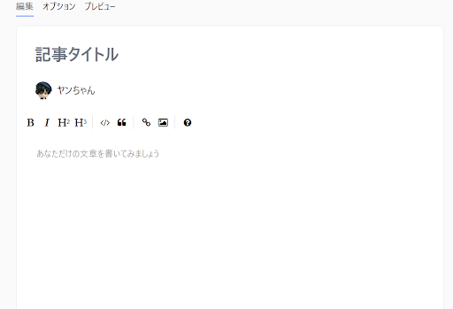
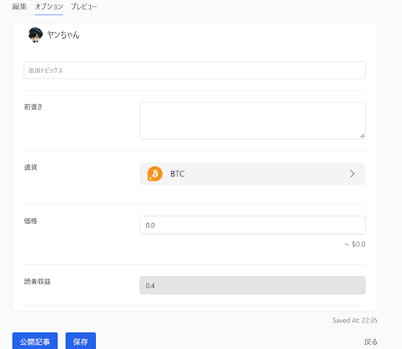
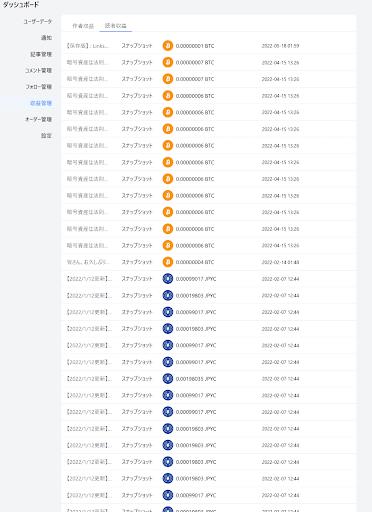
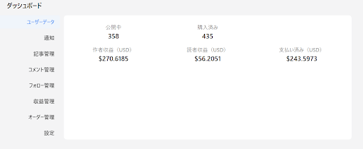
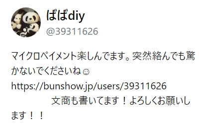

# 執筆者・読者共に報酬を受け取ることができる新しいメディアプラットフォーム「Quill」

- Author: ヤンちゃん
- Mixin ID: 39749821

## 免責事項

本記事は、下記dAppsの利用の推奨や特定の暗号資産への投資勧誘を目的としたものではありません。掲載されている内容やリンク先、サービス等からの不利益や損害については、一切の責任を負いかねます。各dAppsのご利用、または暗号資産への投資に関するご決定は利用者ご自身のご判断において行われるようお願いいたします。

## Quill

### 概要

[Quill](https://quill.im/)（日本では元々文商として提供されていた)は、Mixinユーザーならどなたでも記事を書いて価格を設定し、公開することができます。

どなたかがあなたの記事に興味を持ち、購読して頂けたら仮想通貨で収入を得ることができるサービスです。

記事タイトルを決めて、本文を仕上げたらオプションにすすみ前書き（冒頭の意。有料無料とわず閲覧できます。）を設定します。

『有料記事』にする場合は価格設定（BTC, ETHなど）、『無料記事』にしたい場合は価格を0.0にして公開記事にすればあなたの伝えたい内容が誰でもすぐに閲覧できます。

Quillの基本情報は以下のとおりです。

***
- 開発企業（開発者）：李安（Mixin ID：1051445）
- 対応言語：日本語、英語、中国語
- サービス概要：Quillは、Mixin Network上に実装された、執筆者・読者共に報酬を受け取ることができるwin-winな新しいメディアプラットフォーム
- 対応通貨：BTC、ETH, pUSD, XIN
- Mixin ID：7000101549
***

### ユーザーインターフェイス（UI）の紹介

#### 編集画面

執筆は、[マークダウン記法](https://backlog.com/ja/blog/how-to-write-markdown/)と呼ばれる記法を用います。マークダウン記法のルールはそれほど複雑でなく、初心者でも1時間あれば慣れることができます。また、マークダウン記法に触れたことがない方のために、画面上部にマークダウン記法のサポート機能が付いています。各アイコンをクリックするだけで、サイト側がマークダウン記法を用意してくれるため、慣れない方はこのサポート機能を利用すると良いでしょう。

記事はプレビュータブで公開前に確認することもできます。

#### オプション画面

オプション画面では、以下の項目を設定することができます。

- 記事タイトル
- 追加トピックス（Twitterの#のようなもの）
- 前書き（記事の価格に関わらず、冒頭に表示される文章）
- 支払い通貨の種類
- 各種価格（記事の販売価格や読者への還元価格など）

オプション機能を利用して、ご自身が望む形で記事の販売を行うことができます。

### 【作者】有料記事売買について

- BTC、ETH, pUSD, XINでリリース前に価格を設定します。（無料（0.0）で設定することも可能です。）

- 記事作者には売上の50%、10％は手数料、40％は購読者群でシェアします。

- 無料記事でも購読者がリワードしてくれたら作者にリワードの50％が配分されます。早期購入者にはシェア率に応じて配分があります。

### 【購読者】有料記事売買について

- 40%が読者群に配分される（最初の購読者は全配分、２番目は20％…購読者が増えると40％枠内の分配シェアに応じ分配額が変化します。
- シェアを変えるには記事購読後に複数人になったら記事にリワードするとリワード額に応じシェア率を増やすことができます。

### 早期購入者特典について

Quillは早期購入者（経験上２０読者以上の記事なら５番目くらいまで）は初期分配で記事購入額全額～７割程度くらい原資回収可能です。

購読者リワードもあなたのシェア率が高く維持できている場合に限り、後続購読者がいれば読者でも十分収益は得られます。

### 良い点

- **記事作者、記事を購入してくれた読者双方に利益還元する仕組みがある**

従来のメディアプラットフォームでは、記事やコンテンツの制作者のみがその利益を受け取ることができました。一方、Quillではコンテンツの制作者、コンテンツを購入した読者の双方に利益が還元されます。

- **売上金が仮想通貨ウォレットへ即時に着金される**

従来のプラットフォームは銀行口座を通じて売上が振り込まれるため、即時に着金することは難しいです。Quillは、報酬のやり取りに仮想通貨を用いているため、そうした着金にかかる時間を大幅に削減することができます。

- **多種多様な活用方法が存在する**

作者側の視点となりますが、Quillでは記事のリリース後にも記事追記や価格設定変更ができるため、情報量により価値を高める書き方もできるため小説や更新型のブログ運用もできます。

### 欠点

- **プラットフォームの持続性が低い**

私自身ユーザーとして５０以上記事書いて、４００以上の記事を購読しましたが、クオリティの高い作家さんの定着率が低く（もしくは参入していない）ので有料記事売買プラットフォームとしては持続性に欠けます。

- **購読者の啓蒙不足**

購読記事は購読者が紹介して広めていくことでQuillのシステムが活き、継続性とクオリティの高い作家さんの定着が図れますが、残念ながら購読者群は記事を購読したら終わりで記事伝播の流れをつくることができない状況です。

### FAQ

**Q：Quillを書きたいがどのように書けばよいか分からない。**

- A：あなたの書きたい興味のあることや伝えたいことを再確認してみましょう。日常やなにげない会話からニーズは掘り出せるはずです。
- A：構成に関しては参考になるQuillもありますのでご購読なさってみてください。

参考になる作者をピックアップしてみました。お時間がある方は是非参考にしてみてください。

