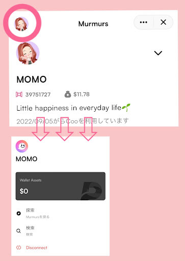
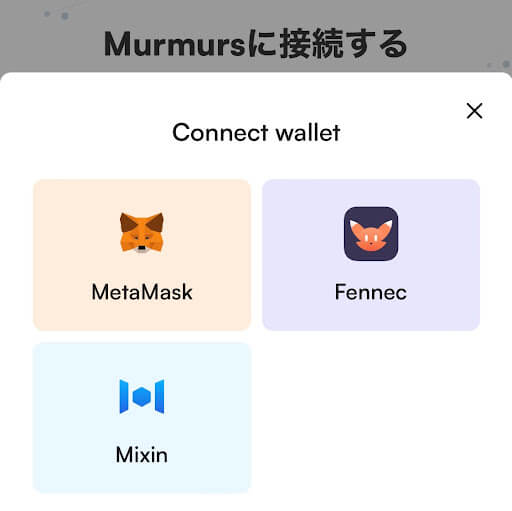
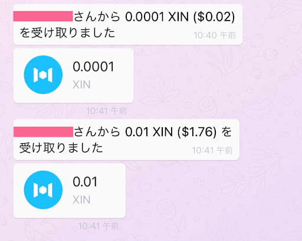

# WEB3.0！次世代SNS Murmurs✨

- Author: MOMO
- Mixin ID: 39751727

## 免責事項

本記事は、下記dAppsの利用の推奨や特定の暗号資産への投資勧誘を目的としたものではありません。掲載されている内容やリンク先、サービス等からの不利益や損害については、一切の責任を負いかねます。各dAppsのご利用、または暗号資産への投資に関するご決定は利用者ご自身のご判断において行われるようお願いいたします。

## Murmurs

### 概要

[Murmurs](https://murmurs.io/)は分散型ネットワーク[Mixin Network](https://mixin.network/)上にあるプラットフォーム、ソーシャル・ネットワーキング・サービス（SNS）です。文章や写真を投稿したり、みることができます。また、投稿者にTipを送ることができます。

Murmurとは「つぶやき」を意味しており、「Murmurs」は「近くで起こっていることをつぶやくように共有する場であると共に、他ユーザーのそうしたつぶやきを発見する場でもあるSNS」と表現できます。

Murmurs の基本情報は以下の通りです。

***
- 開発企業（開発者）：Lyric
- 対応言語：英語、日本語
- サービス概要：分散型ネットワークMixin Network上にあるプラットフォーム、ソーシャル・ネットワーキング・サービス（SNS）
- Mixin ID：7000101420
***

### Murmursの機能

#### テキストや画像の投稿

- 全角140文字以内のテキスト、1度に4枚までの画像やファイルの投稿ができます。

#### 投稿へのリアクション

- フォロー
- いいね / ★
- リプライ（返信）
- フォワード （リツイート）
- コメントを付けてリツイート
- URLのコピー
- Tipの送信

#### 探索/検索

- ホームページ : ひと言メッセージの記載やフォロワーやフォローの確認などができます。
- ホーム : 自分の投稿やフォロワーの投稿が時系列に表示されます。
- 通知 : リプライが時系列に表示されます。
- 探索 : 『提案』『トレンド』『最新』の3つの項目が表示されます。

- 提案 : ピックアップユーザーを参照できます。
- トレンド : 人気の高い投稿が表示されます。
- 最新 : 最新の投稿が時系列に表示されます。

探索では新たなユーザーを発見するのに役立ち、繋がることができます。

#### ユーザーの検索

画面左上のアイコンからユーザーの検索ができます。検索機能を使うことで、手軽に知っているユーザーと繋がり合うことができます。

#### Tipの送受信

MetaMask、[Mixin wallet](https://mixinwallet.com/)、Fennecに対応しています。対応暗号通貨はBTC、ETH、XIN、USDTです。

受け取り履歴はチャットに表示され、トランザクションを確認することができます。

### Murmursの魅力✨

特筆すべきは、WEB3.0！分散型ネットワーク上に構築されたプラットフォームであり、新しいコミュニティということです。

- **Mixin messengerの特徴を生かした通知機能！** チャットに通知が届くため、新規フォロワーやリプライなどを見逃すことがありません。通知から直接該当ページに移動することができるのでとても便利です。

- **投稿可能容量が大きい！** 一度に4枚までの画像やファイルの投稿ができ、URLと同時投稿も可能です。つぶやきの幅が拡がります。

- **Tipの支払いが簡便！** Mixin messengerを利用することで送金先アドレスを入力するなどの面倒な手続きが一切必要ありません。送受信に手数料がかからず、マイクロペイメントを迅速に確実に行うことができます。Mixin Wallet以外のWalletへの[Connect](https://murmurs.io/connect)（接続）も可能です。

コミュニケーション目的としてmurmur！ひとりで黙々とmurmur！使い方は自由です。

趣味や時事NEWS、身の回りのちょっとした出来事などをつぶやいてみましょう。誰かの目に止まり、もしかしたら誰かがそのつぶやきに返信をしたりTipを送ってくれるかもしれません。

誰かのつぶやきを読むことで、新たな発見があるかもしれません。良いなと思ったら、簡単に迅速に投稿者にTipを送ることができます。

### Murmursの現状

- Murmursはローンチしたばかりです。そのため、認知度が低く利用するユーザーが少なく、投稿が少ないです。

- 執筆時現在、報酬が貰えるイベントを不定期的に開催されています。タスクをこなすことでMurmursの機能を段階的に習得することができます。Murmurs登録者数に対して参加率が低く、定着率の低さが示唆されます。参加者にとっては、当選確率の高い魅力的なイベントとなっています。

### おわりに

[Mixin Network](https://mixin.network/)上にあるプラットフォーム、Murmursについて紹介しました。アカウントでの投稿は匿名性があり自由に気兼ねなく投稿できるというのが良いところですが、人の目にふれるものです。これは、Murmurs に限ったことではありませんが発言には十分配慮が必要です。

次世代SNS Murmursが周知され、利用するユーザーが増えることにより、私たちユーザーは興味関心や探究心が芽生えるきっかけをより多く得ることができるでしょう。Murmursの魅力を生かすのは私たち次第です。

