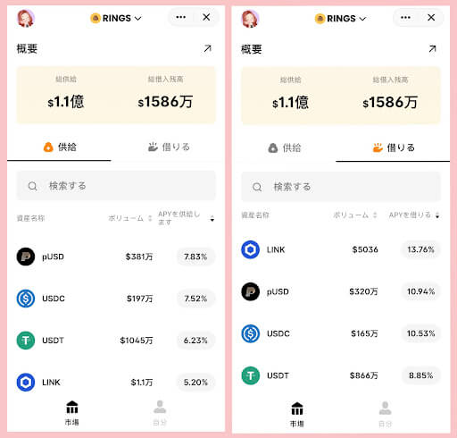

# Pando Ringsで暗号資産を稼ぐ！

- Author: MOMO
- Mixin ID: 39751727
- [Source](https://pando.im/essays/2022/an-introduction-to-pando-rings/ "Pando Ringsで暗号資産を稼ぐ！")

## 免責事項

本記事は、下記dAppsの利用の推奨や特定の暗号資産への投資勧誘を目的としたものではありません。掲載されている内容やリンク先、サービス等からの不利益や損害については、一切の責任を負いかねます。各dAppsのご利用、または暗号資産への投資に関するご決定は利用者ご自身のご判断において行われるようお願いいたします。

## Pando Rings

[Pando Rings](https://pando.im/ja/rings/)は、Mixin MTG(Mixin Trusted Group)技術で構築されたアルゴリズムによる自律的な金利プロトコルで『暗号通貨を貸し借りできる場所』お金のオープンマーケットです。暗号通貨を預けて利息を得たり、暗号通貨を担保に他の暗号資産を借りたりすることができます。

### Pando Ringsの仕組み

Pando Ringsで提供される資産は、Pando RingsのネイティブトークンであるrTokensと呼ばれるトークンで追跡されます。 rTokensは、Pando Ringsの資産プールの一部に対する請求権を表すERC-20トークンです。

例えば、Pando RingsにBTCを入金すると、それはrBTCに変換されます。ETHを入金すると、rETHに変換されます。 rTokenは、Mixin wallet間であれば受け渡しすることもできます。

マネーマーケットが利息を得る(借入が増加)につれて、rTokensは利息を得て、より多くの原資産に変換できるようになります。複数のコインを預けると、それぞれのrTokenの金利に基づいて利息を得ます。rTokenを保有することで、Pando Ringsの利息を稼ぐことができます。

#### Pando Ringsで貸し出す

供給したい資産を選択し、Mixin Walletを通じて取引に署名することで即座に資産はプールに追加されます。同時に、資産はrTokenに変換され、リアルタイムに利息を獲得し始めます。

#### Pando Ringsで借りる

借入力（借入残高）を得るために、担保としてrTokenをシステムにロックし質権設定したことを確認します。供給に利用可能なすべての資産は、その担保係数に基づいて、異なる量の借入力を追加します。持っている総借入力(借入限度額)に応じて借入を行うことができます。

Pando Ringsのすべての金利は、利用率の関数として決定されます。**利用率の変化に伴い、金利は継続的に変動**します。

Pando Ringsの基本情報は以下の通りです。
***
- 開発企業（開発者）：[Pando](https://hellopando.com/)
- 対応言語：英語、日本語、ドイツ語、中国語、スペイン語、韓国語
- サービス概要：Pandoによって提供されているMixin Network上の分散型の仮想通貨の貸借プラットフォーム
- Mixin ID：7000104159
***

### Pando Ringsの魅力✨

- **スマホで直感的に操作ができる！** 圧倒的にシンプルでわかりやすいUIデザインです。 
- Mixin Walletがあれば**面倒な手続きは不要！** 貸し借りや返済、引き出しを24時間いつでも迅速に行うことができます。
- **業界最高水準の高い金利！** 利息は複利で、15秒ごとに計算され、いつでも元本と利息を引き出すことができます。
- 使わずに眠っているだけの暗号資産を貸出して、**お得に暗号資産が増える！** 少額からでも始められるので積立にも最適です。

### Pando Ringsのデメリット

- 保有通貨を預けている間にも相場は動いています。価格変動により損をする可能性があります。これはPando Ringsに限ったことではありません。そのため、銘柄選びが重要となります。
- 供給と借入の金利は、需要と供給に基づいてアルゴリズム的に調整されます。そのため、希望する銘柄に流動性がない場合もあります。

### 【Pando Ringsを始めるために】Mixin walletに暗号通貨を入金する方法🌱

Mixin Walletへの入金方法は、以下の３つの方法があります。

**①暗号資産取引所からMixin Walletに送金する。**
    
取引所ごとに送金手数料が異なります。手数料の低い暗号通貨を選ぶ、手数料の掛からない取引所を選ぶ、などの方法がありますので見比べてみましょう。
    
**②JPYCを購入し、MixinのdAppで希望する暗号通貨に交換する。**
  - 【STEP1】JPYCは[JPYC公式サイト](https://app.jpyc.jp/)で購入することができます。Ethereum（ETH）ネットワークを選択します。
  - 【STEP2】Mixin walletに送金されたJPYCをMixin Network上にある[4swap](https://app.4swap.org/)で希望する暗号通貨に交換します。

**③[Fennec](https://pando.im/wallet)や[MetaMask](https://bridge.mvm.app/)をPandoにブリッジする。**

## 終わりに

[Mixin Network](https://mixin.network/)上にあるPando Ringsについて紹介しました。本記事はdAppsの利用の推奨や特定の暗号資産への投資勧誘を目的としたものではありません。サービス等のご利用からの不利益や損害について、一切の責任を負いかねます。ご自身の責任のもと、理解してご利用ください。

