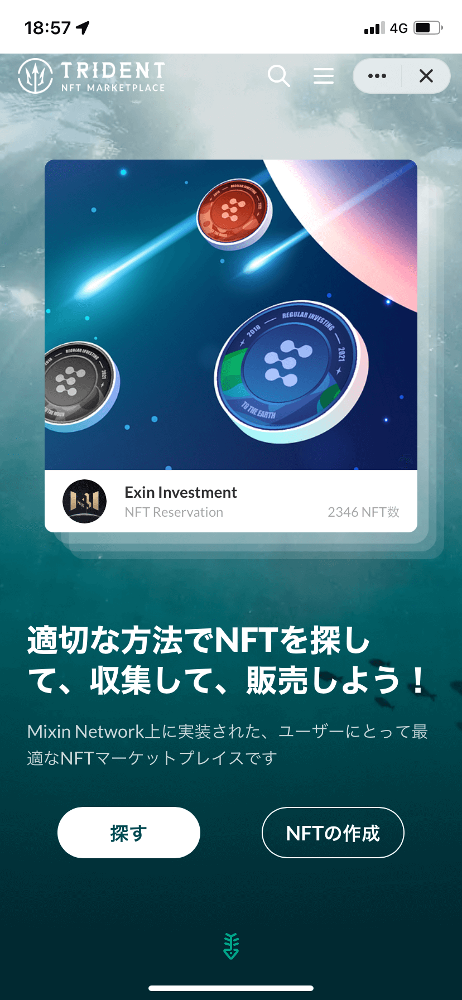

# Mixin上で最大規模のNFTマーケットプレイス「Trident」  

- Author: Katsu カツ
- Mixin ID: 39214520

## 免責事項

本記事は、下記dAppsの利用の推奨や特定の暗号資産への投資勧誘を目的としたものではありません。掲載されている内容やリンク先、サービス等からの不利益や損害については、一切の責任を負いかねます。各dAppsのご利用、または暗号資産への投資に関するご決定は利用者ご自身のご判断において行われるようお願いいたします。

## Trident

Tridentは、Mixin Network上に実装された、現在Mixin エコシステム上唯一のNFTマーケットプレイスです。

### 概要

- 開発企業（開発者）：李安（Mixin ID：1051445）
- 対応言語：日本語、英語、中国語
- サービス概要：Mixin Network上に実装されたNFTマーケットプレイス
- 対応通貨：BTC、ETH、XIN、pUSD、USDT、JPYC等Mixin上の主要流通通貨
- Mixin ID：7000104475

Tridentは、Mixin Network上実装されたNFTマーケットプレイスです。主に以下の２つの機能が実装されています。

- NFT取引機能：Mixin Network上のNFTを取引することやNFTのオークション取引をすることができます。
- NFT作成機能：誰でもTridentでNFTを作成することができます。人気の創作者は公式から優秀アーティスト認証

上記機能の利用は、Mixin Messengerのみならず、Webブラウザウォレット(メタマスクなど)からアクセスも可能です。

### 良いところ

Tridentの良いところは、3つあります。

**①手数料無料且つスピーディー**

１つ目は、TridentはMixin Network 上で構築された為、手数料無料で利用すること且つ高速で取引や創作することができる点です。イーサリアムでNFT取引経験のある方は分かると思いますが、手数料が変動したり、スピードが不安定したりすることが多いでしょう。Tridentなら安定でスピーディーな取引ができます。

**②多数の端末、ウォレット対応**

２つ目は、Mixin Messengerだけではなく、メタマスクなど、スマホやPCから色々なウォレットからアクセスできる点です。Mixin Messengerユーザーのみならず、PCでブラウザウォレットを利用しているユーザーも簡単に利用できます。

**③開発者の活躍**

3つ目は、開発者の更なる活躍が期待できることです。Tridentの開発者李安さん(1051445)は、Mixinコミュニティで大活躍されている1人の開発者で、複数のミニアプリを開発しています。Links公式で最初に発表されたミニアプリ「文商」のオリジナルバージョンである「Quill」も彼が開発した１つのミニアプリです。そして、多くのコミュニティに愛用されているサークル機能「我信」も彼が開発したもので、特定のNFTによるサークルメンバーシップの獲得など、NFTで複数のミニアプリを連携することが実現されました。

また、Mixinを通じて直接に開発者に連絡できるので、使用上の問題点や要望などがあれば、開発者本人に伝えば、近いうちに更新してくれます。(JPYCへの対応は当日中に更新してくれました)これからも新アプリや新機能のリリースが期待できるでしょう。

### イマイチなところ

便利に利用できるTridentですが、現時点で残念なところもあります。

**①現在ユーザー数が少ない**

１つ目は、現在ユーザー数が少ない点です。そもそもMixin Networkの利用者数が少ないので、１つのDappに過ぎないTridentの利用者が更に少ないのも当然です。その故、優秀なアーティストや作品が少ないのは現状です。しかし、これから日本人ユーザーや創作者が参入することでコミュニティの成長は期待できるでしょう。

**②公式コミュニティは中国語のみ対応**

２つ目は、公式コミュニティは中国語のみ対応することです。開発者による更新発表やコミュニティ内の情報発信は基本的に中国語で行うので、最新情報の取得や利用上のお問合せが困難だと考えられます。

**③流通額の統計機能は実装されていない**

３つ目は、マーケットプレイス内の総流通額などのデータ統計機能が実装されていないことです。アプリの細かいところについてはユーザーからのアドバイスや要望などが重要です。

