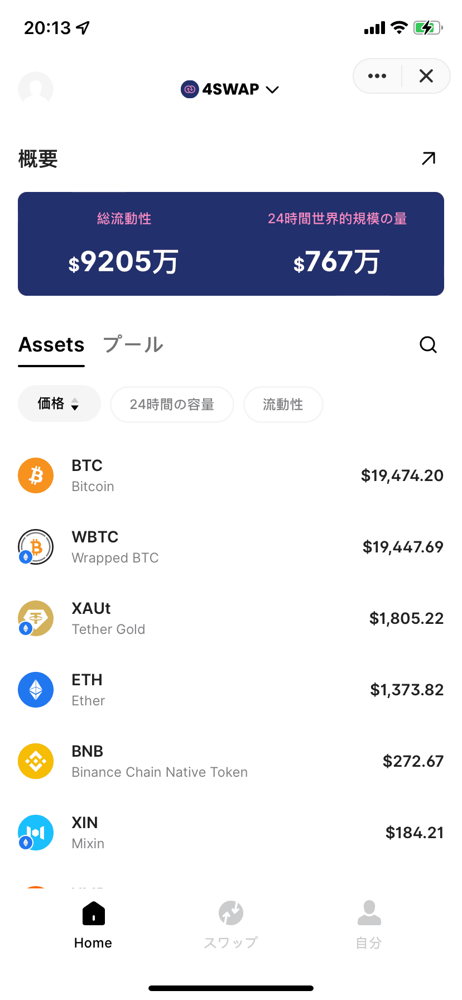
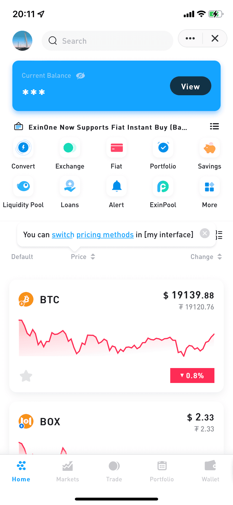
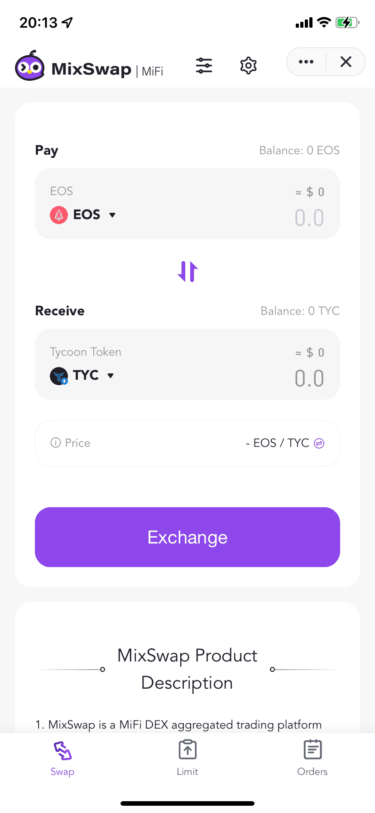

# 【2022年版】Mixin Network上の金融サービス紹介                                                                                               

- Author: Miyazaki
- Mixin ID: 39811596

[Mixin Network](https://mixin.network)は、「全てのブロックチェーンのレイヤー２へ」をビジョンに掲げており、ブロックチェーンに馴染みのない方にもフレンドリーなパブリックブロックチェーンのひとつです。Mixin Networkのブロックチェーン内に持ち込まれている総資産額は約[9.8億](https://mixin.space/)ドル（執筆時点）ほどです。また、そのうちDeFiプロトコルに預けられた暗号資産の価値（TVL）は約[440百万ドル](https://defillama.com/chains)（執筆時点）であり、これはパブリックブロックチェーンの中でも12番目に大きい金額です。

Mixin Networkはブロックチェーンとしての規模が大きいのみならず、スマートフォンに最適化されているチェーンでもあります。多くのブロックチェーンがwebブラウザからアクセスする必要がある中、Mixin Networkは独自開発した「Mixin Messenger」を通じてスマートフォンからブロックチェーンにアクセスすることが可能です。

今回は、こうしたMixin Network上で展開されている主要な3つの金融サービス（DeFi含む）についてご紹介します。紹介する金融サービスを活用することで、Mixin Network内の資産を効率的に運用することができますので、ぜひご覧ください。

## 免責事項

本記事は、下記dAppsの利用の推奨や特定の暗号資産への投資勧誘を目的としたものではありません。掲載されている内容やリンク先、サービス等からの不利益や損害については、一切の責任を負いかねます。各dAppsのご利用、または暗号資産への投資に関するご決定は利用者ご自身のご判断において行われるようお願いいたします。

## 4swap

### 概要

4swapは、[Pando](https://pando.im)によって提供されているMixin Network上の分散型取引所（DEX）です。最もメジャーなDEX Uniswapと同様に、4swapもAMM（Automated Market Maker）という仕組みを採用しています。AMMについては、[こちらの記事](https://coinpost.jp/?p=216803)で深く理解することができます。

4swapの基本情報は以下の通りです。

- 開発企業（開発者）：[Pando](https://pando.im/ja/)
- 対応言語：英語、日本語、ドイツ語、中国語、スペイン語、韓国語
- サービス概要：Pandoによって提供されているMixin Network上の分散型取引所。
- Mixin ID：7000103537

4swapには、2つの機能が実装されています。

- 取引機能（スワップ機能）：さまざまな暗号資産の取引を行うことができます
- 流動性提供機能：流動性プールにお手持ちの資産を貸し出すことで、一定の利回りを得ることができます

### 良いところ

4swapの良いところは、3つあります。

**①豊富な取引ペア**

Mixin Networkが複数のブロックチェーンと互換性を持っているため、Mixin Metwork上の4swapでも異なるブロックチェーンの暗号資産を取引することができます。Uniswapはイーサリアム上のDEXですので、基本的にイーサリアム上で発行されている暗号資産のみ取引可能です。一方、4swapではビットコインとイーサリアムの取引ペアといった異なるチェーンの暗号資産を取引できます。

**②取引量が安定している**

4swapの[日別の取引量](https://app.4swap.org/#/market/overview)を確認すると、安定して数億円ほどの取引量が存在していることがわかります。流動性プールに資産を貸し出すことで得られる利回りは取引量に左右されるため、取引量が安定しているということは利回りが安定していることを意味します。
もちろん、ここで表示されている取引量は4swap全体の取引量を示していますので、正確には各ペア間の取引量を確認する必要がありますが、4swap全体の取引量も参考にはなると思います。

**③流動性プールの総資産額が大きい**

4swapの流動性プールの総資産額は、現在約140億円となっています。4swapでは、ユーザーは流動性プール内の資産と取引を行うため、流動性プールの資産額の大きさによって取引の円滑さが左右されます。140億円という金額は、円滑な取引を実現するには十分な額であると言えます。その一方、取引量と同様に140億円という金額は、4swap全体の流動性プールに預けられている金額です。実際には、ユーザーは各取引ペアの流動性プールと取引することとなりますので、各通貨間の取引の円滑さを見るためには、各取引ペアの流動性プールの資産額を確認する必要があることに注意してください。

### イマイチなところ

Mixin Network内で最大規模のDEXである4swapですが、欠点もいくつかあります。

**①流動性に偏りがある**

当然ですが、ユーザーからの需要が高い（人気である）暗号資産の取引ペアであればあるほど、流動性は大きくなります。一方、マイナーな暗号資産の流動性プールはどうしても資産額が小さくなってしまう傾向にあります。例えば、ビットコインとUSDTの取引ペアの流動性プールには、約21億円の資産が預けられています。一方であまり人気のない取引ペアの流動性プールに預けられている金額は、数万円を下回っていることもあります。このように各取引ペアで流動性に大きな差がある点については注意が必要です。

**②不利なレートで取引が成立する場合がある**

では、流動性が低いとどのようなことが生じるのでしょうか。端的にいうと、ユーザーが意図しないレートで取引が実行されてしまう可能性が高くなります。こうした意図しないレートによる取引を防ぐために、「スリッページの許容範囲」を設定する必要があります。スリッページとは、ユーザーの注文レートと実際に約定したレートの差の事を指します。4swapでは、このスリッページの許容範囲を取引する際に「0.1%、0.5%、1%、カスタム」の中から選択できます。ぜひ、取引の際にスリッページの許容範囲を設定することをお勧めします。

## ExinOne

### 概要

ExinOneは、Exinによって提供されている暗号資産の総合金融サービスプラットフォームです。

ExinOneの基本情報は以下の通りです。

- 開発企業（開発者）：[Exin](https://github.com/Exinone)
- 対応言語：英語、中国語
- サービス概要：Exinによって提供されているデジタル資産の総合金融サービスプラットフォーム
- Mixin ID：7000101276

ExinOneは、暗号資産に関連する多種多様な機能を１つのミニアプリで一括提供しています。具体的には以下の機能が実装されています。

- 取引機能（Convert、Exchange、Fiat、Portfolio）：暗号資産間の取引だけでなく、クレジットカードによる暗号資産の購入、暗号資産の自動投資といった機能も搭載されています
- 積立機能（Savings）：暗号資産をExinOneに預けることで、一定の利回りを得ることができます
- マーケット情報の表示（Markets）：暗号資産のマーケットデータを確認することができます
- ローン機能（Loans）：暗号資産の借入を行うことができます

上記以外にも多種多様な機能が豊富に備わっています。ユーザーはこうした機能をMixin Messengerのウォレットを登録するだけで利用することができます。

### 良いところ

ExinOneの良い点は、２つあります。

**①わかりやすいインターフェイス**

１つ目は、アプリのユーザーインターフェース（UI）が非常に見やすく、ユーザーも直感的に扱うことができる点です。例えば、ホーム画面上部にExinOneが提供している機能が表示されていますが、こうした機能には画面下に表示されている機能を種類別に分けた「Home、Market、Trade…」をタップしてもアクセスすることができます。そのため、どの機能が大まかにどのようなことを提供しているのかユーザーが理解しやすい設計となっています。

**②ExinOneで暗号資産運用を一括で行うことが可能**

２つ目は、ExinOneで一通りの暗号資産運用を行うことができる点です。通常の取引機能に加え、積立機能やステーキング機能なども備わっているため、こうした機能を有効活用することで効率よく暗号資産運用を行い、かつ管理が容易となります。

### イマイチなところ

豊富な機能を搭載しているExinOneですが、欠点もいくつかあります。

**①日本語対応していない**

１つ目は、日本語をサポートしていない点です。ExinOneは、現在中国語と英語のみをサポートしています。ユーザー自身の資産を扱うため、日本人ユーザーが母国語でアプリケーションを扱えないことで資産を減らしてしまう恐れがあります。特に暗号資産運用においては、独自の投資方法や暗号資産特有のリスク等があるため、そうした内容を母国語で正確に入手できる必要があります。英語や中国語に自信がないユーザーは、慎重に利用するようにしましょう。

**②暗号資産への理解が浅いユーザーには難しい**

２つ目は、暗号資産への理解が浅いユーザーには使いこなすことが難しい点です。ExinOneには多種多様な機能が備わっていますが、これは裏を返すとユーザーは多種多様な資産運用方法から選択する必要があると言えます。つまり、ユーザーはExinOneが提供している機能についてある程度理解しておかなければなりません。すでに暗号資産運用の経験が豊富な方はExinOneについて理解しやすいですが、初心者には理解が困難な機能もあります。暗号資産運用機能についてのリスクやメリットを理解せずに利用を行うと、ユーザーの資産を失う可能性も十分にあるため、初心者の方はまずExinOneの各種機能を十分に理解した上で利用することが良いでしょう。

## MixSwap

### 概要

MixSwapは、Exinによって提供されている分散型取引所（DEX）アグリゲーターです。DEXアグリゲーターとは、複数あるDEXの中から最適なレートをユーザーに提供するサービスを指します。同様のサービスに1inch networkなどがあります。

MixSwapの基本情報は以下の通りです。

- 開発企業（開発者）：Exin
- 対応言語：英語、中国語
- サービス概要：Exinによって提供されている分散型取引所（DEX）アグリゲーター。
- Mixin ID：7000103767

MixSwapには、2つの機能が実装されています。

- 取引機能（スワップ機能）：さまざまな暗号資産の取引を行うことができます
- 指値注文機能：特定の価格、あるいはそれよりも有利な価格で売買を提案することができます

### 良いところ

MixSwapの良いところは、2つあります。

**①複数のDEXを行き来する必要がない**

MixSwapを利用することで、複数間のDEXを行き来してより良い取引レートを探す手間が省けます。現在MixSwapは、Mixin Network上のDEXであるExinSwapと4swapに対応しています。両者は、Mixin Network内トップ2に入るDEXです。従って、両者のレートがMixSwap内で比較されることで、ユーザーは効率よく暗号資産取引を進めることができます。

また、ExinSwapに存在しない取引ペアでも、4swapに存在する場合、ユーザーは最初からMixSwapにアクセスすることでExinSwapで取引ペアを探した後に4swapへ移動するよりもやはり効率的に取引を進めることができます。

**②（一部取引において）手数料が発生しない**

MixSwapを利用して通常の取引を行う場合には、MixSwapを利用する対価としての手数料は発生しません。この点は非常にユーザーにとってメリットが大きいと思います。しかし、最終的にはMixSwapを通じて4swapもしくはExinSwapで取引を行うこととなり、その際の各種DEXを利用する対価としての手数料は発生します。あくまでもMixSwapからの手数料は発生しないという風に認識していただければと思います。

また指値注文を利用する際は、MixSwapに0.2%の手数料を支払う必要がありますのでご注意ください。

### イマイチなところ

さまざまなメリットがある一方で、MixSwapには欠点もいくつかあります。

**①日本語対応していない**

MixSwapは、現在中国語と英語のみに対応しており、日本語には対応していません。この点は日本人ユーザーにとっては大きなデメリットとなります。暗号資産運用においては、独自の投資方法や暗号資産特有のリスク等があるため、そうした内容を母国語で正確に入手できる必要があります。英語・中国語に自信がない方は、まずweb等でDEX、DEXアグリゲーターのリスクを予習するなどして、慎重に利用を進めていくようにしましょう。

**②指値注文の板が薄い**

MixSwapには、指値注文機能がありますが、取引ペアのほとんどの流動性が低い状態にあります。そのため、指値注文を行ったとしても約定する可能性は低いと考えられます。指し値注文の約定をお急ぎの方は、別のプラットフォームや取引所にて注文を行うことをお勧めします。

いかがでしたでしょうか。より無駄なく暗号資産のスワップを行いたいユーザーは、MixSwapを通じて取引を行うことで効率よくお手持ちの暗号資産を交換することができます。ぜひ、一度お試しください。

## 最後に

いかがでしたでしょうか。本記事では、Mixin Network上の主要な金融サービス3つをご紹介しました。いずれのサービスも日本語対応がなされていないという点で日本人には扱いづらいかもしれませんが、展開しているサービスは基本的にDeFi業界ではメジャーなものとなっています。そのため、他ブロックチェーンの類似サービスで日本語対応しているサービスを利用してから、Mixin上のサービスを扱うことをお勧めします。

