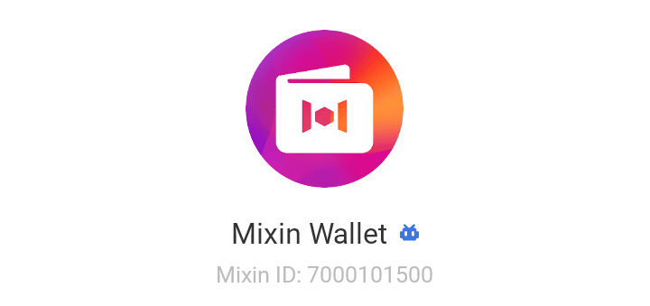
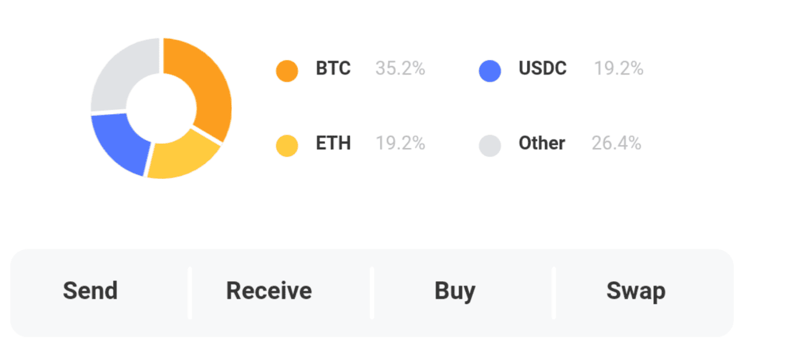
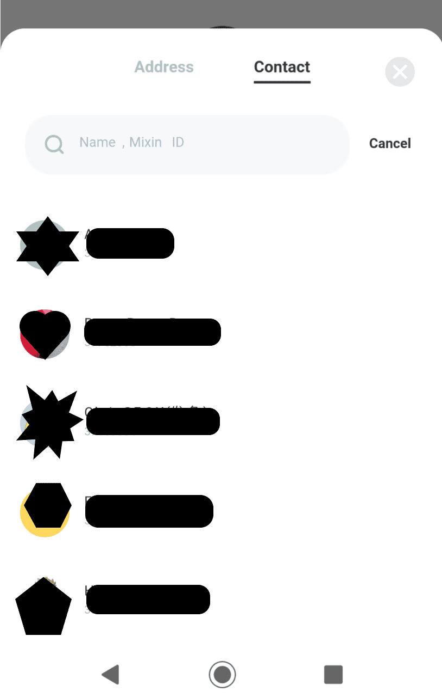

# 視覚的なわかりやすさを追求したウォレット「Mixin Wallet」

- Author: ヤンちゃん
- Mixin ID: 39749821

## 特徴

MixinメッセンジャーのWalletと直結し、
以下の機能に特化して視覚的に使いやすくしたアプリです。

- ■送金
- ■入金
- ■購入（BTC　ETH　USDC　USDT）
- ■スワップ

## Mixinメッセンジャーとは?以下参照

[Mixin](https://mixin.one/messenger)

## 利点

- ◎他ネットワーク間のスワップ機能MixSwapがついているので直観的な操作が可能です。
- ◎送金履歴がコインごとに残るため管理しやすいです。

主に暗号資産の入送金と資産の管理に特化した使い方をするアプリです。

## 欠点

■Mixinネットワーク内部の送金、スワップなど、暗号資産の送受信に関して高い利便性とスピードに優れていますが、Mixinからご使用の取引所、Walletへ出金する際には出金feeを理解していないと割高になる場合があります。

Mixinに入金するときは入金する取引所、個人Walletのfeeをよく確認しましょう。

## 入金に関しては国内、ネットワークfeeは以下が安いです。

国内取引所は0円送金が多い

- ◎XRP

個人Walletなど早くて安いのは以下

- ◎SOL
- ◎TRX
- ◎AVAX（※注意AVAX-Cではない）

TRXは他所取引所、Walletの出金feeは0、もしくは1TRXです。Mixinは他と違い23TRX出金feeで割高です。

## Mixinから出金に関しては以下がfee安くつきます。

- ◎SOL
- ◎AVAX（※注意AVAX-Cではない）
- ◎DOGE

※2022年　9月現在はfee8DOGEが最安で出金可能です。

## まとめ

使えるAPPの機能や特徴をよく見極めて組み合わせたり、用途に応じた使用方法で更にあなたが使いやすいようにカスタマイズできるのがMixinメッセンジャーの良いところです。

悪いところも工夫や組み合わせ、使い方で解消して使う、もしくは使わないを選択しましょう。

あなたが快適に使えるよう参考になれば幸いです。

## FAQ

頻繁に質問のある事例です。

- ●Q：Mixinに入金する際、どの取引所からどのコインを送金したらよいですか？
- ●A：GMOコイン　50XRP以上無料で送金できます。
- ●A：GMOコインは国内銀行への日本円入金は無料です。

暗号資産を日本円に換金するため口座は開設しておいたほうがおススメです。

※トラベルルールの確認を求められ登録してから送金となります。

銀行口座は住信SBIネット銀行に口座開設していればほとんどの国内取引所への送金は手数料無料です。

- ●A：　送金なさったXRPがMixin　Walletに着金後、MixSwapで必要なコインに交換してご使用ください。
