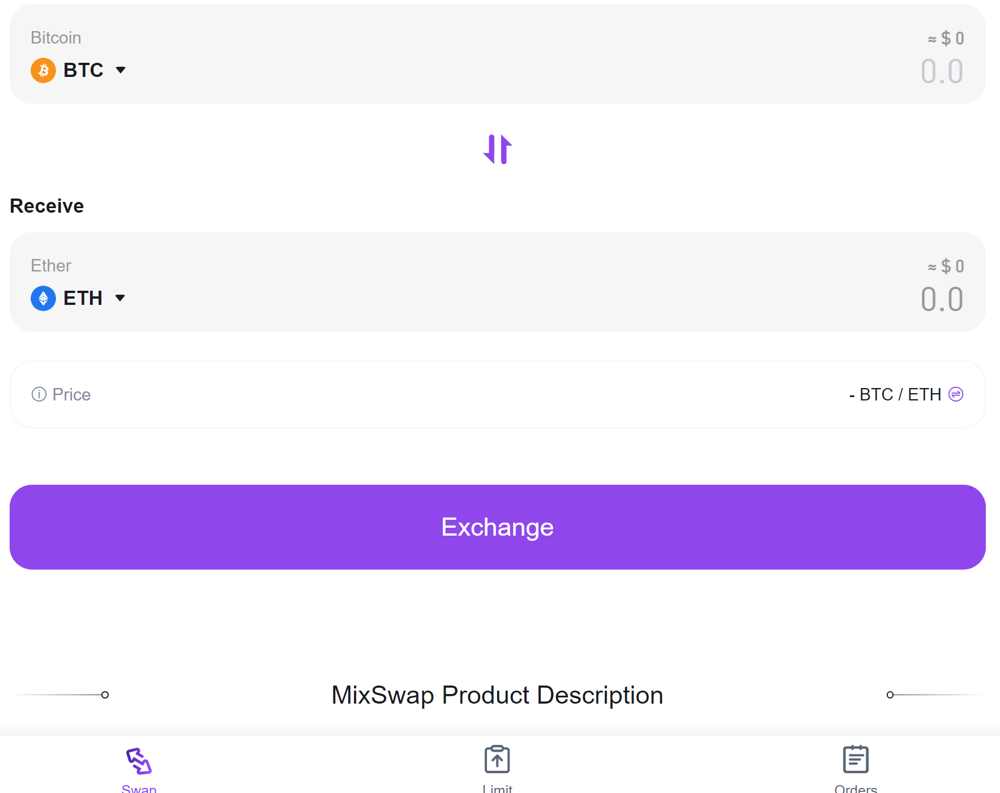
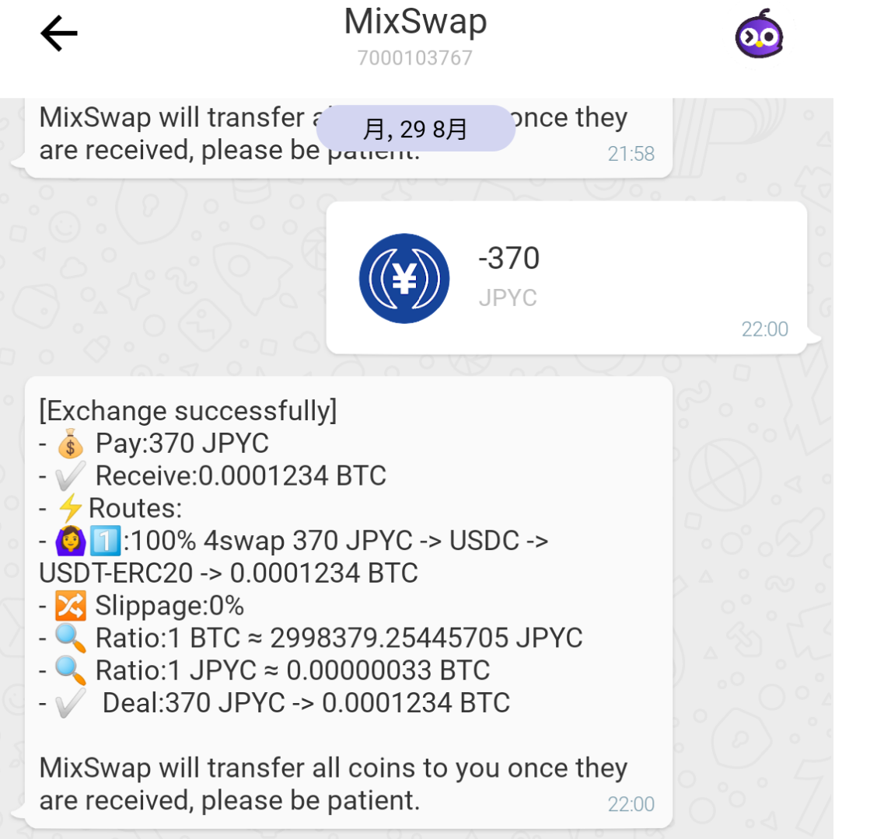
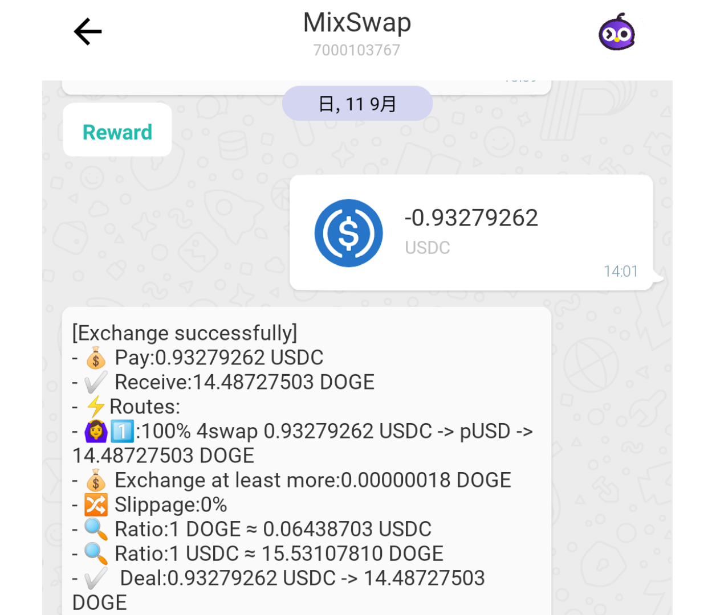

# Mixinの「1inch」！複数の取引所から最適レートの取引を実現する「MixSwap」

- Author: ヤンちゃん
- Mixin ID: 39749821

## 特徴

Mixin Network上のDEXアグリゲーターです。

MixinにはほかにもExinSwapと4swapというDEXがありますが、両者のレートがMixSwap内で最適なレートを探し出しその時点で適切なレートをユーザーに提供するサービスです。

## 利点

◎Mixin Networkで取り扱いのあるほとんどの暗号資産に対応しています。
スワップはこのアプリがあればマイナーなコイン以外は対応できるので十分です。

◎1円単位～以下のスワップでも対応しており、0.00000111BTCなど少額でもUSDTにスワップ
したり、細かい端数を1つのコインにまとめることもできるので便利です。

◎手数料は他のDEXを跨がないならMixSwapで完結する場合無料です。
実際、使っていて経験上ほぼそれはないですが手数料は微々たるものなので問題ありません。

以下、少額スワップの結果をアプリ内で参照できます。

【スワップ結果参照例①】

【スワップ結果参照例②】

Mixin Network内で集まったコインはMixSwapを使用して任意のコインにひとまとめにすることで手数料も他のDEXを行き来する手間もなく時短となります。

## 欠点

### ■欠点というのもユーザーの立ち位置で変わります。

他DEX使用しているMixinユーザーは海外DEXに慣れていらっしゃるため問題ありません。
初心者の方は日本語に対応していませんので使いづらいかもしれません。

※使用できるのは中国語と英語です。

### ■一部、スワップできないマイナーコインがあります。

Mixin Networkは多様なコインが使われています。

メジャーどころは何の問題もありませんが、たまに価値が0のコインもあり、対応されてない場合もあります。

その場合は他DEXでスワップ可能です。

ベテランユーザーの方々はそのDEX使用するため問題ではありません。

MixSwapもネットワーク内すべてのコインに対応してないという欠点もあります。

## 参考　Mixin Network内　その他DEX

- [4Swap](https://app.4swap.org)　　Mixin ID：7000103537
- 4Swap　Legacy　Mixin ID：7000103699

## まとめ

MixSwapはあなたのWallet内にある少額なコインやMixin内で使用する必要なコインを
スワップしたりとても便利なアプリです。Walletと組み合わせて頻繁に使用します。

Mixinに登録したら1番目に検索して追加しましょう。
●Mixin ID：7000103767

次にMixinWalletをご紹介しますがそのアプリにも繋がっております。

Mixinから出金する時にMixSwapを使用して出金feeを抑え、あなたに余計な出費を強いるのを抑えるため続けてご覧ください。

◎安く出金するためにMixSwapで交換するコインとは?
