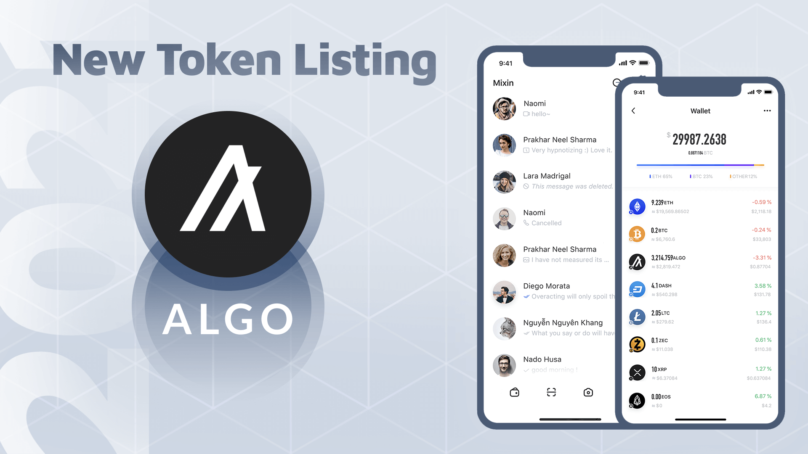

Mixin Network now supports the 37th blockchain Algorand, the token ticker is ALGO, the official website is https://www.algorand.com/.

Algorand is the world's most powerful and sustainable blockchain. Its institutional grade blockchain infrastructure is the frist and only to achieve decentralization, scalability, and security without compromises and while being environmentally sustainable.