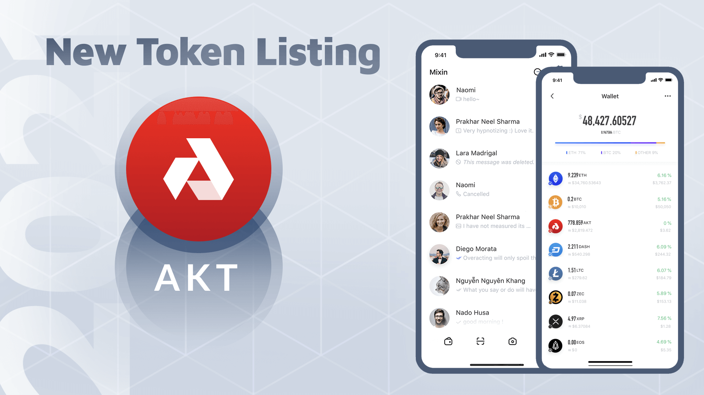

Mixin Network now supports the 38th blockchain Akash Network, the token ticker is AKT the official website is https://akash.network/.

Akash Network, the world's first decentralized and open-source cloud, accelerates deployment, scale, efficiency and price performance for high-growth industries like blockchain and machine learning/AI.