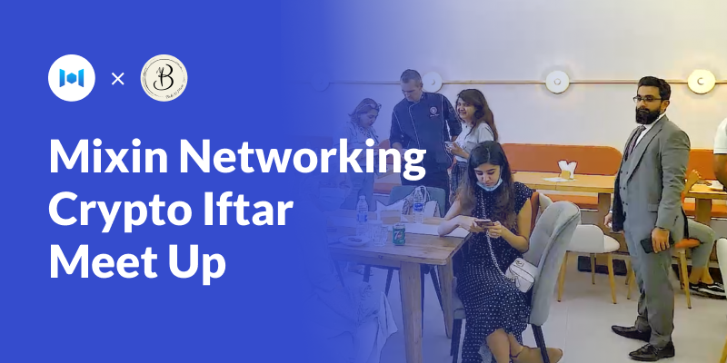
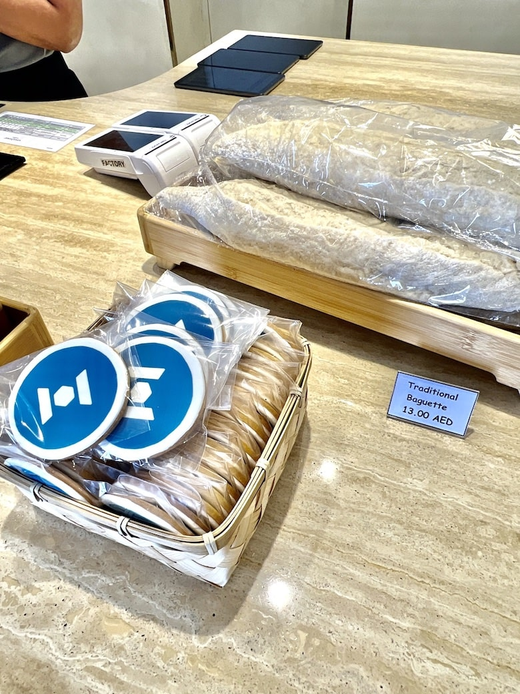

# Mixin Networking Crypto lftar Meet-up

April 20, 2022: Mixin Network hold its first meet-up with Bake N More cafe. Before the event, Mixin and Bake N More prepared customized hand-made crypto biscuits which printed XIN and SHIB token logos.

During the Mixin Networking Crypto lftar meet-up, Meng Chan Shu from Mixin Network introduced basic information about Mixin and its recent success with Bake N More. MixPay, from our ecosystem, also gave them a fantastic presentation on the project of MixPay.

Almost 30 crypto lovers, hodlers, and Mixin users attended the meet-up with great discussion and a friendly atmosphere.

## About Mixin Network
Mixin Network is an open-source, lightning-fast, and decentralized W3 platform to bring speed and scalability to the blockchain. Mixin allows blockchains to gain trillions of TPS, sub-second final confirmation, zero transaction fee, enhanced privacy and unlimited extensibility.
Mixin Network is a PoS network with 26 full nodes. As a wallet solution, it is currently supporting 41 public blockchains including Bitcoin, Ethereum, Avalanche, Polkadot, etc. The total assets on the network have been over 1 billion US Dollars. Mixin is also a full-featured financial platform with functions of AMM, aggregating trade, pending orders on Exchange platforms, unbiased stable currency, etc. Mixin Network is dedicated to providing users with a decentralized blockchain infrastructure that always puts security, privacy, and decentralization first.

Follow us:
[Official Website](https://mixin.one/)｜[Twitter](https://twitter.com/Mixin_Network)｜[Facebook](https://www.facebook.com/MixinNetwork)｜[Medium](https://medium.com/mixinnetwork)｜[Email](http://contact@mixin.one) ｜[Instagram](https://instagram.com/mixinnetwork)

## About MixPay 

MixPay is a decentralized web3 payment protocol, which connects different chains, different tokens, different wallets, and exchanges, whether it is an on-chain wallet (MetaMask, Trust Wallet) or a centralized wallet (Blockchain.com, BlockFi), or exchanges (Binance, Coinbase). As long as they access the MixPay Protocol, they can provide their users with safe, simple, and free payment services anywhere in the world marked by MixPay, without merchants needing to care about what wallet or token the customer uses to pay, just like what Visa and Mastercard do in the traditional payment field. 

| [Official Website](https://mixpay.me/) |