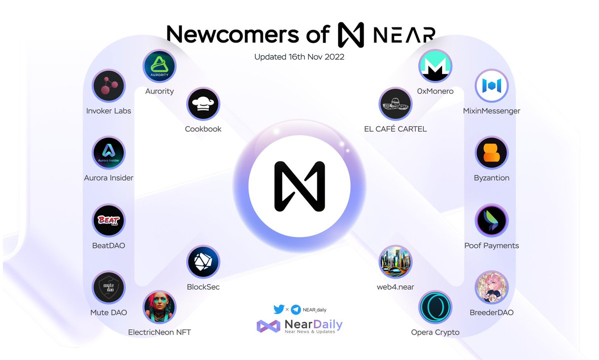

# Mixin Messenger has been listed on Near ecosystem
Mixin Messenger has been listed on the [Near Protocol ecosystem](https://awesomenear.com/mixin-messenger). This is a small achievement in the process of Mixin's efforts to expand. Mixin believes that the future is blockchain and will also strive to become the buildler of the blockchain world.

## About Near Protocol
NEAR is the network for a world reimagined. Through simple, secure, and scalable technology, millions are empowered to invent and explore new experiences. Business, creativity, and community are being reimagined for a more sustainable and inclusive future.

| [Official Website](https://near.org/) |

## About Mixin Network
Mixin Network is an open-source, lightning-fast, and decentralized Web3 platform to bring speed and scalability to the blockchain. Mixin allows blockchains to gain millions of TPS, sub-second final confirmation, zero transaction fee, enhanced privacy and unlimited extensibility.

Mixin Network is a PoS network with 26 full nodes. As a wallet solution, it is currently supporting 44 public blockchains including Bitcoin, Ethereum, Avalanche, Polkadot, etc. The total assets on the network have been over 1 billion US Dollars. Mixin is also a full-featured financial platform with functions of AMM, aggregating trade, pending orders on Exchange platforms, unbiased stable currency, etc. Mixin Network is dedicated to providing users with a decentralized blockchain infrastructure that always puts security, privacy, and decentralization first. 

| [Official Website](https://mixin.network/) | [Twitter](https://twitter.com/Mixin_Network)｜[Facebook](https://www.facebook.com/MixinNetwork)｜[Medium](https://medium.com/mixinnetwork)｜[Email](http://contact@mixin.one) ｜[Instagram](https://instagram.com/mixinnetwork)
