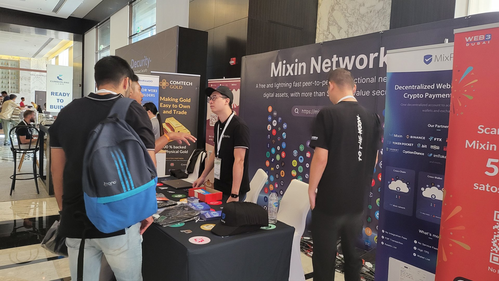
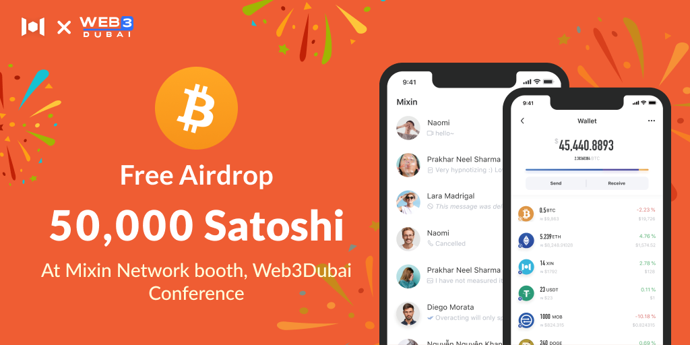
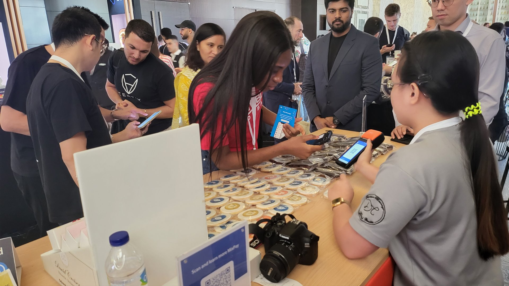
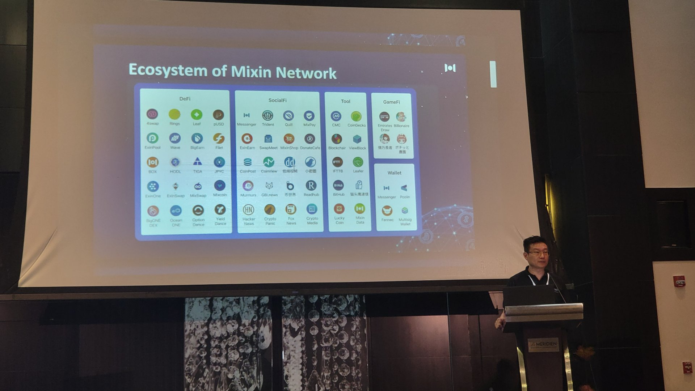
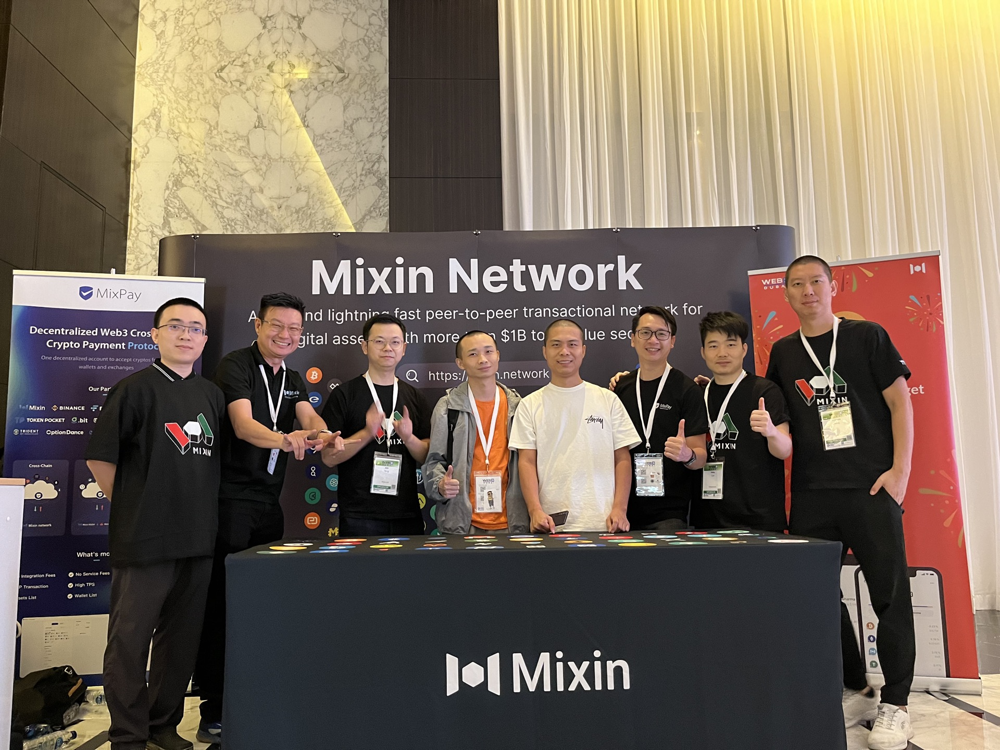

# Mixin and MixPay Participated Web3Dubai Conference
The [Web3Dubai Developer Conference](https://www.web3dubai.org) successfully took place in Le Meridien Dubai Hotel & Conference center from November 17 to 18. Mixin and its eco-partner, MixPay, participated in the conference as sponsors. We exchanged friendly views of the current market with many developers who participated in the forum. 

Mixin has made many preparations for the conference, designed a new booth, planned an exclusive airdrop event, panel limited T-shirts, and customized crypto biscuits for sale at the Bake N More Cafe mini bar.

The Bitcoin airdrop campaign received many good reputations; there was no threshold for participation, and all attendees could enroll for free: just go to the Mixin booth to get the redeem card and download Mixin Messenger to claim the 50000 Satoshi award.  

The participants can directly use the rewards at the Bake N More booth to buy crypto limited-edition cookies and desserts through MixPay to experience the fun of digital currency payment. 

The director of Mixin Network, Meng Chan Shu, also brought us a keynote speech about The infrastructure for Web3.

Mixin is on the path to stable development, keeping strong and moving.

## About Mixin
Mixin Network is an open-source, lightning-fast, and decentralized Web3 platform to bring speed and scalability to the blockchain. Mixin allows blockchains to gain millions of TPS, sub-second final confirmation, zero transaction fee, enhanced privacy and unlimited extensibility.

Mixin Network is a PoS network with 26 full nodes. As a wallet solution, it is currently supporting 44 public blockchains including Bitcoin, Ethereum, Avalanche, Polkadot, etc. The total assets on the network have been over 1 billion US Dollars. Mixin is also a full-featured financial platform with functions of AMM, aggregating trade, pending orders on Exchange platforms, unbiased stable currency, etc. Mixin Network is dedicated to providing users with a decentralized blockchain infrastructure that always puts security, privacy, and decentralization first. 

| [Official Website](https://mixin.network/) | 

## About MixPay 

MixPay is a decentralized web3 payment protocol, which connects different chains, different tokens, different wallets, and exchanges, whether it is an on-chain wallet (MetaMask, Trust Wallet) or a centralized wallet (Blockchain.com, BlockFi), or exchanges (Binance, Coinbase). As long as they access the MixPay Protocol, they can provide their users with safe, simple, and free payment services anywhere in the world marked by MixPay, without merchants needing to care about what wallet or token the customer uses to pay, just like what Visa and Mastercard do in the traditional payment field. 

| [Official Website](https://mixpay.me/) |
