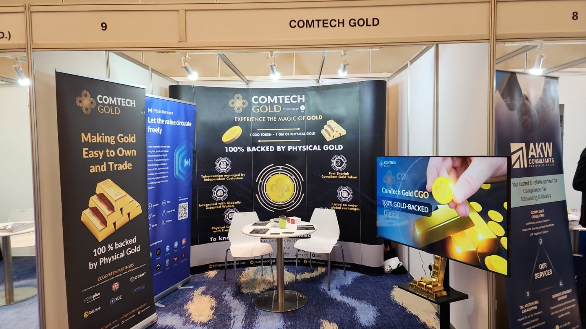
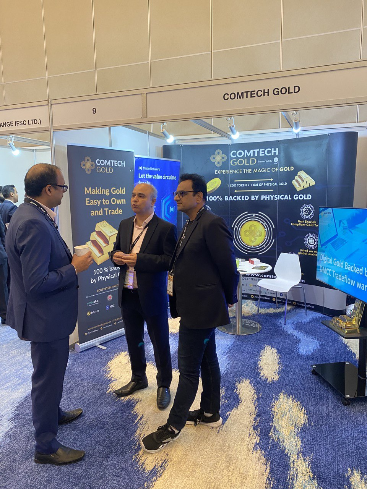

# Mixin Network was exhibited at Dubai Precious Metals Conference

Mixin Network's key strategic partner, ComTech Gold, has been invited to participate in Dubai Precious Metals Conference. During this period, Mixin Network's roll-up was placed in ComTech's booth and attracted much attention from attendees. We appreciate the support from ComTech GOLD.

## About Mixin Network
Mixin Network is an open-source, lightning-fast, and decentralized Web3 platform to bring speed and scalability to the blockchain. Mixin allows blockchains to gain millions of TPS, sub-second final confirmation, zero transaction fee, enhanced privacy and unlimited extensibility.

Mixin Network is a PoS network with 26 full nodes. As a wallet solution, it is currently supporting 44 public blockchains including Bitcoin, Ethereum, Avalanche, Polkadot, etc. The total assets on the network have been over 1 billion US Dollars. Mixin is also a full-featured financial platform with functions of AMM, aggregating trade, pending orders on Exchange platforms, unbiased stable currency, etc. Mixin Network is dedicated to providing users with a decentralized blockchain infrastructure that always puts security, privacy, and decentralization first. 

| [Official Website](https://mixin.network/) | [Twitter](https://twitter.com/Mixin_Network)｜[Facebook](https://www.facebook.com/MixinNetwork)｜[Medium](https://medium.com/mixinnetwork)｜[Email](http://contact@mixin.one) ｜[Instagram](https://instagram.com/mixinnetwork)