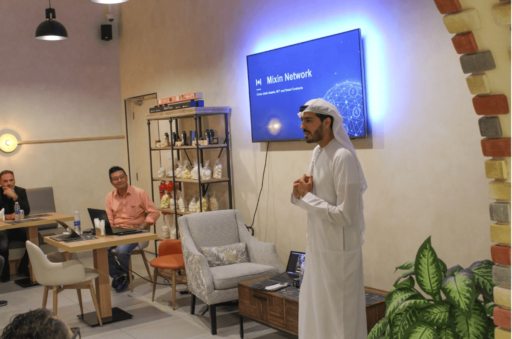

# Live Future Club Event

September 15, 2022: One amazing event was held at Live Future Club by Scopernia. People were gathering together to share their thoughts about crypto. The participants are from the FMCG, Oil and Gas, Construction, Technology and Services sectors.

Meng Chan Shu from Mixin Network, as a guest speaker explained the functions of Mixin Network and Mixpay to a group of business associates in Dubai, which is well received. Scopernia expressed that they are looking at launching a web3 portal called Imagine3, which is worth looking into.

## About Mixin Network
Mixin Network is an open-source, lightning-fast, and decentralized W3 platform to bring speed and scalability to the blockchain. Mixin allows blockchains to gain trillions of TPS, sub-second final confirmation, zero transaction fee, enhanced privacy and unlimited extensibility.
Mixin Network is a PoS network with 26 full nodes. As a wallet solution, it is currently supporting 41 public blockchains including Bitcoin, Ethereum, Avalanche, Polkadot, etc. The total assets on the network have been over 1 billion US Dollars. Mixin is also a full-featured financial platform with functions of AMM, aggregating trade, pending orders on Exchange platforms, unbiased stable currency, etc. Mixin Network is dedicated to providing users with a decentralized blockchain infrastructure that always puts security, privacy, and decentralization first.
Follow us:
[Official Website](https://mixin.one/)｜[Twitter](https://twitter.com/Mixin_Network)｜[Facebook](https://www.facebook.com/MixinNetwork)｜[Medium](https://medium.com/mixinnetwork)｜[Email](http://contact@mixin.one) ｜[Instagram](https://instagram.com/mixinnetwork)

## About Mixpay
1. MixPay is a decentralized crypto payment service platform built on Mixin Network, which desires to be the Visa, MasterCard of the cryptocurrency space.

2. MixPay supports the aggregation of all crypto assets and fiat currencies, all chains, all wallets, all payment integrators, and all cryptocurrency holders.

3. MixPay uses a separate architecture for quote, payment, and settlement, and supports three account models: personal, developer, and multi-signer. Merchants can easily integrate with APIs, MixPay plugins, Shopify, or WooCommerce plugins to start their crypto business.

4. Regarding compliance, MixPay is actively working with regulators and applying for licenses in the Middle East, North America, and other regions.

5. More than [20 offline shops](https://help.mixpay.me/en_US/for-businesses/offline-merchants-information) and [7 online shops and platforms](https://help.mixpay.me/en_US/for-businesses/online-platforms-and-shops-information) support MixPay payment in UAE, and dozens of website and offline shops are integrating.
|[Official Website](https://mixpay.me/)| [Instagram](https://www.instagram.com/mixpay.me)| [Twitter](https://twitter.com/MixPayHQ)|

