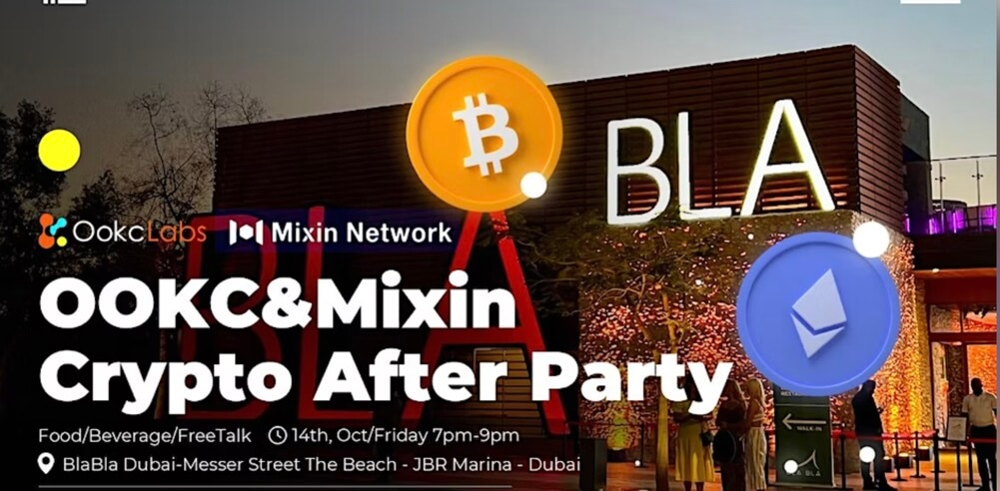
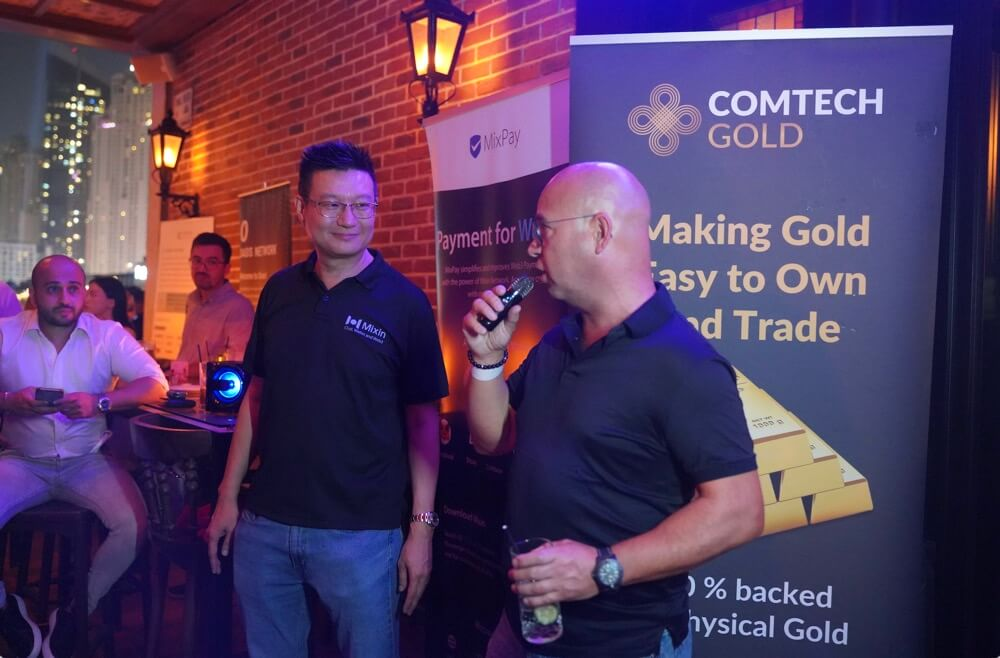

# OOKC & Mixin Crypto After Party

October 14, 2022: During Future Blockchain Summit FBS Week, an excellent Crypto After Party was co-held by Mixin Network and OOKC Labs in Dubai, United Arab Emirates.

The event was attended by more than 120 participants from the blockchain community such as blockchain projects, venture capitalists, crypto exchanges, wallets operator, Events organizers and Mixin Users. Mixin Network also invited other blockchain partners EOS Foundation, XinFin Network, ComtechGold, and Kucoin Ventures (through OOKC Incubator Labs) to give an updates on their progresses, which are welcomed by the participants.

## About Mixin Network
Mixin Network is an open-source, lightning-fast, and decentralized W3 platform to bring speed and scalability to the blockchain. Mixin allows blockchains to gain millions of TPS, sub-second final confirmation, zero transaction fee, enhanced privacy and unlimited extensibility.
Mixin Network is a PoS network with 26 full nodes. As a wallet solution, it is currently supporting 42 public blockchains including Bitcoin, Ethereum, Avalanche, Polkadot, etc. The total assets on the network have been over 1 billion US Dollars. Mixin is also a full-featured financial platform with functions of AMM, aggregating trade, pending orders on Exchange platforms, unbiased stable currency, etc. Mixin Network is dedicated to providing users with a decentralized blockchain infrastructure that always puts security, privacy, and decentralization first.
Highest TVL: USD2.9 billion on November 10, 2021
Highest Daily Transaction Volume: 4.9 million transactions on August 27, 2021
User Base: 1 million
Follow us:
[Official Website](https://mixin.one/)｜[Twitter](https://twitter.com/Mixin_Network)｜[Facebook](https://www.facebook.com/MixinNetwork)｜[Medium](https://medium.com/mixinnetwork)｜[Email](http://contact@mixin.one) ｜[Instagram](https://instagram.com/mixinnetwork)

## About OOKC
Founded in 2017, [Ookc Labs](https://www.ookc.com/) is a blockchain incubator in Dubai that empowers long-terminism entrepreneurs to build the future through technology. we support portfolio partners, governments and enterprises all around the world with product-market advisory, strategic planning and global industry connection.
​
Ookc Labs has offices in Dubai, Singapore, Hong Kong, Shenzhen and San Francisco.
​
We aim to deeply connect entrepreneurs, and projects reach their full potential, from the technical (mechanism design, smart contract security, engineering) to the operational (brand building, regulatory strategy).

